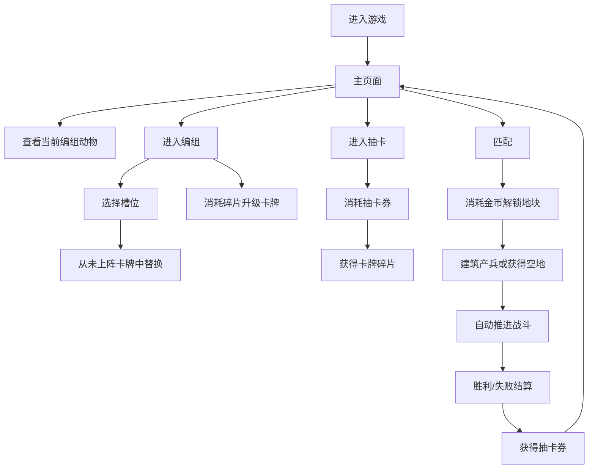

# 丛林法则 - 当前玩法模块策划案

生成日期：2026-07-04  
用途：整理当前已实现玩法，按模块列出规则、数值、流程和可调整项，方便后续逐项改策划。

## 0. 当前版本定位

当前项目是一个移动竖屏 Godot 原型，核心玩法是“地块扩张 + 建筑产兵 + 自动推进战斗 + 卡牌收集养成”。

当前运行版本已经具备：

- 主界面：显示游戏名、基地、当前上阵动物，并让动物在场景中小范围随机移动。
- 编组页：8 个上阵槽位，下方卡牌列表会隐藏已经上阵的卡牌。
- 抽卡页：消耗抽卡券进行 1 抽或 10 抽，获得卡牌碎片。
- 战斗页：7x13 六边形棋盘，双方从各自大本营开始，通过消耗金币解锁相邻地块扩张。
- 自动战斗：建筑自动产出单位，单位自动寻找敌对动物、移动、攻击敌对动物或敌方建筑，不再把空地地块作为攻击目标。
- 基础养成：卡牌有等级、碎片、升级消耗和属性成长。

当前需要注意：

- 代码运行使用 `config/tables/cards.csv` 作为卡牌数据源。
- 地块、经济、关卡、技能、防御等配置表已经存在，但当前战斗逻辑仍有一部分使用脚本硬编码规则。
- 当前已有本地段位与镜像数据库，使用 `user://rank_mirror_db.json` 保存玩家隐藏 ELO、胜负和胜利镜像；金币、抽卡券、卡牌数量和编组仍主要在每次运行时从初始状态开始。

## 1. 全局流程

### 1.0 专业制图交付清单

当前策划案按项目开发流程补齐正式图件，Mermaid 只作为文档内的快速草图，不作为最终交付源文件。

| 图件 | 专业源文件 | 预览图 | 用途 |
| --- | --- | --- | --- |
| 当前玩法流程图 | `docs/diagrams/current_gameplay_flow.drawio` | `output/diagrams/current_gameplay_flow.png` | 表达大厅、编组、抽卡、匹配、战斗、结算和回流关系 |
| 当前 UI/UE 线框交互图 | `docs/diagrams/current_ui_ue_wireflow.drawio` | `output/diagrams/current_ui_ue_wireflow.png` | 表达主界面、编组页、战斗页、结算弹窗和底部信息面板的交互关系 |

### 1.1 玩家主循环

### 1.2 当前界面模块

| 模块 | 当前入口 | 已实现内容 | 未开放/待补 |
| --- | --- | --- | --- |
| 主界面 | 底部“战斗”页 | 游戏标题、资源栏、基地、当前编组动物、段位信息和匹配按钮 | 关卡选择、离线收益、主界面建筑交互 |
| 编组 | 底部“编组”页 | 8 个上阵槽位、卡牌详情、升级、下方未上阵卡牌列表 | 阵容保存、推荐编组、筛选排序 |
| 抽卡 | 底部“抽卡”页 | 抽 1 次、抽 10 次、最近获得展示 | 卡池详情、保底、概率公示、动画 |
| 战斗 | 主界面“匹配” | 同段位对手匹配、地块解锁、建筑产兵、单位推进、暂停、结算 | 关卡目标、波次、技能释放、战斗复盘 |
| 商店 | 底部“商店” | 按钮存在但锁定 | 商品、礼包、每日刷新 |
| 更多 | 底部“更多” | 按钮存在但锁定 | 设置、图鉴、邮件、任务 |

## 2. 战斗模块

### 2.1 战斗基础参数

| 参数 | 当前值 | 来源 | 说明 |
| --- | ---: | --- | --- |
| 棋盘尺寸 | 7 列 x 13 行 | `BoardRules.GRID_COLS/GRID_ROWS` | 六边形棋盘 |
| 单局时长 | 180 秒 | `BATTLE_TIME` | 倒计时结束后按地块数判定胜负 |
| 玩家初始金币 | 60 | `STARTING_GOLD` | 战斗内金币 |
| AI 初始金币 | 60 | `STARTING_GOLD` | AI 战斗内金币 |
| 收入间隔 | 3 秒 | `INCOME_INTERVAL` | 大本营和金矿均按此间隔产出 |
| 大本营收入 | 12 金币/3 秒 | `BASE_INCOME` | 每个己方大本营提供 |
| 金矿收入 | 10 金币/3 秒 | `MINE_INCOME` | 每个己方金矿提供 |
| 战斗奖励 | 胜利 3 抽卡券，失败 1 抽卡券 | `BATTLE_WIN_REWARD_TICKETS` / `BATTLE_LOSS_REWARD_TICKETS` | 按胜负发放 |

### 2.2 初始状态

- 玩家初始只有己方大本营 `(3, 11)` 是已解锁可用地块。
- AI 初始只有敌方大本营 `(3, 1)` 是已解锁可用地块。
- 开局时棋盘下半区标记为玩家阵营预归属，上半区标记为敌方阵营预归属；这些预归属只用于视觉和战线识别，不等同于已解锁。
- 除大本营外，其他地块仍为未解锁状态，必须由对应阵营消耗金币解锁后才会生成建筑、空地或奖励，并计入真实拥有地块。
- 地块类型和价格生成后，本局不会因为后续行为而重新随机。

### 2.3 战斗目标与结算

| 触发 | 当前结果 |
| --- | --- |
| 任意单位摧毁敌方大本营 | 攻击方胜利 |
| 倒计时归零 | 比较双方已解锁地块数量，玩家地块数大于等于敌方则胜利，否则失败 |
| 玩家暂停后退出 | 直接失败并回主界面 |
| 结算奖励 | 胜利发放 3 抽卡券，失败发放 1 抽卡券 |

### 2.4 自动战斗规则

建筑每帧更新自身计时器，计时结束后：

- 大本营：只提供金币收入，并执行防御塔式攻击，不再生产动物。
- 营地/大厅：自动生成该地块绑定的动物卡牌。
- 防御塔：不产兵，而是攻击范围内最近敌方单位。
- 金矿：不产兵，只提供金币收入。

单位每帧执行：

1. 若死亡则从单位列表移除。
2. 搜索敌对动物和敌方建筑作为候选目标。
3. 按距离分数选目标，敌对动物和敌方基地拥有额外优先分，避免空地进入目标列表。
4. 若目标在攻击距离内且冷却结束，则造成伤害。
5. 远程攻击和防御塔攻击会生成一条短时间高亮弹道，帮助玩家看清攻击来源和目标。
6. 若不在攻击距离内，则向目标移动。
7. 单位不再把空地或普通地块作为目标；地块扩张只通过玩家/AI 消耗金币解锁，或通过摧毁建筑后的归属转换发生。

### 2.5 目标选择

单位目标只包含敌对动物和敌方建筑：

- 敌对动物会进入目标列表，并获得额外优先分，因此双方动物会互相攻击。
- 非己方建筑会进入目标列表；敌方大本营分数额外降低，因而更容易成为推进目标。
- 空地、未解锁地块和只有预归属阵营的地块不再进入单位目标列表。
- 摧毁非基地建筑后，该地块转为攻击方真实拥有的空地；摧毁基地仍直接触发胜负。

### 2.6 关键可调整项

| 调整项 | 当前值/规则 | 建议调整入口 |
| --- | --- | --- |
| 单局节奏 | 180 秒，收入 3 秒一次 | `scripts/app/main.gd` 常量 |
| 开局金币 | 玩家/AI 均 60 | `STARTING_GOLD` |
| 结算奖励 | 胜利给 3 抽卡券，失败给 1 抽卡券 | `_finish_battle()` |
| 单位攻击冷却 | 固定 0.85 秒 | `_update_units()` |
| 防御塔伤害 | 44 点/次 | `_tower_attack()` |
| 防御塔索敌范围 | 150 像素 | `_tower_attack()` |
| AI 操作频率 | 开局 4.0 秒后首次尝试，之后每 2.2 秒尝试一次解锁 | `_update_enemy()` |
| 是否允许失败奖励 | 当前允许，失败奖励为 1 抽卡券 | `_finish_battle()` |

### 2.7 段位匹配与镜像数据库

当前原型新增一套 ELO 天梯系统，底层使用 ELO 作为隐藏匹配分。ELO 只用于匹配、结算和镜像分段，所有游戏页面都不直接显示原始 ELO 或 ELO 增减值；玩家可见信息只显示“段位 + 星数”。

| 段位 | 隐藏分范围 | 星级规则 |
| --- | ---: | --- |
| 青铜 | 1000-1199 | 3 星 |
| 白银 | 1200-1399 | 3 星 |
| 黄金 | 1400-1599 | 4 星 |
| 钻石 | 1600-1799 | 5 星 |
| 王者 | 1800+ | 每 40 ELO 增加 1 星，无固定上限 |

匹配流程：

1. 玩家在大厅点击“匹配”。
2. 系统读取玩家当前隐藏 ELO，并换算出当前段位分段。
3. 系统从本地镜像数据库中优先选取同分段其他玩家镜像；如果只有本机记录则退回本机镜像，如果该分段还没有记录，则生成一份同段位默认镜像作为兜底。
4. 镜像会把敌方卡组替换为记录中的 8 张出战卡，并读取镜像中记录的卡牌等级。
5. 进入战斗后，敌方仍按当前 AI 规则消耗金币扩张、解锁地块、产兵和战斗。

结算与入库：

| 触发 | 数据规则 |
| --- | --- |
| 任意胜负结算 | 按双方隐藏 ELO 使用 K=32 公式更新玩家隐藏 ELO |
| 玩家胜利 | 将本局开战时所在段位、隐藏 ELO、8 张出战卡和卡牌等级记录为一份胜利镜像 |
| 玩家失败 | 只更新隐藏 ELO 和胜负统计，不写入胜利镜像 |
| 镜像库容量 | 每个段位最多保留 20 条本地镜像，超过后移除最旧记录 |

显示规则：

- 大厅段位面板只显示当前段位、星数和胜负，不显示镜像数量等服务器/匹配池信息。
- 战斗顶部只显示双方段位星数对阵，不显示双方隐藏分。
- 结算页只显示结算后的当前段位星数，不显示 ELO 增减。

本地数据库位置为 `user://rank_mirror_db.json`。当前版本是单机原型，数据库结构按后续服务端同步设计：未来接入服务器后，其他玩家的胜利镜像可按相同字段写入共享库，玩家匹配时按同段位抽取“其他玩家镜像”。

## 3. 地图与地块模块

### 3.1 地块显示状态

当前地块视觉分为 4 类：

| 状态 | 条件 | 当前显示 |
| --- | --- | --- |
| 无归属未解锁区域 | 没有真实拥有者，也没有预归属阵营 | 米黄色 |
| 预归属未解锁区域 | 开局按上下半区标记为玩家或敌方，但尚未消耗金币解锁 | 使用米黄色底色和阵营细边线，仅作战线识别 |
| 已解锁区域 | `team` 为玩家或敌方 | 己方绿色，敌方红色；有建筑显示建筑，无建筑显示空地 |
| 可解锁区域 | 与己方已解锁地块相邻且有站点 | 黄色高亮，显示类型剪影和金币价格，不显示品质色 |

补充规则：

- 真正解锁必须由玩家点击并消耗金币。
- AI 解锁也是模拟玩家行为：选择可解锁地块，检查金币，扣金币，应用解锁结果。
- 待解锁地块只知道站点类型和价格，不知道本次解锁后的品质；动物营地和防御塔在未解锁时统一使用黑灰剪影。
- 品质随机和问号翻开结果在解锁瞬间执行，并写入该地块；解锁后才按品质色显示建筑。
- 动物头像不再使用阵营小圆点；阵营由血条颜色表达，己方为绿色，敌方为红色。

### 3.2 当前地块生成逻辑

运行代码中的当前随机规则：

| 随机区间 | 地块类型 | 价格 |
| --- | --- | --- |
| 0-49 | 问号地块 | 25 |
| 50-69 | 单位建筑，价格高时为大厅，否则营地；大本营相邻随机单位建筑强制为低价营地 | 50/100/250，大本营相邻单位建筑为 50 |
| 70-89 | 防御塔 | 50 |
| 90-99 | 金矿 | 50 |

单位建筑的价格池：

| 价格 | 权重 | 当前含义 |
| ---: | ---: | --- |
| 50 | 30 | 低价单位，主要从 Tier 1-3 中选择 |
| 100 | 50 | 中价单位，主要从 Tier 3-5 中选择 |
| 250 | 20 | 高价单位，主要从 Tier 5-6 中选择 |

### 3.3 问号地块

当前运行代码中的问号结果在解锁瞬间随机：

| 结果 | 概率 | 说明 |
| --- | ---: | --- |
| 空地 | 70% | 解锁后成为己方空地 |
| 营地 | 10% | 绑定 Tier 3-4 卡 |
| 大厅 | 15% | 绑定 Tier 5 卡 |
| 大厅 | 5% | 绑定 Tier 6 卡 |

配置表中另有设计：问号 10% 可直接给金币 25-40，但当前运行代码未接入该配置结果。

### 3.4 建筑数值

| 建筑 | 当前生命 | 生产/攻击规则 |
| --- | ---: | --- |
| 大本营 | 520 | 每 3 秒提供金币，并按防御塔逻辑攻击，不产兵 |
| 营地 | 绑定动物最大生命 x 3 | 按绑定卡牌召唤间隔产兵 |
| 大厅 | 绑定动物最大生命 x 3 | 按绑定卡牌召唤间隔产兵 |
| 防御塔 | 180 | 1.1 秒刷新攻击逻辑，当前每次命中伤害 44 |
| 金矿 | 125 | 不产兵，每 3 秒提供 10 金币 |

### 3.5 配置表与运行代码差异

| 内容 | 配置表设计 | 当前运行实现 |
| --- | --- | --- |
| 地图随机 | 上半地图随机后镜像到下半地图 | 逐格按坐标 hash 生成，没有真正镜像 |
| 地块类型权重 | 问号 50%、单位 20%、防御 20%、金矿 10% | 接近实现，但单位和防御合并/简化 |
| 问号结果 | 空、防御池、单位池、金币 | 空、营地、大厅，没有金币 |
| 防御地块 | 可从防御卡池抽不同防御 | 当前只有防御塔一种 |
| 价格池 | 50/100/250 对应不同单位/防御池 | 价格影响单位 Tier，未读取卡池表 |

### 3.6 关键可调整项

| 调整项 | 当前位置 | 建议 |
| --- | --- | --- |
| 地图尺寸 | `board_rules.gd` | 若改尺寸，需同步 UI 棋盘框和基地坐标 |
| 初始基地位置 | `PLAYER_BASE/ENEMY_BASE` | 当前上下对称但不靠边 |
| 地块生成权重 | `BoardRules.site_for_key()` | 后续建议改为读取 `board_cell_types.csv` |
| 问号结果 | `BoardRules.roll_unlock_result()` | 建议接入 `cell_reveal_rules.csv` |
| 价格和品质 | `BoardRules.price_for_seed()` | 建议接入 `cell_price_pools.csv` |
| 解锁规则 | `BoardRules.can_unlock()` | 当前只判断与己方 team 相邻，不看 occupier |

## 4. 卡牌与编组模块

### 4.1 卡牌数据规模

当前 `cards.csv`：

| 维度 | 当前分布 |
| --- | --- |
| 卡牌总数 | 60 |
| 稀有度 | common 20、rare 20、epic 10、legendary 10 |
| Tier | 1-6 每档 10 张 |
| 攻击 | 5-46，平均约 18.1 |
| 生命 | 38-320，平均约 135.5 |
| 速度 | 45.1-78.1，平均约 58.39 |
| 攻击距离 | 40-130，平均约 62.33 |
| 召唤间隔 | 2.45-7.4 秒，平均约 5.03 秒 |

### 4.2 攻击距离显示

当前 UI 不显示具体像素距离，只显示档位：

| 档位 | 判定 |
| --- | --- |
| 近战 | 小于等于 1.5 个地块半径，显示“近战(1格)” |
| 远程 | 小于等于 2.6 个地块半径，显示“远程(2格)” |
| 超远程 | 大于 2.6 个地块半径，显示“超远程(3格)” |

### 4.3 初始卡牌与编组

- 初始拥有前 8 张普通卡各 1 张。
- 编组槽位数量为 8。
- 初始化编组会从已拥有卡牌中循环填满 8 个槽位。
- 主界面显示当前编组动物，并让它们在基地附近小范围随机移动。
- 编组页下方卡牌列表会隐藏已经上阵的卡牌。

### 4.4 卡牌升级

| 项 | 当前规则 |
| --- | --- |
| 初始等级 | 1 |
| 升级消耗 | `[1, 2, 5, 10, 20, 30, 50, 80, 100]` |
| 满级 | 消耗表结束后视为满级 |
| 碎片计算 | 拥有数量减 1 为可消耗碎片 |
| 属性成长 | 每升 1 级，攻击、生命、速度、攻击距离乘以 `1 + (等级-1) x 0.105` |
| 召唤间隔成长 | 召唤间隔除以同一个倍率，最低 1 秒 |

### 4.5 当前技能状态

`cards.csv` 和 `skills.csv` 中已经有技能字段、技能说明和技能表，但当前战斗逻辑未真正执行技能效果。

当前实际生效的只有：

- 攻击
- 生命
- 移动速度
- 攻击距离
- 召唤间隔

技能文本目前主要作为策划数据和卡牌描述储备。

### 4.6 关键可调整项

| 调整项 | 当前位置 | 建议 |
| --- | --- | --- |
| 编组数量 | `DECK_SIZE` | 8 个偏多，适合展示阵容；若要更策略化可降到 5-6 |
| 初始拥有 | `_init_player_collection()` | 当前只给前 8 张 common，缺少新手指定卡组 |
| 升级消耗 | `CardRules.LEVEL_COSTS` | 可按留存节奏重做 |
| 成长倍率 | `CardRules.LEVEL_STAT_STEP` | 当前 10.5%/级偏强，后期会指数感明显 |
| 技能接入 | `skills.csv` + 战斗系统 | 需要单独实现技能触发器和效果系统 |

## 5. 抽卡模块

### 5.1 抽卡入口

- 抽卡页显示当前抽卡券数量。
- 支持“抽1次”和“抽10次”。
- 抽卡券不足时弹 Toast。
- 最近获得会显示本次抽到的卡牌。
- 点击抽卡后先播放一次抽取特效，特效期间暂不显示动物卡牌。
- 单抽在特效结束后翻开 1 张动物卡牌。
- 十连抽只播放一次抽取特效，随后 10 张动物卡牌按顺序逐张翻开。

### 5.2 当前概率

当前概率为硬编码，不读取 `card_random_pools.csv`：

| 稀有度 | 概率 |
| --- | ---: |
| common | 80.0% |
| rare | 16.0% |
| epic | 3.2% |
| legendary | 0.8% |

抽中某个稀有度后，会在该稀有度所有卡牌中等概率随机一张。

### 5.3 抽卡产物

- 每抽到 1 张卡，`card_counts[card_id] += 1`。
- 如果是新卡，等级初始化为 1。
- 卡牌数量同时承担“拥有”和“碎片”两种含义。
- 抽卡后会调用 `_ensure_deck_valid()`，保证编组中的卡仍为已拥有卡。

### 5.4 抽卡券来源

| 来源 | 当前实现 |
| --- | --- |
| 初始赠送 | 10 张抽卡券 |
| 战斗结算 | 胜利 +3 张，失败 +1 张 |
| 日常/任务/商店 | 配置表有经济字段，当前未实现 |

### 5.5 关键可调整项

| 调整项 | 当前位置 | 建议 |
| --- | --- | --- |
| 抽卡概率 | `CardRules.GACHA_RATES` | 若要卡池化，改为读取 `card_random_pools.csv` |
| 保底 | 当前无 | 建议加入 10 抽至少 rare、累计保底 epic/legendary |
| 奖励发放 | `_finish_battle()` | 建议区分胜负奖励 |
| 新卡展示 | `_draw_gacha_reward_card()` / `_draw_gacha_fx()` | 先播放抽取特效，再翻牌展示；十连逐张翻开 |

## 6. 经济模块

### 6.1 战斗内经济

战斗内金币只在单局中使用：

- 开局 60 金币。
- 大本营每 3 秒提供 12 金币。
- 金矿每 3 秒提供 10 金币。
- 解锁地块消耗金币。
- 问号地块当前不会产出金币奖励，虽然配置表中已有金币结果。

### 6.2 局外经济

当前局外只实现抽卡券：

- 初始 10 张。
- 每局结算胜利 +3 张，失败 +1 张。
- 抽卡消耗 1 或 10 张。

配置表中已有金币、体力、经验、每日登录等奖励项，但当前主逻辑未接入这些局外资源。

### 6.3 关键可调整项

| 调整项 | 当前状态 | 建议 |
| --- | --- | --- |
| 战斗金币节奏 | 已实现 | 先调整开局 60、收入 12/10、地块价格 25/50/100/250 |
| 局外金币 | 配置存在，未实现 | 需要存档与奖励系统 |
| 体力 | 配置存在，未实现 | 适合后续商业化或关卡体力门槛 |
| 经验 | 配置存在，未实现 | 可用于账号等级或角色等级 |

## 7. AI 模块

### 7.1 当前 AI 行为

AI 开局 4.0 秒后首次尝试解锁，之后每 2.2 秒尝试解锁一个地块：

1. 遍历所有地块。
2. 找到 AI 可解锁、金币足够支付且 `y` 最大的地块。
3. 扣除对应金币并解锁。
4. 如果没有可支付目标，则等待下次检查。

因为敌方基地在上方 `(3,1)`，AI 选择最大 `y` 的地块，等于倾向向下推进。

### 7.2 AI 产兵与战斗

- 敌方大本营不产兵，只提供金币和防御攻击。
- 敌方默认阵容为 8 张 common 绿色动物卡牌。
- 敌方建筑如果绑定了卡牌，则按地块卡牌产兵；生产间隔与玩家同样读取卡牌召唤间隔。
- AI 单位和玩家单位使用同一套自动索敌、移动和攻击规则。

### 7.3 关键可调整项

| 调整项 | 当前规则 | 建议 |
| --- | --- | --- |
| AI 扩张频率 | 首次 4.0 秒，之后 2.2 秒 | 可按难度调整 |
| AI 选地策略 | 只看 y 最大 | 建议加入价格、建筑类型、离基地距离、进攻路线评分 |
| AI 默认阵容 | 8 张 common 绿色动物卡牌 | 可按关卡/难度读配置表 |
| AI 金币 | 和玩家同起点同收入，并且必须消耗金币才能解锁地块 | 可做简单难度倍率 |

## 8. UI/UE 模块

### 8.1 当前视觉与交互方向

- 竖屏 720x1280 设计尺寸，按视口等比缩放。
- UI 风格为粗描边、强色块、按钮阴影、底部导航。
- 底部导航包含商店、编组、战斗、抽卡、更多。
- 所有 UI 由 `main.gd` 直接绘制，尚未拆成独立 UI 场景。

### 8.2 战斗信息呈现

- 顶部显示金币和抽卡券。
- 战斗中显示倒计时。
- 可解锁地块显示简化图标和金币价格。
- 底部选择面板显示当前选中地块说明。
- 暂停按钮在右上角。

### 8.3 待优化点

| 问题 | 当前状态 | 建议 |
| --- | --- | --- |
| 所有 UI 集中在 `main.gd` | 已开始拆规则，UI 未拆 | 下一步拆 `ui/lobby_view.gd`、`ui/deck_view.gd` 等 |
| 地块价格可读性 | 已增强但仍依赖小字号 | 可增加价格底板和固定图标尺寸 |
| 战斗反馈 | 只有脉冲圈和血条 | 增加攻击闪白、命中飘字、建筑受击抖动 |
| 抽卡反馈 | 直接显示结果 | 增加翻牌、稀有度光效、十连结算 |

## 9. 配置与实现关系

### 9.1 当前已接入配置表

| 表 | 当前用途 |
| --- | --- |
| `cards.csv` | 运行时读取卡牌基础属性、名称、图片、稀有度、Tier |
| `runtime/config/config_manifest.json` | `ConfigDB` 加载运行时 JSON |
| `runtime/config/cards.json` | 实际运行读到的卡牌 JSON |

### 9.2 当前存在但未完全接入的配置

| 表 | 当前状态 |
| --- | --- |
| `board_cell_types.csv` | 设计了地块类型权重和收入，但运行代码未直接读取 |
| `board_rules.csv` | 设计了镜像地图规则，但运行代码未直接读取 |
| `cell_price_pools.csv` | 设计了价格池，但运行代码用硬编码等价逻辑 |
| `cell_reveal_rules.csv` | 设计了问号翻开池，但运行代码用硬编码简化逻辑 |
| `card_random_pools.csv` | 设计了卡池，但抽卡当前按稀有度硬编码概率 |
| `skills.csv` | 设计了技能，但战斗当前未执行技能 |
| `defenses.csv` | 设计了多种防御塔，但当前只有一种防御塔逻辑 |
| `stages.csv` | 设计了关卡，但当前没有关卡选择与关卡驱动 |
| `economy.csv` | 设计了局外经济，但当前没有存档和局外资源系统 |

## 10. 建议的下一步调整顺序

### 10.1 先调体验的 5 个点

1. 地块价格与分布：先确认 25/50/100/250 是否符合开局节奏。
2. 战斗奖励：继续实机验证胜利 3 抽卡券、失败 1 抽卡券是否适合当前养成节奏。
3. AI 扩张速度：首动 4.0 秒、之后 2.2 秒一次，需要继续实机感受。
4. 单位攻击冷却：当前固定 0.85 秒，所有单位实际攻速差异主要来自攻击和召唤间隔。
5. 卡牌成长：10.5%/级对攻击、血量、速度、距离都生效，可能导致远程卡等级收益过高。

### 10.2 再做系统化的 5 个点

1. 把地块生成接入配置表，避免代码和表两套规则。
2. 加存档，把抽卡券、卡牌数量、等级、编组保存下来。
3. 把技能系统接入战斗，至少先实现被动、出生、攻击触发三类。
4. 把战斗 UI、编组 UI、抽卡 UI 从 `main.gd` 拆出去。
5. 做关卡系统，按 `stages.csv` 控制时长、敌方池、奖励池和地图规则。

## 11. 模块调整索引

| 想调整什么 | 优先改哪里 |
| --- | --- |
| 开局金币、战斗时间、奖励券 | `scripts/app/main.gd` 顶部常量 |
| 地块生成概率、价格、基地位置 | `scripts/app/systems/board_rules.gd` |
| 卡牌升级消耗、成长倍率、抽卡概率 | `scripts/app/systems/card_rules.gd` |
| 卡牌基础属性、名称、图片 | `config/tables/cards.csv` 后运行 `tools/export_config.py` |
| 未来技能设计 | `config/tables/skills.csv` |
| 未来地块表驱动 | `config/tables/board_cell_types.csv`、`cell_price_pools.csv`、`cell_reveal_rules.csv` |
| UI 结构拆分 | 后续新增 `scripts/app/ui/` 或 Godot UI 场景 |

## 12. 当前风险与待确认

| 风险/问题 | 影响 | 建议 |
| --- | --- | --- |
| 规则硬编码与配置表并存 | 策划改表后可能看不到效果 | 标记哪些表已接入，逐步消灭硬编码 |
| 没有存档 | 抽卡和升级体验无法长期验证 | 下一步优先加本地存档 |
| 技能未实装 | 卡牌差异主要靠基础属性 | 先做 3-5 个核心技能验证方向 |
| 战斗奖励胜负差距较小 | 失败也能稳定获得抽卡券 | 继续验证胜利 3、失败 1 是否需要拉开差距 |
| AI 策略单一 | 战斗变化少 | 加入地块价值评分 |
| `main.gd` 仍承担 UI 和战斗 | 后续功能继续堆叠会难维护 | 继续按正式项目拆分 |
