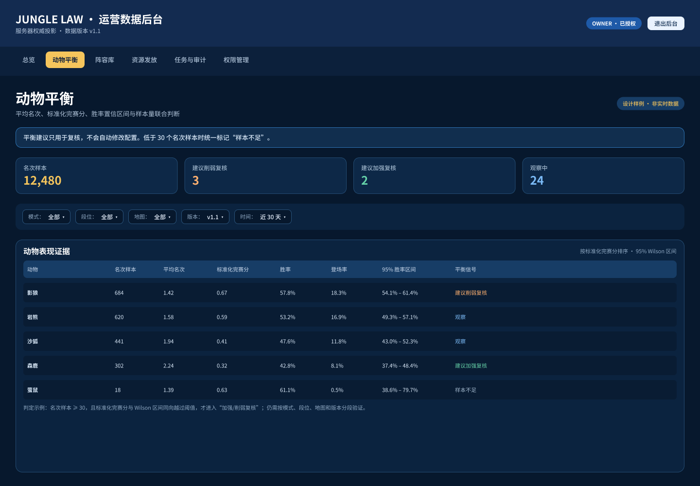
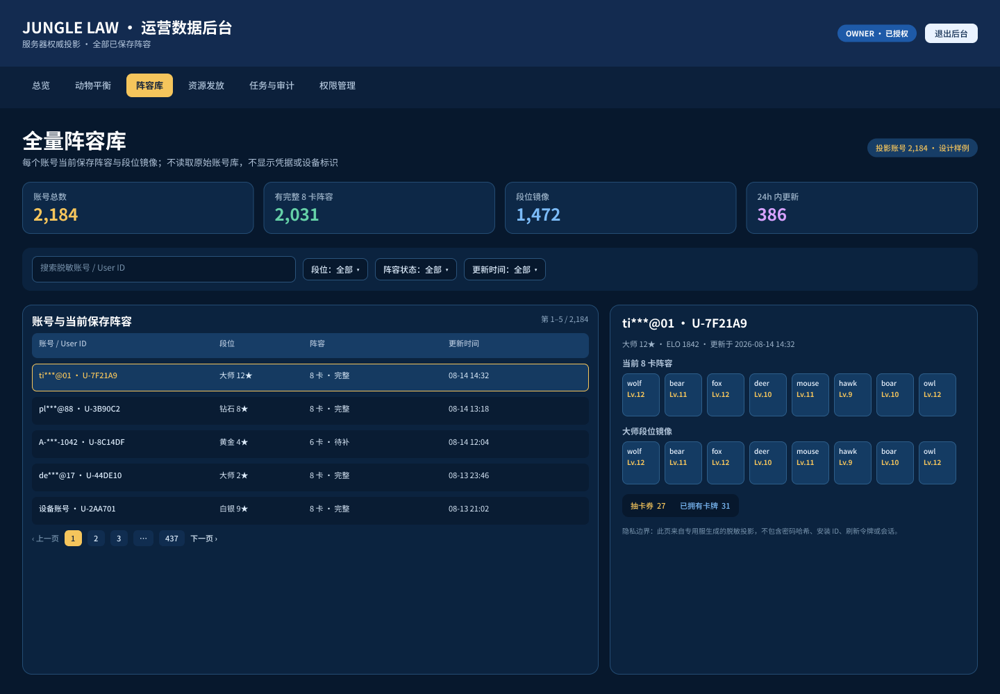
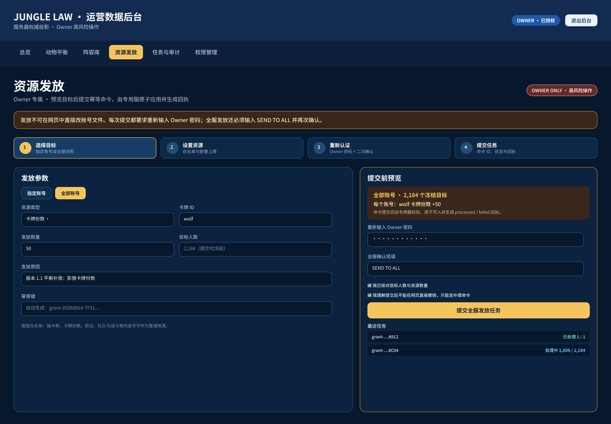

# 运营数据后台设计与实现契约

- 功能编号：F-ZC-ADMIN-001
- 文档名称：运营数据后台设计与实现契约
- 版本：v1.3.1
- 状态：MATERIAL / IMPLEMENTATION_CONTRACT
- 更新日期：2026-08-23
- 适用范围：阿里云私有运营后台、只读数据投影与 Owner 资源指令
- 文档责任：产品目标、UE、字段、接口、权限、安全、部署、QA 与回滚的统一实施基线

## 目录

- [版本历史](#版本历史)
- [1. 文档目标与权威性](#1-文档目标与权威性)
  - [1.1 来源与证据等级](#1-1-来源与证据等级)
- [2. 范围、角色与成功标准](#2-范围-角色与成功标准)
  - [2.1 本期范围](#2-1-本期范围)
  - [2.2 非目标](#2-2-非目标)
  - [2.3 角色与结果](#2-3-角色与结果)
- [3. 信息架构与 UE 流程](#3-信息架构与-ue-流程)
  - [3.1 页面顺序](#3-1-页面顺序)
  - [3.2 登录与只读分析 UE](#3-2-登录与只读分析-ue)
  - [3.3 Owner 资源发放 UE](#3-3-owner-资源发放-ue)
  - [3.4 Owner 管理危险操作 UE](#3-4-owner-管理危险操作-ue)
- [4. 页面规格与可编辑设计](#4-页面规格与可编辑设计)
  - [4.1 总览](#4-1-总览)
  - [4.2 动物平衡](#4-2-动物平衡)
  - [4.3 角色](#4-3-角色)
  - [4.4 阵容库](#4-4-阵容库)
  - [4.5 Owner 资源发放](#4-5-owner-资源发放)
  - [4.6 Owner 任务与审计](#4-6-owner-任务与审计)
  - [4.7 Owner 权限](#4-7-owner-权限)
  - [4.8 Figma 同步登记](#4-8-figma-同步登记)
  - [4.9 v1.3 视觉风格与排版契约](#4-9-v1-3-视觉风格与排版契约)
- [5. 数据来源、字段与公式](#5-数据来源-字段与公式)
  - [5.1 文件边界](#5-1-文件边界)
  - [5.2 战斗事实与类型](#5-2-战斗事实与类型)
  - [5.3 动物排名字段](#5-3-动物排名字段)
  - [5.4 账号投影字段](#5-4-账号投影字段)
- [6. HTTP API 实施契约](#6-http-api-实施契约)
  - [6.1 资源请求结构](#6-1-资源请求结构)
- [7. 命令、幂等、CAS 与审计](#7-命令-幂等-cas-与审计)
  - [7.1 幂等与原子入队](#7-1-幂等与原子入队)
  - [7.2 权威账号存档、迁移与故障封闭](#7-2-权威账号存档-迁移与故障封闭)
  - [7.3 执行器 CAS](#7-3-执行器-cas)
  - [7.4 审计最小字段](#7-4-审计最小字段)
- [8. 状态矩阵](#8-状态矩阵)
- [9. 权限与安全矩阵](#9-权限与安全矩阵)
- [10. 无障碍、响应式与交互质量](#10-无障碍-响应式与交互质量)
- [11. 边界与异常处理](#11-边界与异常处理)
- [12. 阿里云部署与发布门禁](#12-阿里云部署与发布门禁)
  - [12.1 启动与停服参数契约](#12-1-启动与停服参数契约)
- [13. QA 验收矩阵](#13-qa-验收矩阵)
  - [13.1 发布前自动检查](#13-1-发布前自动检查)
- [14. 回滚与事故处理](#14-回滚与事故处理)
- [15. 完成定义与追踪](#15-完成定义与追踪)

## 版本历史

| 版本 | 日期 | 状态 | 变更摘要 | 设计同步 |
| --- | --- | --- | --- | --- |
| v1.0 | 2026-07-18 | 历史基线 | 赛事统计、排行榜、头部卡组、动物胜率、后台授权。 | Figma 原文件作为历史基线。 |
| v1.1 | 2026-08-14 | MATERIAL / IMPLEMENTATION_CONTRACT | 新增动物平均排名、全量保存阵容、Owner 资源发放、任务回执、权限安全、阿里云门禁与完整 QA/回滚契约。 | 页面 10:33 与三张核心画板已同步并逐屏截图复核。 |
| v1.1.1 | 2026-08-14 | MATERIAL / IMPLEMENTATION_CONTRACT | 补充账号权威存档故障封闭、v2→v3 无损迁移、原子写校验、内存回滚与恢复规则。 | 不改变六页 UE；新增存储健康与迁移验收契约。 |
| v1.1.2 | 2026-08-14 | MATERIAL / IMPLEMENTATION_CONTRACT | 按用户指定的英雄联盟数据站榜单页提炼深色暖金、顶部导航、左筛选/右排名与密集数据表视觉契约；保留原创品牌和完整响应式。 | 本地代码与视觉验收 PNG 已完成；Figma 新风格帧因 Starter 套餐调用上限待同步，旧 v1.1 可编辑画板继续保留。 |
| v1.2.0 | 2026-08-22 | MATERIAL / IMPLEMENTATION_CONTRACT | 所有可上报的已完成战斗按 battle_type 入库；新增角色页与账号直达发放；阵容改为中文名段位列表；指定账号收敛为一次提交并修复跨服务 pending。 | 沿用 v1.1.2 深色暖金组件体系；全账号群发继续保留强确认。 |
| v1.3.0 | 2026-08-23 | MATERIAL / IMPLEMENTATION_CONTRACT | 资源页改为可搜索的玩家明细表，直接展示完整玩家 ID 与脱敏运营数据；支持持续勾选多个玩家并以一条冻结、签名、幂等命令原子发放。 | 沿用深色暖金组件体系；v1.3 可编辑资源页状态仍为 PENDING，不冒充已同步。 |
| v1.3.1 | 2026-08-23 | MATERIAL / IMPLEMENTATION_CONTRACT | 修复资源主按钮被长玩家表推到首屏以下的问题；玩家、阵容和资源页优先显示/搜索用户名，缺失时显示稳定的系统临时名称。 | 沿用 v1.3 组件；操作卡与玩家表桌面并列、窄屏操作卡在表前；可编辑 v1.3.1 状态仍为 PENDING。 |

## 1. 文档目标与权威性

本文件是 F-ZC-ADMIN-001 v1.3.1 的 MATERIAL / IMPLEMENTATION_CONTRACT。它约束产品、前端、后台 API、战斗统计采集、资源命令执行器、阿里云部署和 QA；实现与本文件冲突时，必须先完成正式变更评审并同步本文与可编辑设计源。

- 给运营人员提供登录后可审计的 Web 数据后台，快速查看动物平均排名并提出平衡调整建议。
- 把全部已完成且具有在线认证会话、能够上报的经典、组队和六人乱斗战斗纳入统计，并为每条记录标记 battle_type 与 analytics_authority。
- 角色页显示当前脱敏投影中的所有账号，并优先显示允许重名的玩家用户名；缺失用户名时使用新玩家+user_id 后缀的稳定临时名称。Owner 可点击玩家直接进入资源发放。
- 阵容库以紧凑列表展示全部保存阵容，使用正式卡牌配置中的中文名，并按存储段位从高到低稳定排序。
- 资源页在首屏同时呈现玩家选择与资源操作卡，主按钮不得被长表格推到首屏以下；表格直接展示玩家名称、完整 user_id、段位/星数/Elo、抽卡券和阵容卡数，并支持按名称或 ID 搜索后勾选一个或多个玩家。
- 允许 Owner 给单个、多个选中玩家或全部账号创建抽卡券、卡牌副本资源指令。单个与多选只保留一次明确提交；全账号群发仍强制 Owner 密码与 SEND TO ALL。所有发放继续强制同源/CSRF、签名预览、冻结目标、幂等、审计与终态回执。
- 所有持久服务器组件只允许部署到正式声明的阿里云环境；本地仅用于源代码、静态检查和短时测试替身。

**本文件不包含、保存或分发任何管理员明文密码。初始 Owner 只能在受控服务器交互终端初始化；仓库和部署示例只登记参数名与秘密注入边界。**

### 1.1 来源与证据等级

| 来源 | 用途 | 权威级别 | 约束 |
| --- | --- | --- | --- |
| 本 DOCX 与 Markdown | 功能、接口、状态、安全、部署、QA 契约 | 正式实施基线 | 两份内容由同一 builder 内容模型生成。 |
| Figma v1.1 页面 10:33 | 核心页面信息层级与视觉状态 | 可编辑设计源 | 已同步动物平衡、全量阵容、资源发放三张画板。 |
| 英雄联盟数据站榜单页（2026-08-14 观察） | 风格与排版参考 | 非权威外部参考 | 只提炼深色暖金、导航层级、筛选与排名表密度；不得复制品牌、素材、源码或具体页面。 |
| dashboard_snapshot.json | 赛事、排行、动物统计 | 服务端只读投影 | 网页不得反向写入。 |
| admin_accounts_snapshot.json | 脱敏账号、保存阵容与资源摘要 | 服务端只读投影 | 不得替换为 player_accounts.json。 |
| 资源命令目录 | Owner 已授权资源命令与执行回执 | 受保护写入边界 | 网页只建命令，执行器负责 CAS 与终态。 |

## 2. 范围、角色与成功标准

### 2.1 本期范围

- 账号密码登录、会话续期检查、退出后清空已渲染敏感状态。
- 总览：赛事 KPI、玩家榜单、最近对局与数据口径。
- 动物平衡：placement_samples、average_placement、average_placement_score、average_field_size、balance_signal、confidence。
- 角色：当前投影内全部账号、玩家名称与完整 ID、本地搜索和账号行直达发放，不做客户端分页截断。
- 阵容库：全部保存阵容的紧凑列表、中文卡牌名、等级与存储段位降序。
- Owner 资源发放：首屏可见操作卡与主按钮、玩家名称明细表持续勾选，单个/多选玩家一次提交；全部账号保留密码重认证与 SEND TO ALL；三种范围均含原因、幂等键与终态回执。
- Owner 任务与审计：资源命令状态和后台权限审计。
- Owner 权限：创建管理员、启停、角色切换、撤销会话，所有危险动作二次确认。

### 2.2 非目标

- 不提供普通玩家自助注册、玩家账号密码登录或原始账号库下载。
- 不在浏览器、Node 后台或文档中直接修改 config/tables、runtime/config 或玩家权威存档。
- 不把 queued/pending 当作到账证明，不提供绕过执行器的即时写库按钮。
- 不把本地工作站作为长期服务器、数据库、反向代理、证书或权威数据部署目标。
- 不在 v1.1 声称 Owner 任务与审计、Owner 权限具有独立完整 Figma 画板；它们只在导航、资源页最近任务状态与本文页面契约中定义。

### 2.3 角色与结果

| 角色 | 核心任务 | 可见页面 | 成功结果 |
| --- | --- | --- | --- |
| Analyst | 查看经营与平衡数据 | 总览、动物平衡、角色、阵容库 | 能按战斗类型解释指标口径并提出有样本依据的调整建议。 |
| Owner | 承担高风险运营与权限责任 | 全部七页 | 可见玩家明细并勾选单个/多个目标一次提交；全账号强确认；所有指令有明确目标、原因、幂等键和终态回执。 |
| 阿里云执行器 | 消费受保护命令 | 无 Web 页面 | 按账号 CAS 更新并写入 processed/failed 回执。 |
| QA / 运维 | 验证与发布 | 健康检查、日志与验收证据 | 部署、持久化、重启、外部访问和回滚均有可复核证据。 |

## 3. 信息架构与 UE 流程

### 3.1 页面顺序

1. 总览
2. 动物平衡
3. 角色
4. 阵容库
5. Owner 资源发放
6. Owner 任务与审计
7. Owner 权限

前四页对 Analyst 与 Owner 可见；后三页只向 Owner 渲染，但隐藏导航不是权限边界，API 必须再次校验 Owner。主导航使用 ARIA tablist / tab / tabpanel，支持左右方向键、Home、End 与焦点迁移。

### 3.2 登录与只读分析 UE

1. 打开受控 HTTPS 地址；未登录只显示用户名、密码与安全登录按钮。
2. 提交登录后，服务端验证限流、密码、账号状态与来源，返回 HttpOnly 会话 Cookie 和 CSRF token。
3. 默认进入总览；用户可通过鼠标或键盘切换动物平衡、角色与阵容库。
4. 读取失败时只在对应页面显示 error/empty/unavailable 状态，不泄露源文件路径或原始响应。
5. 退出登录后清空会话、CSRF、账号投影、资源预览、状态回执与审计列表，并把焦点送回用户名。

### 3.3 Owner 资源发放 UE

| 步骤 | 界面动作 | 校验与反馈 | 禁止行为 |
| --- | --- | --- | --- |
| 1 选择玩家 | 资源页首屏同时呈现玩家表与资源操作卡；Owner 可按玩家名称、完整 ID 或脱敏账号搜索、逐行勾选、全选当前结果或清空选择。 | 搜索不清除已勾选玩家；页面持续显示已选择 X / 全部 N；临时名称明确标记。 | 不得只显示下拉框、截断完整 user_id、把按钮放到长表格之后，或把隐藏分页当作全选。 |
| 2 单个/多选 | 操作卡填写资源、数量和原因；按钮始终可见，选择为空时明确禁用；选择有效后点击一次发放资源。 | 单个冻结一个 user_id；多选冻结排序后的 2..500 个唯一 user_id；服务器以一条 command_id 原子处理。 | 不得拆成多条浏览器请求、静默去重重复 ID、夹带密码/SEND 或绕过预览签名。 |
| 3 全部账号 | 当选择覆盖当前全部账号时自动升级为 all；生成预览后显示冻结目标数，Owner 输入当前密码和 SEND TO ALL 再提交。 | 密码错误、确认文本错误、目标集合变化或用 selected 冒充全服均拒绝，且不入队。 | 不得把多选一次提交规则扩展成无保护群发。 |
| 4 终态回执 | 自动短轮询同一 command_id，直到 processed/failed 或超时。 | processed 才显示已到账；短暂 pending 只显示一条处理中状态。 | 不得把 pending/queued 当成功，也不得堆叠重复状态卡。 |

### 3.4 Owner 管理危险操作 UE

创建管理员、停用/启用、升降角色、撤销全部会话都必须经过操作按钮与可访问确认对话框两次意图表达。对话框说明目标、权限变化和不可撤销影响；取消后焦点回到触发控件，确认后显示状态消息并刷新审计。最后一位启用 Owner 由服务端保护。

## 4. 页面规格与可编辑设计

### 4.1 总览

| 区域 | 内容 | 状态 |
| --- | --- | --- |
| 页头 | 当前后台身份、角色、刷新、退出。 | 会话过期回登录页并清空状态。 |
| KPI | 已纳入对局、上榜玩家、24 小时活跃、赛季。 | 缺失值显示 — 或未设定，不伪造 0。 |
| 数据口径 | 快照时间、来源、只读说明。 | availability 非 ready 时展示未就绪。 |
| 玩家榜单 | 排名、脱敏身份、段位、Elo、场次、胜率。 | 窄屏按 data-label 转卡片。 |
| 战斗类型 | 按 classic_ranked_ai、multiplayer_1v1/2v2/3v3、free_for_all_6、legacy_unknown 汇总。 | 总数等于各类型之和；旧记录不伪造类型。 |
| 最近对局 | 战斗类型、采集权威、地图、时间、参赛者与胜负。 | 无记录显示空状态。 |

### 4.2 动物平衡

动物可按全部战斗或单一 battle_type 查看，并按 average_placement 升序展示；无排名样本的动物置后。不同规则模式不混作同质样本：每个类型独立给出样本、区间与建议，总计只用于覆盖观察。信号和置信度由服务端计算，前端只翻译与呈现，不在浏览器内重新判定增强/削弱。



[图 1  动物平衡画板（Figma 节点 10:34，已同步并逐屏截图复核）（可编辑源）](https://www.figma.com/design/bGtSRFlZfFe8erC5GdGVP4?node-id=10-34)

### 4.3 角色

角色页展示 admin_accounts_snapshot.json 中全部脱敏账号，不以是否有战斗样本或是否保存非空阵容作为过滤条件。身份列优先显示白名单字段 username；字段缺失或非法时显示基于 user_id 后缀生成的稳定新玩家XXXX，并标记系统临时名称，不得回退显示原始登录 account。支持按玩家名称、完整 user_id 或脱敏账号本地搜索且不做客户端分页截断；Owner 可从任一玩家行点击发放资源，资源页随即预选该 user_id。Analyst 只能查看，服务端仍拒绝其资源写请求。

### 4.4 阵容库

阵容库使用紧凑表格/列表展示投影中的全部非空保存阵容，不再使用大卡片墙。排序固定为存储段位等级降序、rank_stars 降序、elo 降序、user_id 升序；每张卡牌优先由 admin_accounts_snapshot.json 的 card_names 正式目录映射中文名，并同时保留 card_id 与等级供核对。未知 ID 明确显示 card_id，不伪造中文名。



[图 2  全量保存阵容画板（Figma 节点 10:35，已同步并逐屏截图复核）（可编辑源）](https://www.figma.com/design/bGtSRFlZfFe8erC5GdGVP4?node-id=10-35)

### 4.5 Owner 资源发放

资源页首先加载账号投影。桌面端使用左侧玩家表+右侧资源操作卡的主次布局，右侧卡片在当前视口保持可见；窄屏把操作卡放到玩家表之前。主按钮必须始终渲染，未选择玩家或选择超限时明确禁用并给出状态，禁止由表格高度决定按钮是否可见。玩家表固定为决策所需列：勾选、玩家名称、完整 user_id、段位/星数/Elo、抽卡券、阵容卡数；低优先级数据仍保留在角色/详情数据中，不占用发放主流程。

选择集合独立于搜索结果：搜索只改变当前可见行，“全选当前结果”并入集合，“清空选择”显式移除全部，投影刷新时只保留仍存在的 user_id。选择 1 人使用 target；选择 2..500 人使用 selected；若选择覆盖当前全部账号，必须自动升级为 all，不允许用 selected 绕过全服强确认。账号投影不是 ready、账号数为 0、选择为空、存在重复/未知 ID、选择超过 500 或签名后目标集合变化时均 fail closed。

target 与 selected 都只需一次明确提交：页面内部取得绑定已排序目标列表和摘要的短期签名预览后立即提交同一冻结负载；all 预览必须显示冻结目标数，并要求 Owner 密码重认证和 SEND TO ALL。提交后自动查询同一 command_id：processed 才显示已到账，failed 显示安全错误，pending 只保留单一处理中摘要。多选是一条命令和一次权威存档提交；任一目标校验或持久化失败时整条命令失败并恢复提交前内存，不得出现部分玩家已到账而页面宣称整体成功。



[图 3  Owner 资源发放画板（Figma 节点 10:36，已同步并逐屏截图复核）（可编辑源）](https://www.figma.com/design/bGtSRFlZfFe8erC5GdGVP4?node-id=10-36)

### 4.6 Owner 任务与审计

- 资源任务默认显示最近终态；仍未终结的 pending 单独置顶且每个 command_id 只出现一次，不堆叠重复状态。
- 权限审计显示登录、登出、失败登录、授权、停用、角色变化、会话撤销和资源授权事件。
- unknown 状态只能作为未知只读标签，不得推断为成功；刷新失败保留显式错误状态。
- 本页在 v1.1 没有独立完整 Figma 画板，其导航入口和最近任务状态在资源画板中可见，完整行为以本文为准。

### 4.7 Owner 权限

- 创建管理员需要用户名、一次性初始密码和角色，提交前显示二次确认对话框。
- 停用、启用、Owner/Analyst 角色切换和撤销会话均为危险操作，必须再次确认并审计。
- 操作完成后清空密码字段；API 错误以固定中文文案呈现，不回显后端堆栈。
- 本页在 v1.1 没有独立完整 Figma 画板，其导航位置已同步；页面行为、状态与无障碍要求以本文为准。

### 4.8 Figma 同步登记

[F-ZC-ADMIN-001 v1.1 可编辑页面（节点 10:33）](https://www.figma.com/design/bGtSRFlZfFe8erC5GdGVP4?node-id=10-33) — 已同步；三张核心画板已逐屏截图复核。

| 登记项 | 节点 | 状态 | 说明 |
| --- | --- | --- | --- |
| 历史基线 | 原文件根 | 保留 | v1.0 登录、总览、排行榜、卡组、动物胜率、授权管理的历史基线。 |
| v1.1 页面 | 10:33 | 已同步 | F-ZC-ADMIN-001 v1.1。 |
| 动物平衡 | 10:34 | 已同步/已截图复核 | 与图 1 对应。 |
| 全量阵容 | 10:35 | 已同步/已截图复核 | 与图 2 对应。 |
| 资源发放 | 10:36 | 已同步/已截图复核 | 与图 3 对应。 |
| v1.1.2 风格帧 | 待分配 | PENDING：套餐调用上限 | 本地实现与视觉验收 PNG 已完成；额度恢复后须同步可编辑风格帧并逐屏复核。 |
| v1.2 行为修订 | 沿用 10:33–10:36 | 合同已更新 | 不改变品牌和组件基线；新增角色页、列表阵容、战斗类型筛选、指定账号一次提交与全账号强确认状态。 |
| v1.3 多选资源页 | 待分配 | PENDING：可编辑设计未同步 | 本次按用户明确行为合同实现玩家明细表、持续勾选、多选一次提交与全服升级；不得声称 Figma 已完成。 |
| v1.3.1 操作卡与玩家名称 | 待分配 | PENDING：可编辑设计未同步 | 按制作人截图修复首屏主操作层级，并补玩家名称/临时名称状态；浏览器证据不能冒充可编辑设计源。 |
| 任务/权限 | 无独立完整画板 | 契约已定义 | 仅在导航与资源页最近任务状态中体现，不声称独立画板。 |

### 4.9 v1.3 视觉风格与排版契约

用户指定 https://101.qq.com/#/rankings/rift 作为风格与排版参考。该页面仅作为观察样本，不属于项目素材或实现来源；Jungle Law 后台必须保留自己的品牌、内容、交互语义与可访问实现。

| 层级 | 实施契约 | 明确禁止 |
| --- | --- | --- |
| 外壳 | 近黑蓝页面、低对比表面、暖金主强调、细分隔线；装饰服从数据。 | 复制英雄联盟 Logo、图像、专有字体、纹理、图标或源代码。 |
| 导航 | 桌面端品牌、七页主导航和账号工具同处紧凑顶栏；当前页用暖金文字与下划线表达。 | 改变 Analyst/Owner 可见范围，或用仅颜色且无 aria-selected 的状态。 |
| 动物页 | 桌面采用左侧动物筛选索引、右侧平均排名表；表头约 42px、数据行约 56px，数值使用等宽数字。 | 从浏览器重算平衡信号，或用角色图片冒充项目自有动物素材。 |
| 组件 | 卡片减少圆角、渐变和悬浮感，使用 4/8px 节奏、44px 控件、清晰 hover/focus/selected/disabled。 | 黑金装饰替代信息层级，或把危险动作做成普通主按钮。 |
| 资源主流程 | 桌面左表右操作卡，操作卡可粘附且主按钮首屏可见；窄屏操作卡先于玩家表。玩家表优先显示名称与完整 ID，搜索、选择计数、全选当前结果和清空选择位于同一工具栏。 | 把玩家重新藏回下拉框、把主按钮放到长表格后面、仅用颜色表示选中、搜索后丢失选择，或省略完整 user_id。 |
| 响应式 | 1440/1024 保持左筛选右表；768 以下改为单列，≤720 的表格转 data-label 键值卡片，320px 无页面级横向滚动。 | 继承参考站 1608px 最小画布、裁切导航或要求移动端横向拖动整页。 |

v1.1.2 可编辑 Figma 风格帧尚未同步：2026-08-14 调用时触发 Starter 套餐 MCP 上限。此项保持发布验收门禁，不以本地截图冒充可编辑设计源。

[Figma 历史基线文件](https://www.figma.com/design/bGtSRFlZfFe8erC5GdGVP4)

## 5. 数据来源、字段与公式

### 5.1 文件边界

```text
dashboard_snapshot.json              # 赛事、玩家榜、动物统计、最近对局；只读
admin_accounts_snapshot.json         # 脱敏账号、阵容、等级、镜像、段位、资源摘要；只读
<protected command root>/pending      # 后台原子创建的待处理资源命令
<protected command root>/processed    # 执行成功回执
<protected command root>/failed       # 执行失败回执
```

**网站进程绝不能读取 player_accounts.json、玩家数据库、刷新令牌、安装 ID、密码哈希或任意未白名单字段。快照必须由阿里云服务端原子写入；网页遇到不存在、超限、损坏或 schema 不合法时返回 unavailable/empty/invalid，不尝试回退到权威源。**

### 5.2 战斗事实与类型

| 字段/枚举 | 定义 | 采集边界 | 展示/分析 |
| --- | --- | --- | --- |
| battle_type | classic_ranked_ai、multiplayer_1v1、multiplayer_2v2、multiplayer_3v3、free_for_all_6、legacy_unknown。 | 新记录必须为受控枚举；历史缺失只标 legacy_unknown。 | 最近战斗与类型汇总必显；动物指标可按类型筛选。 |
| analytics_authority | server_authoritative 或 authenticated_client_reported。 | 在线房间由服务器结算；经典/本地乱斗由登录会话提交，服务器冻结账号档案并校验结果结构。 | 两类来源可分辨；客户端回报不得冒充服务器权威。 |
| completed battle | game_over 且具有完整终局结果的一条战斗事实。 | 同一 match/report ID 幂等；未完成、退出或损坏结果不计。 | overview.matches 等于所有 battle_type 终局记录之和。 |
| coverage | 全部已完成且具有在线认证会话、能够送达阿里云采集端的支持模式。 | 离线且从未连网的本地战斗无法形成云端事实，必须在覆盖说明中显式排除。 | 不以零样本或漏采样本伪装为完整覆盖。 |

服务器房间不再要求满额真人才启动统计；AI 补位房间也记录该战斗，并只对已认证真人阵容累积动物样本。经典与本地六人乱斗通过当前已认证会话提交一次性 report_id；服务器从权威账号档案冻结 user_id、段位和保存阵容，客户端只提供受控战斗类型、地图与终局。所有记录按 battle_type 分组，跨类型总计不得直接触发确定性平衡改数。

### 5.3 动物排名字段

| 字段 | 类型/范围 | 定义 | 前端显示 |
| --- | --- | --- | --- |
| placement_samples | integer ≥ 0 | 该动物在存在有效最终名次的对局/队伍样本数。 | 整数；0 时平均字段显示 —。 |
| average_placement | number 1..field_size 或 null | Σ placement ÷ placement_samples。名次越小越好。 | 保留 2 位；升序排序。 |
| average_placement_score | number 0..1 或 null | Σ normalized_score ÷ placement_samples。field_size≤1 时 normalized_score=1；否则为 (field_size-placement)/(field_size-1)。越大越强。 | 保留 3 位。 |
| average_field_size | number 1..6 或 null | Σ field_size ÷ placement_samples，用于解释不同对局规模。 | 保留 2 位。 |
| balance_signal | 服务端枚举 | 综合样本、平均名次得分和胜率区间形成的 review_nerf/review_buff/observe/insufficient_samples 等信号。 | 中文文字 + 非单色标签。 |
| confidence | object | sample_sufficient、win_rate_lower、win_rate_upper、rationale；由服务端给出样本充分性、95% 胜率区间和解释。 | 显示样本结论、区间与原因；前端不重算。 |

胜率仍定义为携带该动物的已完成有效对局胜率。平衡信号是“建议进一步评审”，不是自动改数命令：样本不足不得下结论，observe 不等于绝对平衡，review_nerf/review_buff 还需分段位、地图、阵容与版本复核。

### 5.4 账号投影字段

| 字段 | 内容 | 隐私/边界 |
| --- | --- | --- |
| user_id | 服务器内部稳定目标 ID。 | 只向已登录后台显示；不得下载原始账号库。 |
| username | 允许重名、可修改的玩家名称。 | 仅接受服务端快照白名单值；控制字符与超长值被清洗；不得作为登录键。 |
| masked_account | 脱敏后的登录账号摘要。 | 只作辅助核对；不可反推出凭据，不再作为列表主身份。 |
| updated_at_unix | 账号投影更新时间。 | 显示陈旧性；不作为 CAS revision。 |
| deck / card_levels | 当前保存阵容与对应卡牌等级。 | 卡牌 ID 白名单；等级范围清洗。 |
| rank_mirrors | 各段位的镜像阵容集合。 | 限制每段位数量与字段长度。 |
| rank | rank_key、rank_stars、elo。 | 仅运营展示。 |
| resources | gacha_tickets 与 card_copies 摘要。 | 只读快照，不允许浏览器直接编辑。 |

## 6. HTTP API 实施契约

| 方法/路径 | 权限 | 请求/响应 | 失败边界 |
| --- | --- | --- | --- |
| GET /api/dashboard | 已登录 | 返回 availability、overview、battle_types、leaderboard、animals、animals_by_battle_type、recent_matches；战斗记录含 battle_type/analytics_authority。 | 快照不存在/损坏时返回安全 unavailable，不读权威账号库。 |
| GET /api/accounts | 已登录 | 返回 availability、generated_at_unix、accounts[]；每项含 user_id、username、masked_account、updated_at_unix、deck、card_levels、rank_mirrors、rank、resources。 | 字段白名单、大小限制、控制字符清洗、去重、稳定排序；禁止返回 account/密码材料。 |
| POST /api/resource-grants/preview | Owner + CSRF | 接收目标、资源、原因与幂等键；返回绑定会话和冻结目标的短期签名预览。 | 严格字段白名单；目标、卡牌、原因或快照无效时零入队。 |
| POST /api/resource-grants | Owner + CSRF + 签名预览 | 单个/多选账号仅提交 preview_token 与 idempotency_key；全账号额外提交 password 与 confirmation=SEND TO ALL。 | 来源、角色、预览会话/时限、冻结目标、selected 不得覆盖全服、全账号重认证与幂等均 fail closed。 |
| GET /api/resource-grants | Owner | 返回 entries[] 任务状态。 | 损坏命令不回显原始内容；未知状态不推断成功。 |
| /api/admins 与 /api/audit | Owner | 管理员管理与审计。 | 最后 Owner 保护；固定错误；危险操作审计。 |

### 6.1 资源请求结构

```text
POST /api/resource-grants/preview
{
  "target": { "kind": "user", "user_id": "<目标 user_id>" },
  "grant": { "type": "gacha_tickets", "amount": 10 },
  "reason": "<4–200 字可审计业务原因>",
  "idempotency_key": "<UUID>"
}

// 多选玩家使用同一预览与同一幂等键：
POST /api/resource-grants/preview
{
  "target": { "kind": "selected", "user_ids": ["<user_id A>", "<user_id B>"] },
  "grant": { "type": "card_copies", "card_id": "<合法卡牌 ID>", "amount": 5 },
  "reason": "<4–200 字可审计业务原因>",
  "idempotency_key": "<UUID>"
}

POST /api/resource-grants
{
  "preview_token": "<服务器短期签名预览>",
  "idempotency_key": "<同一 UUID>"
}

// 仅全账号群发额外要求：
POST /api/resource-grants
{
  "preview_token": "<服务器短期签名预览>",
  "idempotency_key": "<同一 UUID>",
  "password": "<当前 Owner 密码，仅经 HTTPS 请求使用>",
  "confirmation": "SEND TO ALL"
}
```

| 字段 | 校验 | 审计/存储 |
| --- | --- | --- |
| target | kind 仅 user/selected/all；user 必须包含一个有效 user_id；selected 必须是排序前可验证的 2..500 个唯一有效 user_id，且不得覆盖当前全部账号；all 必须有非空 ready 投影。 | 命令冻结已排序的 target_user_ids、target_count 和 targets_digest。 |
| grant | type 仅 gacha_tickets/card_copies；amount 为 1..100000 的整数；card_copies 必须含合法 card_id。 | 记录类型、数量、卡牌 ID；不接受负数或未知资源。 |
| reason | 4–200 字，去控制字符。 | 进入授权审计与命令摘要。 |
| preview_token | HMAC 签名并绑定当前会话、Owner、目标摘要、资源、原因、幂等键与 2 分钟时限。 | 只在本次提交使用；不得写入任务、审计或日志。 |
| idempotency_key | UUID；预览后固定。 | 同时作为命令去重键；重复同请求返回原命令。 |
| password / confirmation | 只允许全账号提交；密码必须验证当前 Owner，confirmation 必须精确等于 SEND TO ALL；单个或 selected 夹带这两个字段会被拒绝。 | 不得进入命令、审计、日志或前端持久状态。 |

## 7. 命令、幂等、CAS 与审计

### 7.1 幂等与原子入队

1. 生成预览时创建 UUID idempotency_key；返回修改后重新生成，确认页内不得改变。
2. 服务端完成 Owner、CSRF、来源、签名预览、冻结目标、资源、原因和幂等校验后，先写不可抵赖的授权审计；selected 必须重验目标仍存在且不等于全服集合，全账号还必须完成 Owner 密码和 SEND TO ALL 校验。
3. 命令以 no-replace/独占创建方式原子写入 pending；同键竞态只能有一个实体。
4. 跨服务 pending 文件必须继承 junglelaw-admin-command 组并为 0660；禁止 owner-only 0600 造成执行器永久不可读。全账号内部命令必须由服务器写入 all_confirmation=SEND TO ALL，浏览器不接触该字段。
5. 相同 idempotency_key 的重试返回原 command，不再次入队；相同键配不同负载必须返回冲突。
6. 浏览器超时后先 GET 查询原键状态，不得自动创建新键。

### 7.2 权威账号存档、迁移与故障封闭

player_accounts.json 是账号、凭据哈希、资源和阵容的唯一权威存档。后台账号投影、统计快照和命令回执都是派生数据，不得反向覆盖或替代权威存档。服务必须分别暴露 authority_storage_ready 与 admin_snapshot_ready；前者为 false 时游戏服拒绝启动并拒绝全部账号、档案及资源命令操作，后者为 false 时仅将后台投影标记为 degraded。

| 场景 | 规定行为 | 可观察结果 |
| --- | --- | --- |
| 主文件合法 | 永远以合法主文件为准，即使 .previous 同时存在也不得猜测代际或自动回退。 | authority_storage_ready=true；按当前主文件继续。 |
| 主文件缺失且 .previous 单独合法 | 允许原子恢复 .previous，并记录强告警；恢复文件通过同一 schema 校验后才开放服务。 | 恢复成功后 ready；恢复失败则 fail closed。 |
| 已有主文件不可读、JSON 损坏或 schema 非法 | 不得当作空库、不得创建空投影、不得自动用旁路文件覆盖；保留原文件供人工恢复。 | authority_storage_ready=false；服务启动失败。 |
| 版本高于服务支持范围 | 拒绝降级读取或写回，禁止对未知 schema 做推断迁移。 | 固定错误码与运维告警，不泄露原始内容。 |
| v2→v3 迁移 | 只新增 version=3、每账号 profile_revision 与空 admin_command_receipts；原账号、凭据哈希/盐、时间、profile、installation 记录逐字段保留。 | 迁移持久化成功且二次加载幂等后才 ready。 |
| 生命周期单写者 | 服务在读取或迁移前原子创建 <authority>.write_lock 目录并写入、回读随机 owner_token；已有或残留锁一律不猜测清理。 | 第二实例和崩溃残留锁均 fail closed；所有权丢失后任何权威写入失败。 |
| 受控停服握手 | 仅在 ZHANCHENG_SHUTDOWN_CONTROL_ROOT 指向已存在的受保护绝对目录时启用；每次启动独占创建 junglelaw-server.shutdown，发布 64 位十六进制随机 token 的 ready.json，只接受 version/action/pid/token 全匹配的 request.json。 | 匹配请求在主线程关闭 transport 与 account store；只有 lifecycle lock 明确释放、结果写入和自身控制目录释放全部成功才退出 0。 |
| 权威提交失败 | 恢复提交前的内存账号、profile、revision 与 updated_at；不得产生 ghost commit。 | 调用失败且再次读取仍是旧值。 |
| 权威提交成功、后台投影失败 | 不回滚已经落盘的权威提交；将 admin_snapshot_ready=false，并在健康检查与日志中暴露 degraded。 | 游戏账号仍一致，后台只读投影明确不可用。 |

PlayerAccountStore 必须在读取、迁移或生成空库前取得贯穿对象生命周期的单写者锁，并在每次权威写入前核对锁路径与 owner_token；析构只允许释放自身令牌对应的锁，进程崩溃留下的锁不得自动猜测为陈旧或安全，必须由运维确认没有存活写者并走受控恢复。权威原子写在该生命周期锁内创建临时文件，完成写入与 flush 错误检查，并重新打开逐字节读回、解析和 schema 校验；非权威快照仍使用各自的短时排他锁。只有临时文件验证通过才允许替换主文件。已有 .previous 必须先无损移入本次事务回滚槽，中途任何 remove/rename/恢复失败都返回失败、还原主文件与旧 .previous 并强告警。新主文件已经原子提交后，旧回滚槽清理失败只允许记录明确 degraded 告警，不得向调用方谎报提交失败并回滚内存。含凭据的 .previous 与事务回滚槽必须继承主文件的严格权限，并至少保留到启动、重载与回滚验收完成。

Linux headless 导出进程不得依赖 SIGTERM、SIGINT 或窗口关闭通知触发 GDScript 清理。systemd 正常 stop/restart 必须通过同步应用层握手：RuntimeDirectory 由服务管理器以专服账号独占权限创建并设为 0700，ZHANCHENG_SHUTDOWN_CONTROL_ROOT 固定指向该目录；同步 stop helper 读取本次 ready.json 后，在同一文件系统通过 hard-link no-replace 写入匹配 pid/token 的 request.json，并等待 MAINPID 真正退出。主线程接受请求后停止新网络与后台命令处理，幂等关闭 transport 和 PlayerAccountStore；先写 ok=false/exit_code=74 的 pending 结果，确认 lifecycle lock 已释放后严格释放自身控制会话，最后才原子提交 ok=true/exit_code=0/reason=graceful_shutdown_complete 的固定结果。helper 只有在 MAINPID 已退出、结果 pid/token 完全匹配且同名 .previous 不存在时才返回成功。success 提交后的旧代清理若失败，运行时必须隔离未确认 success、恢复旧代并写 result_write_failed；不得留下唯一可见的 success/0 结果却以 74 退出。transport close、结果写入或控制释放任一失败均保留可诊断残留并退出 74，控制桥配置、占用或 ready 发布失败退出 78。陈旧、外来或畸形请求不得退出、不得删除任何 authority/control lock；SIGKILL、崩溃、掉电和 stop 超时仍保留 lifecycle lock 并在下一次启动 fail closed，ExecStopPost 只能审计报警，禁止自动删锁。

停服控制的信任边界是由 root/systemd 创建、专服账号独占的 0700 目录。session 目录使用原子 make_dir 独占，owner_token 与 ready.json 只由该 session 的可信 owner 写入；外部 helper 对 request.json 必须使用内核级 no-replace。纯 GDScript 对 owner/ready 的 missing-check 加 rename 不等同于通用 O_EXCL，只能在上述私有 session 与单一可信 UID 边界内接受为 P2 防御纵深；不得把该结论扩展到共享可写目录或把同 UID 的恶意进程视为已隔离。

### 7.3 执行器 CAS

执行器是唯一允许写玩家权威存档的组件。它读取账号当前 profile revision，基于命令冻结的目标逐个计算新值，在提交前完成全部目标与幂等回执校验，再以一次权威存档事务写入；任一目标、revision 或持久化失败都恢复提交前内存并把整条命令标记为 failed。任何账号都必须只有一次成功应用记录。

| 场景 | CAS 行为 | 回执 |
| --- | --- | --- |
| 指定账号成功 | 一次 CAS 更新资源与 revision。 | processed；accounts[] 记录 user_id 与新 revision。 |
| 多选账号成功 | 对 2..500 个冻结目标完成全量预检后，一次权威存档事务提交全部资源、revision 与命令回执。 | processed；target_count 与 accounts[] 完全一致，不允许部分成功。 |
| 全服全部成功 | 每个冻结目标独立 CAS；命令级汇总。 | processed；target_count 与结果数一致。 |
| revision 冲突 | 有限重读/重试，不复用陈旧对象覆盖。 | 成功后 processed；耗尽后 failed 并记录安全错误码。 |
| 账号不存在/损坏 | 不创建影子账号，不跳过后伪称全服成功。 | failed；记录可审计错误码，不泄露原始存档。 |
| 执行器崩溃重启 | 按 command_id 检查已应用标记后恢复。 | 不得重复加资源；终态可重复读取。 |

### 7.4 审计最小字段

- 登录/权限事件：event、actor、target、server time、来源 IP 的安全表示、结果与固定 detail。
- 资源授权：command_id、idempotency_key、actor、scope、target_count、grant 摘要、reason、created_at、status。
- 执行回执：processed_at、每账号结果或安全错误码、最终 revision；不得记录密码、Cookie、CSRF、哈希或完整存档。
- 审计必须先于命令入队持久化；审计失败时资源命令 fail closed。

## 8. 状态矩阵

| 对象 | 状态 | UI | 允许动作 | 退出条件 |
| --- | --- | --- | --- | --- |
| 会话 | anonymous | 登录页 | 登录 | authenticated 或固定错误 |
| 会话 | authenticated | 按角色显示页签 | 只读查询；Owner 可进入高风险流程 | 退出/过期回 anonymous |
| 数据 | loading | 局部加载提示 | 等待/刷新 | ready/empty/unavailable/error |
| 数据 | empty/unavailable | 明确空状态和来源边界 | 刷新；运维修复投影 | ready |
| 资源 | draft | 编辑表单 | 生成预览 | preview |
| 资源 | preview | 服务器冻结已排序目标、摘要、资源、原因、幂等键 | 单个/多选同一次点击立即提交；全账号完成密码与 SEND TO ALL | pending 或 error |
| 命令 | pending | 单一处理中摘要，未证明到账 | 自动短轮询/手动刷新 | processed/failed |
| 命令 | processed | 成功终态与时间 | 只读审计 | 终态 |
| 命令 | failed | 失败终态和安全错误码 | 调查；新审批后才可新建命令 | 终态 |

## 9. 权限与安全矩阵

| 能力 | Anonymous | Analyst | Owner | 服务端强制 |
| --- | --- | --- | --- | --- |
| 登录 | 允许 | 不适用 | 不适用 | 限流、固定错误、会话轮换 |
| 总览/动物/阵容 | 拒绝 | 只读 | 只读 | requireSession + 字段白名单 |
| 资源预览 | 拒绝 | 不显示 | 允许 | 提交前不写状态 |
| 提交/查询资源命令 | 拒绝 | 拒绝 | 允许 | Owner + same-origin + CSRF + signed preview + idempotency；selected 限 2..500 且不得覆盖全服；全账号再加密码与 SEND TO ALL |
| 管理员管理/审计 | 拒绝 | 拒绝 | 允许 | Owner + CSRF；最后 Owner 保护 |
| 权威账号写入 | 拒绝 | 拒绝 | Web 也拒绝 | 仅阿里云执行器通过 CAS |

- Cookie：HttpOnly、SameSite=Strict；外部 HTTPS 模式强制 Secure。
- 所有写 API：严格同源、CSRF、Content-Type、请求体大小与字段白名单。
- 密码：独立盐的内存困难哈希、常数时间比较；不复用玩家认证材料。
- 响应：Cache-Control no-store、安全响应头、无堆栈和物理路径；前端固定错误文案。
- 页面：robots noindex/nofollow，但该标记不能代替网络访问控制。

## 10. 无障碍、响应式与交互质量

- 主导航使用 role=tablist/tab/tabpanel，aria-selected、aria-controls、可达 tabIndex 与方向键/Home/End 导航一致。
- 登录错误、加载状态、命令回执使用适当 alert/status live region；焦点不会因整个 main 更新而反复朗读。
- 所有数据表有 caption、列头 scope=col 和可聚焦横向区域；≤720px 时每个 td 通过 data-label 转为卡片键值。
- 资源玩家表的逐行复选框具有包含玩家名称与完整 user_id 的可访问名称；表头全选只作用于当前搜索结果，并通过 indeterminate 表达部分选中；搜索不得清空已选集合；主按钮的禁用状态和原因可被读屏理解。
- 所有按钮与输入最小高度 44px；focus-visible 清晰；颜色不单独表达成功、危险或平衡信号。
- 确认 dialog 有可访问标题、说明、取消/确认动作和 Escape 行为；关闭后保持合理焦点序列。
- 遵守 prefers-reduced-motion 和 forced-colors；320px 宽度不出现页面级横向滚动。
- 动物索引按钮具有 aria-pressed 或等价选中语义；筛选结果更新后保留可理解的标题、计数与空状态。
- 密集表格的数字使用 tabular-nums；表头在桌面滚动区域可粘附，移动端不得依赖 hover、超宽画布或被裁切的导航。

## 11. 边界与异常处理

| 边界 | 预期行为 | 不得发生 |
| --- | --- | --- |
| 统计快照缺失/损坏 | 总览与动物页显示 unavailable/empty；健康检查可区分。 | 读取 match_analytics.json 或伪造数据。 |
| 账号快照缺失/空 | 阵容库显示未就绪；资源表单 fail closed。 | 读取 player_accounts.json 或允许全服 0 目标。 |
| 全服目标在确认期间变化 | 命令以提交时服务端最新 ready 投影冻结目标数；若与预览明显不一致，拒绝并要求重新预览。 | 静默扩张目标。 |
| 重复提交/网络超时 | 按 idempotency_key 查询并返回原命令。 | 生成新键并重复发放。 |
| 数量溢出/未知卡牌 | 400 固定错误，零写入。 | 截断后继续或创建未知资源。 |
| pending 文件不可读 | 入队后游戏服账号必须可读取 0660/group 文件；轮询在有限时间内写 processed/failed。 | 静默跳过并永久显示 pending。 |
| 最后 Owner 被停用/降级 | 409 last_owner_protected。 | 后台失去可管理 Owner。 |
| 部分/未知执行结果 | 命令保持 failed 或明确非成功状态并进入调查。 | 用绿色成功样式或自动重发。 |

## 12. 阿里云部署与发布门禁

**生产和生产式验证只能发生在 producer-owned Alibaba Cloud 环境。本地工作站不得承载持久后台、权威快照、命令目录、TLS 证书或长期开放端口。未加载正式 production/deployment/aliyun-profile.yaml（或正式声明的等价文件），或其中缺少目标、授权、备份、回滚事实时，结论必须是 NOT READY: Aliyun deployment profile。**

| 门禁 | 通过条件 | 证据 |
| --- | --- | --- |
| 目标与授权 | 明确 staging/production、SSH alias、区域、主机角色、Owner 和变更窗口。 | 正式阿里云部署档案与授权记录。 |
| 运行配置 | 设置统计快照、账号快照、命令目录、state dir、host/port；秘密只经批准 secret store/SSH 注入。 | 脱敏 env 清单与服务单元。 |
| 目录权限 | 快照只读；state/command root 仅服务账号；静态目录不可访问命令。 | owner/group/mode 或 ACL 证据。 |
| TLS/入口 | 非回环监听必须 TLS；DNS、证书链、访问控制和安全头通过。 | 外部 HTTPS 探针。 |
| 备份/迁移 | state、审计、pending/processed/failed 和相关权威存档有备份与恢复演练。 | 备份 ID、校验和、恢复记录。 |
| 运行验证 | health、日志、版本、端口、登录、只读数据、资源测试指令、持久化和重启通过。 | 阿里云主机与外部客户端证据。 |
| 回滚 | 旧构件、服务配置和数据恢复点可用，已验证停止消费命令。 | 回滚演练与负责人签字。 |

### 12.1 启动与停服参数契约

| PowerShell 参数 | 环境变量 | 约束 |
| --- | --- | --- |
| -SnapshotPath | ZHANCHENG_DASHBOARD_SNAPSHOT_PATH | 文件名严格为 dashboard_snapshot.json。 |
| -AccountSnapshotPath | ZHANCHENG_DASHBOARD_ACCOUNT_SNAPSHOT_PATH | 文件名严格为 admin_accounts_snapshot.json。 |
| -CommandRoot | ZHANCHENG_DASHBOARD_COMMAND_ROOT | 服务器私有目录，不得位于 Web 根或投影目录。 |
| -StateDir | ZHANCHENG_DASHBOARD_STATE_DIR | 管理员哈希、会话哈希、审计；受保护并纳入备份。 |
| -TlsKeyPath / -TlsCertPath | 对应 TLS 环境变量 | 非回环监听缺一即拒绝启动。 |

| 游戏服运行项 | 固定合同 | 约束 |
| --- | --- | --- |
| 控制根 | RuntimeDirectory=junglelaw；RuntimeDirectoryMode=0700；ZHANCHENG_SHUTDOWN_CONTROL_ROOT=/run/junglelaw | 运行时不得自行创建或放宽根目录；失败现场由 RuntimeDirectoryPreserve=yes 保留。 |
| 同步停服 | ExecStop=/usr/local/libexec/junglelaw-server-stop $MAINPID；TimeoutStopSec=40 | helper 依赖 /usr/bin/python3 >= 3.6，只写匹配 request 并等待进程退出，不发送信号、不删锁。 |
| 结果验收 | pid/token 匹配、ok=true、exit_code=0、reason=graceful_shutdown_complete、无 .previous | 任一不满足即 fail closed；74/78 由 RestartPreventExitStatus 阻止自动重启循环。 |

## 13. QA 验收矩阵

| ID | 层级 | 验证 | 通过标准 |
| --- | --- | --- | --- |
| QA-01 | Auth | 无 Owner、错误密码、限流、会话过期、退出。 | 无默认账号；固定错误；退出清空 UI state。 |
| QA-02 | RBAC | Analyst 直接请求三组 Owner API。 | 全部 403；页面不显示 Owner 页签。 |
| QA-03 | Animals | 0/29/30/大样本、不同 field_size、空平均值。 | 公式、排序、信号、confidence 与服务端快照一致。 |
| QA-03A | Battle types | 经典、1v1/2v2/3v3、六人乱斗、AI 补位、历史无类型、重复 report_id。 | 每个完成事实恰好一次；battle_type/authority 正确；按类型样本不串线。 |
| QA-04 | Accounts/Decks | 0、1、13、100000 账号，合法/非法/缺失 username，按名称/ID 搜索、角色行直达发放、段位排序、中文卡名。 | 名称优先且不泄露 account；缺失时稳定临时名称；账号全量、Owner 预选正确；阵容稳定排序。 |
| QA-05 | Grant target | 首屏按钮可见、0/1/2/29/501 选择、搜索后保留选择、全选当前结果、重复/未知 ID、selected 覆盖全服、发送时目标变化。 | 桌面同屏看到玩家表和操作卡，窄屏操作卡在表前；单个/2..500 多选一次点击完成预览+提交；全账号必须密码+SEND TO ALL；变化时拒绝。 |
| QA-06 | Grant validation | 两种资源、边界数量、未知卡牌、空原因。 | 无效请求零入队、零审计敏感数据。 |
| QA-07 | Idempotency | 同键串行、并发、超时重试、不同负载。 | 只应用一次；冲突明确。 |
| QA-08 | CAS | revision 竞争、执行器中断/重启、账号缺失。 | 不丢更新、不重复加资源、终态可复核。 |
| QA-09 | Accessibility | 键盘、读屏、dialog、表格、320px、reduced motion、forced colors。 | 无键盘陷阱；名称/角色/状态完整；核心对比 AA。 |
| QA-10 | Security | CSRF、Origin、Cookie、路径、超大/损坏 JSON、日志脱敏。 | 全部 fail closed；无秘密、堆栈或物理路径泄露。 |
| QA-11 | Aliyun | 部署、TLS、外部访问、健康、日志、持久化、服务重启。 | 目标环境、版本、端点与证据齐全。 |
| QA-12 | Rollback | 停止入口/执行器、恢复旧构件和数据、pending 隔离。 | 已处理命令不重放；恢复后功能与审计一致。 |
| QA-13 | Authority migration | 24 个真实形态 v2 合成账号、13 个 installation、已知密码登录、旧客户端首次 CAS、二次加载。 | 字段与凭据逐项不变；只新增 v3 字段；二次加载文件字节不变。 |
| QA-14 | Authority failure | 损坏/不可读/小数或未来版本主文件、父目录权限故障、合法 .previous 恢复、预存/残留生命周期锁、双实例、owner_token 丢失、各阶段写入/rename 故障、后台投影故障。 | 权威失败均拒绝启动且不覆写；第二实例和陈旧写无法覆盖；只释放自身锁；旧 .previous 可恢复；保存失败回滚内存；投影失败只进入 degraded。 |
| QA-15 | Dedicated readiness | authority_storage_ready=false 时启动专用服与 systemd 进程。 | 不创建 UDP 监听；专用服进程以非零码退出，服务管理器不得显示假 active。 |
| QA-16 | Graceful shutdown | 匹配、错误、陈旧、畸形 request；hard-link no-replace；stop 与保存/资源命令并发；重复 restart；close/result/control 与 success 后 .previous 清理故障；SIGKILL 与 stop 超时。 | 仅匹配本次 pid/token 的请求可停服；正常 stop 退出 0、端口关闭、无 lifecycle/control lock 且固定结果无 .previous；失败退出 74/78 并保留诊断残留，绝不出现唯一 success/0 与失败退出并存；崩溃后重启 fail closed。 |

### 13.1 发布前自动检查

- node --check tools/admin_dashboard/public/app.js。
- npm --prefix tools/admin_dashboard test。
- 运行账号权威存储、登录、网络、统计与启动相关 Godot 无头场景，并检查 GDScript Tab 缩进。
- 导出 Linux 专服后在 loopback 隔离目录验证 ready/request 同步 stop、同目录 restart、错误/陈旧/畸形 request 忽略、request no-replace、固定结果无 .previous、损坏 authority/残留 lock 非零退出与无 UDP 监听；检查无进程、端口、锁或临时根残留。
- PowerShell 启动脚本语法与三个路径参数的正/反例。
- builder 重新生成 Markdown 与 DOCX，并检查 DOCX 为 A4、中文字体、真实超链接、重复表头、页码和三张 PNG。
- 范围检查确认没有把密码、token、player_accounts.json 内容或本地秘密提交到仓库。

## 14. 回滚与事故处理

1. 立即停止外部入口和新的 Owner 写操作；若怀疑重复执行，先停止资源命令执行器。
2. 记录部署版本、时间、健康、错误和 pending/processed/failed 清单；不得删除或修改命令以掩盖状态。
3. 备份当前 state、审计、命令目录与相关存档；校验后恢复上一已验收构件与服务配置。
4. 对每个 pending 命令依据 command_id 和权威存档应用标记判定：继续、隔离或人工调查，禁止批量重放。
5. 已 processed 的资源发放不可由后台撤销；如需补偿，必须创建新的、独立审批的正向命令和幂等键，并保留关联审计。
6. 恢复健康、TLS、登录、只读投影、执行器幂等、持久化和重启验证；Owner/QA 签字后再开放入口。

## 15. 完成定义与追踪

| 交付面 | 完成定义 |
| --- | --- |
| 产品/UE | 七页顺序、角色全量与玩家名称、列表阵容、按类型平衡、资源页首屏可见操作卡与玩家表、持续勾选、单个/多选一次提交与全账号强确认流程实现。 |
| 数据 | 全部可上报完成战斗按类型入库；两个只读快照与命令目录严格隔离；跨服务命令在有限时间内终结。 |
| 安全 | 无默认/明文凭据；Owner、CSRF、同源、签名预览、冻结目标、幂等、CAS、审计全部 fail closed。 |
| 设计 | Figma v1.1 页面 10:33 与画板 10:34/10:35/10:36 已同步；v1.1.2 风格帧与 v1.3 多选资源页可编辑状态继续明确为 PENDING，完成同步和逐屏复核前不得冒充设计门禁完成。 |
| 部署 | 阿里云档案、备份、TLS、健康、日志、外部访问、持久化、重启与回滚证据齐全。 |
| 文档 | Markdown 与 DOCX 由同一模型生成；DOCX 可编辑、A4、中文字体、目录、真实链接、重复表头和页码通过检查。 |

只有上述完成定义全部满足，且资源指令在授权阿里云 staging 的隔离测试账号完成一次真实 processed 到账与重启幂等验证，F-ZC-ADMIN-001 v1.3.1 才可从 MATERIAL / IMPLEMENTATION_CONTRACT 进入发布验收。本次自动验收不对真实玩家执行资源发放；因此在没有专用测试账号授权前，到账验证保持未完成且不得伪称。
