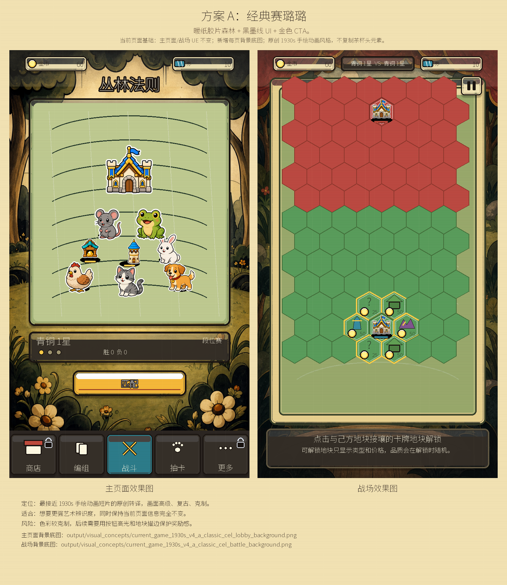
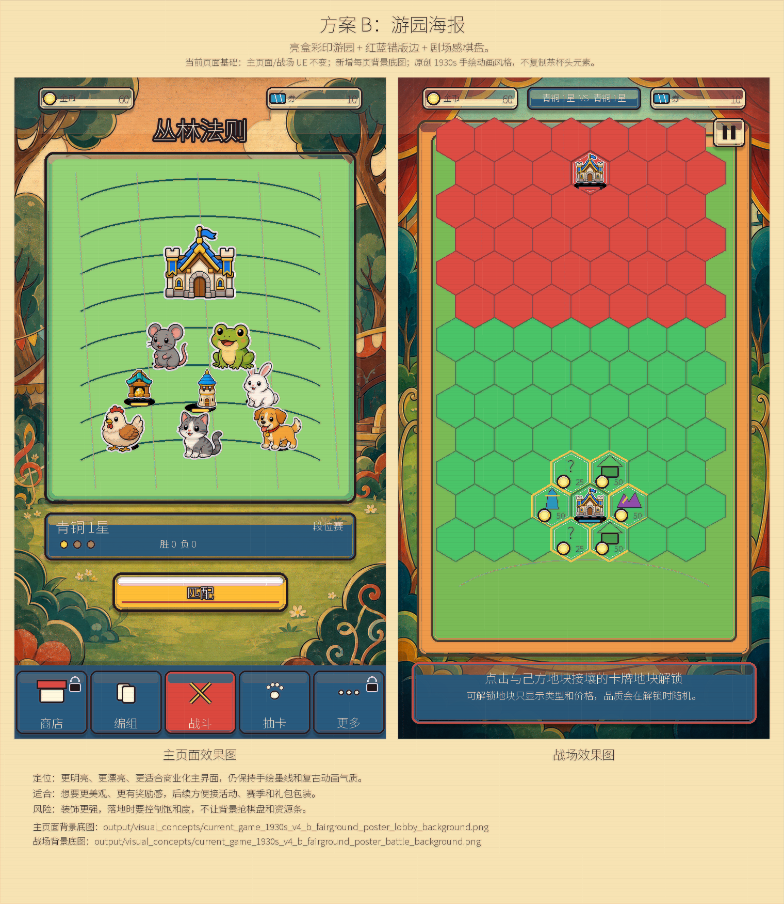
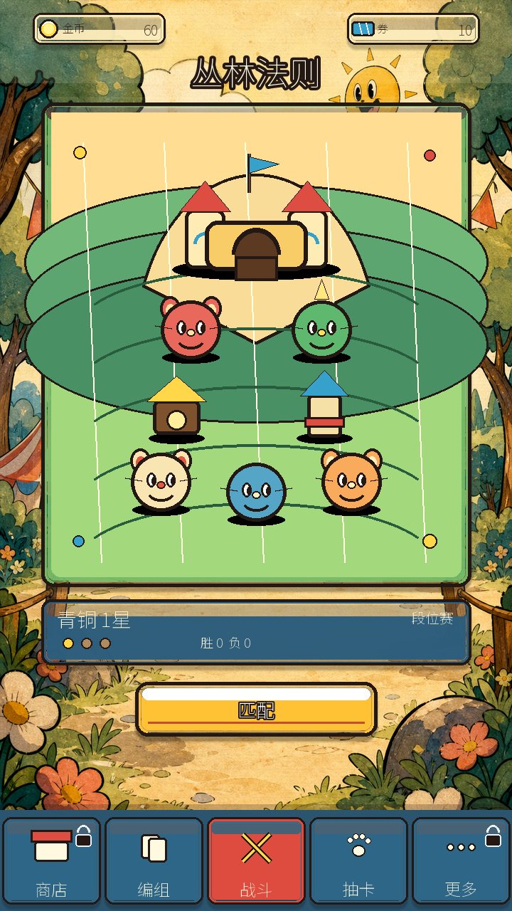
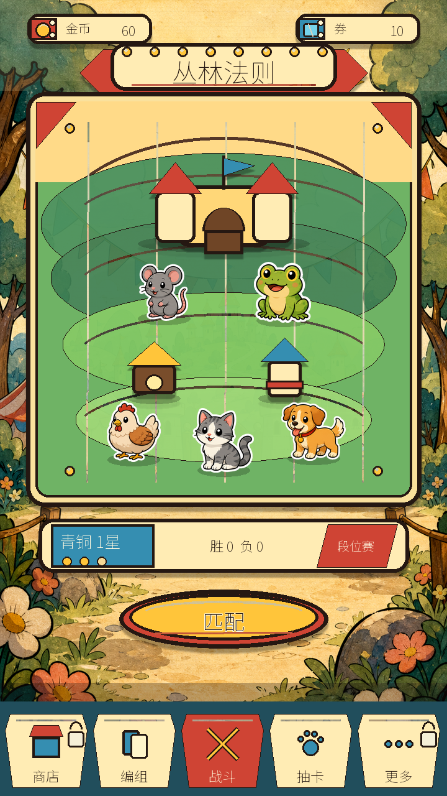
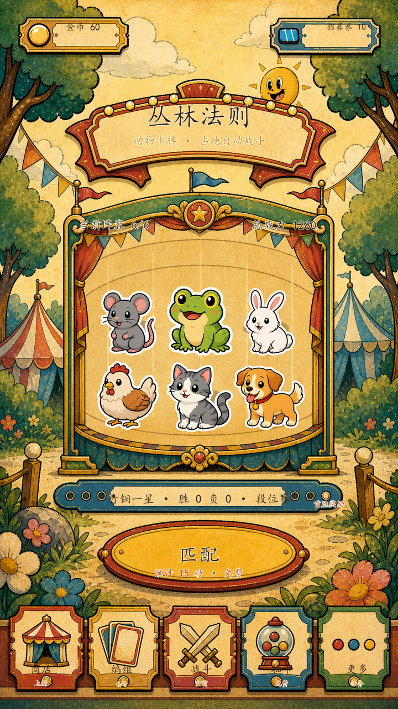
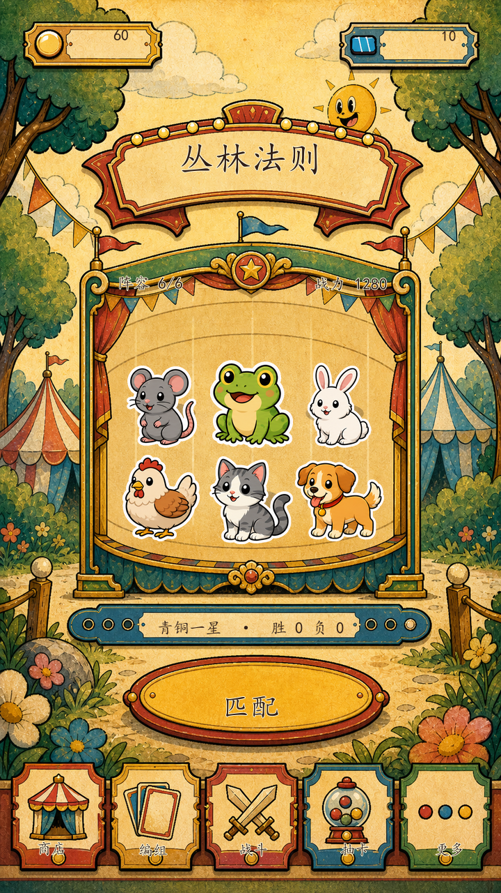
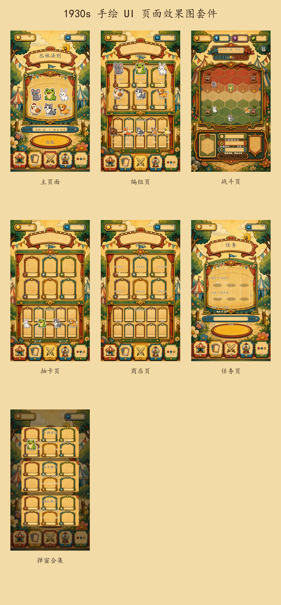
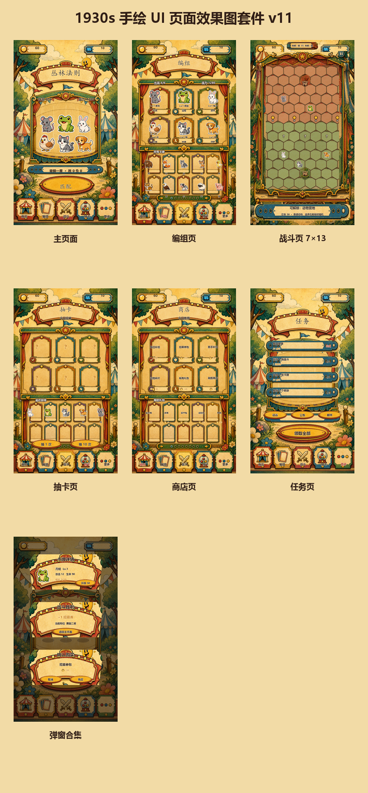
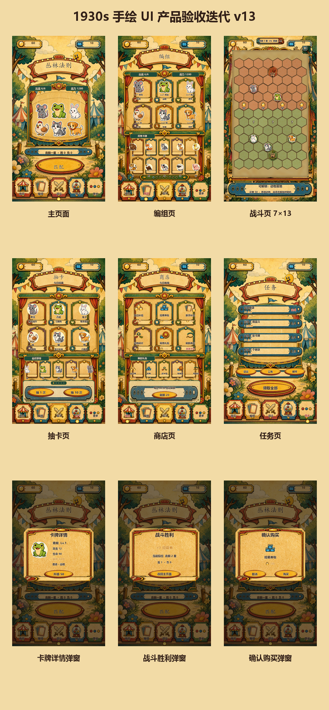
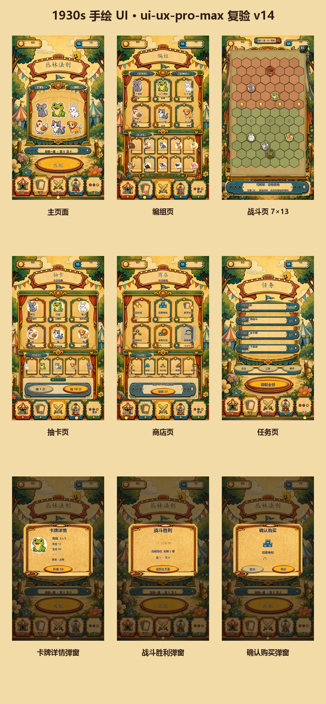

# 当前页面 1930s 手绘动画美术方案

生成日期：2026-07-10

本轮忽略之前的设计，从当前正在使用的主页面和战场页出发，只做设计评审图，不应用到游戏里。

风格学习范围：转译 1930s 橡皮管动画、手绘赛璐璐、胶片颗粒、复古海报印刷与墨线质感；不复制茶杯头角色、Logo、专有造型、关卡或 UI。

## 硬性要求

- 主页面和战场都生成独立背景底图。
- 当前页面信息、布局、控件位置、点击区域和点击反馈不变。
- 效果图只展示美术升级方向，不进入 Godot 实装。

## 方案总览

| 方案 | 名称 | 视觉句子 | 定位 | 主页面背景 | 战场背景 | 总览图 |
| --- | --- | --- | --- | --- | --- | --- |
| A | 经典赛璐璐 | 暖纸胶片森林 + 黑墨线 UI + 金色 CTA。 | 最接近 1930s 手绘动画短片的原创转译，画面高级、复古、克制。 | `output/visual_concepts/current_game_1930s_v4_a_classic_cel_lobby_background.png` | `output/visual_concepts/current_game_1930s_v4_a_classic_cel_battle_background.png` | `output/visual_concepts/current_game_1930s_v4_a_classic_cel_sheet.png` |
| B | 游园海报 | 亮盒彩印游园 + 红蓝错版边 + 剧场感棋盘。 | 更明亮、更漂亮、更适合商业化主界面，仍保持手绘墨线和复古动画气质。 | `output/visual_concepts/current_game_1930s_v4_b_fairground_poster_lobby_background.png` | `output/visual_concepts/current_game_1930s_v4_b_fairground_poster_battle_background.png` | `output/visual_concepts/current_game_1930s_v4_b_fairground_poster_sheet.png` |
| C | 轻欢游园背景版 | 阳光游园入口 + 手绘墨线 + 明亮复古 CTA。 | 主页面背景气氛成立，但 UI 仍混有旧按钮体系，暂不作为最终主推。 | `output/visual_concepts/current_game_1930s_v5_c_cheerful_fair_lobby_background.png` | 暂不生成 | `output/visual_concepts/current_game_1930s_v5_c_cheerful_fair_lobby_mockup.png` |
| D | 全套手绘主页面 | 票券资源条 + 舞台海报框 + 椭圆匹配按钮 + 剪纸票券导航。 | 针对反馈重做整套主页面 UI，动物图暂时保留项目原图不改。 | `output/visual_concepts/current_game_1930s_v6_d_full_rubberhose_lobby_background.png` | 暂不生成 | `output/visual_concepts/current_game_1930s_v6_d_full_rubberhose_lobby_mockup.png` |
| E | AI 手绘信息完整版 | AI 手绘整套 UI 底稿 + 完整页面信息 + 原项目动物 PNG 合成。 | 当前最接近目标的主页面效果图：不是空白皮肤稿，也不是简单几何按钮，而是带真实信息的完整页面。 | `output/visual_concepts/current_game_1930s_v8_f_ai_painted_info_ui_background.png` | 暂不生成 | `output/visual_concepts/current_game_1930s_v8_f_ai_painted_info_ui_lobby_mockup.png` |
| F | 干净信息主页面 | 去掉图标旁冗余文字，保留并放大必要信息。 | 当前主页面推荐版，已按标注删除金币/券等冗余标签，保留信息更清楚。 | `output/visual_concepts/current_game_1930s_v9_g_ai_painted_clean_info_ui_background.png` | 暂不生成 | `output/visual_concepts/current_game_1930s_v9_g_ai_painted_clean_info_ui_lobby_mockup.png` |

## 方案 A：经典赛璐璐

- 视觉句子：暖纸胶片森林 + 黑墨线 UI + 金色 CTA。
- 定位：最接近 1930s 手绘动画短片的原创转译，画面高级、复古、克制。
- 适合：想要更强艺术辨识度，同时保持当前页面信息完全不变。
- 风险：色彩较克制，后续需要用按钮高光和地块描边保护奖励感。
- 主页面背景底图：`output/visual_concepts/current_game_1930s_v4_a_classic_cel_lobby_background.png`
- 战场背景底图：`output/visual_concepts/current_game_1930s_v4_a_classic_cel_battle_background.png`
- 主页面效果图：`output/visual_concepts/current_game_1930s_v4_a_classic_cel_lobby_mockup.png`
- 战场效果图：`output/visual_concepts/current_game_1930s_v4_a_classic_cel_battle_mockup.png`

## 方案 B：游园海报

- 视觉句子：亮盒彩印游园 + 红蓝错版边 + 剧场感棋盘。
- 定位：更明亮、更漂亮、更适合商业化主界面，仍保持手绘墨线和复古动画气质。
- 适合：想要更美观、更有奖励感，后续方便接活动、赛季和礼包包装。
- 风险：装饰更强，落地时要控制饱和度，不让背景抢棋盘和资源条。
- 主页面背景底图：`output/visual_concepts/current_game_1930s_v4_b_fairground_poster_lobby_background.png`
- 战场背景底图：`output/visual_concepts/current_game_1930s_v4_b_fairground_poster_battle_background.png`
- 主页面效果图：`output/visual_concepts/current_game_1930s_v4_b_fairground_poster_lobby_mockup.png`
- 战场效果图：`output/visual_concepts/current_game_1930s_v4_b_fairground_poster_battle_mockup.png`

## 方案 C：轻欢游园背景版

- 视觉句子：阳光游园入口 + 手绘墨线 + 明亮复古 CTA。
- 定位：按“学习 2D 茶杯头的轻松欢快气质”进行原创转译，只借鉴 1930s 橡皮管动画、手绘墨线、水彩纸感和胶片颗粒，不复制茶杯头角色、Logo、专有造型、关卡或 UI。
- 适合：想要主页面更可爱、更明亮、更容易建立亲和力，同时仍保持当前主页面 UE。
- 风险：这一版主要解决了背景和气氛，资源条、按钮、段位板、底部导航仍和旧方案不够统一，因此不作为当前主推。
- 本轮范围：只生成主页面效果图，不生成战场图，不进入 Godot 实装。
- AI 背景源图：`output/visual_concepts/current_game_1930s_v5_c_cheerful_fair_lobby_bg_source.png`
- 主页面背景底图：`output/visual_concepts/current_game_1930s_v5_c_cheerful_fair_lobby_background.png`
- 主页面效果图：`output/visual_concepts/current_game_1930s_v5_c_cheerful_fair_lobby_mockup.png`

## 方案 D：全套手绘主页面

- 视觉句子：票券资源条 + 舞台海报框 + 椭圆匹配按钮 + 剪纸票券导航。
- 定位：针对“不要只换背景、不要沿用旧按钮”的反馈重做整套主页面效果图；所有 UI 面板、按钮、导航、标题和主场景框都改为原创 1930s 手绘动画转译。
- 动物约束：暂时不改动物图片，中央展示区继续使用项目现有动物 PNG，只调整承载舞台、阴影和排布效果图。
- 适合：作为下一轮主页面视觉确认的优先候选；如果确认 OK，再继续设计战场页或拆分 UI 组件。
- 风险：动物图与复古 UI 仍存在风格差异，这是本轮按“先不改动物图片”的结果；后续若确认整体方向，再单独处理动物族群美术统一。
- 本轮范围：只生成主页面效果图，不生成战场图，不进入 Godot 实装。
- 主页面背景底图：`output/visual_concepts/current_game_1930s_v6_d_full_rubberhose_lobby_background.png`
- 主页面效果图：`output/visual_concepts/current_game_1930s_v6_d_full_rubberhose_lobby_mockup.png`

## 方案 E：AI 手绘信息完整版

- 视觉句子：AI 手绘整套 UI 底稿 + 完整页面信息 + 原项目动物 PNG 合成。
- 定位：针对“要带信息的完整 UI 页面”的反馈制作。资源条、标题牌、中央舞台框、段位条、匹配按钮、底部导航图标都来自同一张 AI 手绘复古 UI 底稿，不再使用程序简单几何按钮。
- 信息完整度：包含金币、招募券、主标题、玩法副标、当前阵容、总战力、段位胜负、段位赛、首胜奖励、匹配预计时间、底部入口与入口状态。
- 动物约束：暂时不改动物图片，中央舞台中的动物继续使用项目现有 PNG，只做合成定位。
- 适合：作为当前主页面风格确认的优先候选；确认 OK 后，再继续做战场页同风格效果图或拆分 UI 组件状态。
- 风险：动物图仍与 1930s 手绘 UI 存在风格差异，这是本轮按“暂时不要改动物图片”的结果；后续若确认整体页面方向，再单独处理动物统一。
- 本轮范围：只生成主页面效果图，不生成战场图，不进入 Godot 实装。
- AI 手绘底稿：`output/visual_concepts/current_game_1930s_v7_e_ai_painted_full_ui_base_with_icons.png`
- 主页面背景底图：`output/visual_concepts/current_game_1930s_v8_f_ai_painted_info_ui_background.png`
- 主页面效果图：`output/visual_concepts/current_game_1930s_v8_f_ai_painted_info_ui_lobby_mockup.png`

## 方案 F：干净信息主页面

- 视觉句子：图标表达资源类型 + 必要文字信息清晰保留。
- 定位：针对标注反馈清理主页面信息层。金币、招募券等已有图标表达的文字被删除，只保留数值；玩法副标、首胜奖励、底部小状态等冗余小字被删除。
- 保留信息：资源数值、主标题、阵容数量、战力、段位胜负、匹配按钮、底部主入口名。
- 动物约束：仍不改动物图片，只使用项目现有动物 PNG 合成。
- 当前建议：主页面以 F 作为评审基准，后续页面套件按 F 的信息密度执行。
- 主页面背景底图：`output/visual_concepts/current_game_1930s_v9_g_ai_painted_clean_info_ui_background.png`
- 主页面效果图：`output/visual_concepts/current_game_1930s_v9_g_ai_painted_clean_info_ui_lobby_mockup.png`

## 页面套件 v10

本轮按“AI 手绘底稿/组件 + 清晰中文信息叠层 + 不改动物图片”的流程，继续制作其他页面效果图。所有页面仍然只是视觉评审图，不进入 Godot 实装。

| 页面 | 文件 | 制作说明 |
| --- | --- | --- |
| 主页面 | `output/visual_concepts/current_game_1930s_v9_g_ai_painted_clean_info_ui_lobby_mockup.png` | 推荐主页面基准，清理冗余文字 |
| 编组页 | `output/visual_concepts/current_game_1930s_v10_h_deck_page_mockup.png` | AI 手绘编组底稿 + 当前动物 PNG + 编组信息 |
| 战斗页 | `output/visual_concepts/current_game_1930s_v10_h_battle_page_mockup.png` | AI 手绘战斗底稿 + 棋盘信息 + 当前动物 PNG |
| 抽卡页 | `output/visual_concepts/current_game_1930s_v10_h_gacha_page_mockup.png` | 复用 AI 手绘卡框底稿 + 抽卡信息 |
| 商店页 | `output/visual_concepts/current_game_1930s_v10_h_shop_page_mockup.png` | 复用 AI 手绘卡框底稿 + 商品信息 |
| 更多/任务页 | `output/visual_concepts/current_game_1930s_v10_h_more_tasks_page_mockup.png` | 任务信息页效果图 |
| 弹窗合集 | `output/visual_concepts/current_game_1930s_v10_h_popup_sheet_mockup.png` | 卡牌详情、战斗胜利、确认购买三个弹窗效果 |

说明：抽卡页和商店页的独立 AI 生成请求曾遇到网络错误，因此本轮先用已生成成功的 AI 手绘卡框页面作为组件基底进行效果图合成。后续若确认方向，可再为这些页面补独立 AI 底稿。

## 页面套件 v11：信息对齐与原尺寸战场

本轮继续只制作视觉评审图，不进入 Godot 实装。页面沿用已生成的 AI 手绘底稿和项目现有动物 PNG，重点修正信息与承载组件的对齐关系，并恢复战斗页原有棋盘规格。

- 资源栏：数值以图标右侧的有效空白内框为基准做水平、垂直居中，不再按整张票券或旧文字坐标摆放。
- 页面标题与分区标题：放回对应横幅、分隔条或按钮的有效内框，避免压住边框、装饰和动物。
- 按钮文字：只放在真实按钮底图内，不再落在分页条或空白装饰区。
- 战斗棋盘：严格采用当前工程 `7 x 13` 单元格；中间战斗内场保持 `592 x 982`，外框保持 `648 x 1038`，只替换为 1930s 手绘资源皮肤。
- 动物约束：继续直接使用项目现有动物 PNG，不重绘、不风格化。

| 页面 | 文件 | 本轮校正 |
| --- | --- | --- |
| 主页面 | `output/visual_concepts/current_game_1930s_v11_i_aligned_lobby_mockup.png` | 金币与招募券数值回到各自空白栏中心 |
| 编组页 | `output/visual_concepts/current_game_1930s_v11_i_aligned_deck_page_mockup.png` | 标题、阵容摘要、卡牌名和状态按卡框内框重新排布 |
| 战斗页 | `output/visual_concepts/current_game_1930s_v11_i_aligned_battle_page_mockup.png` | 恢复原尺寸战斗区与 `7 x 13` 棋盘 |
| 抽卡页 | `output/visual_concepts/current_game_1930s_v11_i_aligned_gacha_page_mockup.png` | 分区标题与抽取按钮文字回到对应组件内 |
| 商店页 | `output/visual_concepts/current_game_1930s_v11_i_aligned_shop_page_mockup.png` | 商品名与价格分别对齐卡面和价格带 |
| 更多/任务页 | `output/visual_concepts/current_game_1930s_v11_i_aligned_more_tasks_page_mockup.png` | 任务标题、奖励和进度统一进入任务票券 |
| 弹窗合集 | `output/visual_concepts/current_game_1930s_v11_i_aligned_popup_sheet_mockup.png` | 标题、内容、按钮按弹窗内框分层排布 |
| 总览 | `output/visual_concepts/current_game_1930s_v11_i_aligned_page_set_overview.png` | 汇总本轮全部页面效果图 |

说明：本轮尝试在线编辑新的空白战斗底稿时遇到网络错误，因此没有切换到需要 API Key 的备用模型；战斗页改为复用已生成的 AI 手绘纸张、边框和舞台资源，再按当前工程坐标确定性重建棋盘。

## 产品负责人验收：第 1 轮

验收结论：**不通过**。v11 可作为风格方向稿，但仍存在四项实装前阻断问题：战斗外框侵入有效内场、战斗单位和资源过小、抽卡与商店仍有占位内容、三个弹窗被拼贴在同一页面。

v12 必须达到以下验收线：

1. 战斗页保持 `648 x 1038` 外框与 `592 x 982` 内场，外框不透明像素不得进入内场，`7 x 13` 共 91 格完整可见。
2. 战斗动物显示提高到 `56-64px`，资源图标提高到 `32-36px`，关键数值不小于 `18px`；动物源图保持不变。
3. 抽卡页和商店页移除问号与空商品卡，核心卡必须同时具备图像、名称、状态或价格。
4. 卡牌详情、战斗胜利、确认购买分别输出独立 `720 x 1280` 状态图，每张只展示一个弹窗，背景信息完整并统一压暗。
5. 全套统一资源数值居中、状态栏、导航选中态、标题槽、按钮按压语言和字号规则，消除控件重叠。

## 产品负责人验收：第 2 轮

验收结论：**有条件通过，仅允许进入 v13 精修，不代表允许实装。** v12 已清除功能性 P0：91 格完整显示，战斗单位与资源可读，抽卡/商店无占位，三个弹窗已独立输出。

v12 复验总览：`output/visual_concepts/current_game_1930s_v12_j_product_review_page_set_overview.png`

v13 聚焦以下视觉质量问题：

1. 战斗内场增加半透明手绘内阴影与纸张晕边，连接外框但不得遮挡任何格子。
2. 抽卡和商店底部操作底板降低约 25% 视觉高度，减少蓝色面积、粗边和装饰孔。
3. 分页圆点独立进入清晰分隔带，不与按钮底板争夺层级。
4. 商店商品图标必须为透明底切片，彻底清除方形与横向裁切边。
5. 三类弹窗使用保角拉伸边框，保持四角比例、描边粗细和纹理清晰度。
6. 统一弹窗标题上边距、正文中轴和操作按钮基线，并以 50% 缩放复查。

## 页面套件 v13：产品负责人验收通过

v13 完成三轮“产品负责人验收 -> 修改 -> 复验”闭环。最终结论为：**通过，可冻结为等待用户确认的最终效果图；不代表允许进入 Godot 实装。**

| 页面 | 文件 | 最终状态 |
| --- | --- | --- |
| 主页面 | `output/visual_concepts/current_game_1930s_v13_k_product_approved_lobby_mockup.png` | 资源数值、双栏状态和导航选中态统一 |
| 编组页 | `output/visual_concepts/current_game_1930s_v13_k_product_approved_deck_page_mockup.png` | 卡框主体、名称基线和状态栏统一 |
| 战斗页 | `output/visual_concepts/current_game_1930s_v13_k_product_approved_battle_page_mockup.png` | `7 x 13` 完整可见，单位/资源放大，纸张内阴影通过验收 |
| 抽卡页 | `output/visual_concepts/current_game_1930s_v13_k_product_approved_gacha_page_mockup.png` | 无占位卡，分页与按钮分层，操作区减重 |
| 商店页 | `output/visual_concepts/current_game_1930s_v13_k_product_approved_shop_page_mockup.png` | 商品图像齐全，刷新图标透明化，正常/不可购买状态明确 |
| 更多/任务页 | `output/visual_concepts/current_game_1930s_v13_k_product_approved_more_tasks_page_mockup.png` | 任务奖励和进度字号统一 |
| 卡牌详情弹窗 | `output/visual_concepts/current_game_1930s_v13_k_product_approved_popup_card_detail_mockup.png` | 独立完整页面，保角边框和动作层级通过验收 |
| 战斗胜利弹窗 | `output/visual_concepts/current_game_1930s_v13_k_product_approved_popup_battle_victory_mockup.png` | 独立完整页面，标题/奖励/返回动作明确 |
| 确认购买弹窗 | `output/visual_concepts/current_game_1930s_v13_k_product_approved_popup_purchase_mockup.png` | 独立完整页面，商品/价格/双按钮层级明确 |
| 总览 | `output/visual_concepts/current_game_1930s_v13_k_product_approved_page_set_overview.png` | 九张页面按 3 x 3 汇总 |

## 产品负责人验收：最终轮

最终结论：**通过。P0：无；P1：无。**

- 战斗内场纸张晕边与外框衔接达成，未重新遮挡格子。
- 抽卡/商店底板高度、蓝色面积和装饰重量已降低。
- 分页圆点进入独立分隔带，不再与按钮或卡片重叠。
- 商店刷新相关图标已清除方形背景和横向裁切。
- 三类弹窗采用保角拉伸，四角比例、描边粗细和纹理清晰度可接受。
- 弹窗标题、正文中轴和按钮基线统一，在套件总览缩放下仍可辨认。

冻结规则：继续保持纯效果图状态。只有用户明确说“实装”后，才允许把本视觉方案拆分并应用到 Godot。

## 当前结论

当前优先评审并冻结页面套件 v13。v13 已完成三轮产品负责人验收并通过；在用户明确确认前继续保持纯效果图状态，不直接进入实装。A-F 与 v10-v12 继续保留为历史对照，不作为当前推荐方案。

## 页面套件 v14：ui-ux-pro-max 重新评审计划

用户要求按公共流程 v1.9 重新生成整套美术效果图，并明确说明是否使用 `ui-ux-pro-max`。本轮已从用户提供的 GitHub 路径安装并实际运行该 skill 的 design-system、UX、style、color 和 typography 查询；详细取舍、design tokens 与 QA Gate 见 `docs/CURRENT_GAME_1930S_UI_UX_PRO_MAX_AUDIT.md`。

v14 继续锁定现有 UE 和动物资源，只解决以下 UI 质量问题：

1. 用统一手绘票券组件替换残留的简单圆角状态块，降低组件与背景的风格割裂。
2. 明确主 CTA、次操作、选中、已完成和不可购买状态，避免只靠颜色或相同按钮材质表达。
3. 继续保证金币、票券、价格等动态数字在稳定槽位居中，防止位数变化造成布局跳动。
4. 保持战斗页 `7 x 13`、91 格、`592 x 982` 内场和动物原图不变。
5. 所有页面和三个独立弹窗继续输出完整中文信息，不只输出背景或组件样张。

本节是生成前规格，不代表已经通过产品负责人验收，更不代表允许 Godot 实装。

## 页面套件 v14：ui-ux-pro-max 复验通过

本轮实际运行 `ui-ux-pro-max` 后，按游戏化取舍完成三轮“Producer / Art Director / UI Programmer / QA Lead -> 修改 -> 复验”。最终结论：**效果图通过，P0：无，P1：无；继续等待用户确认，不允许实装。**

| 页面 | 文件 | v14 结果 |
| --- | --- | --- |
| 主页面 | `output/visual_concepts/current_game_1930s_v14_l_uiux_pro_max_reviewed_lobby_mockup.png` | 资源数字保持居中；状态条改用手绘票券；战斗入口选中提示增强 |
| 编组页 | `output/visual_concepts/current_game_1930s_v14_l_uiux_pro_max_reviewed_deck_page_mockup.png` | 状态条、分区条和导航状态统一；动物原图不变 |
| 战斗页 | `output/visual_concepts/current_game_1930s_v14_l_uiux_pro_max_reviewed_battle_page_mockup.png` | 与 v13 哈希一致；`7 x 13`、91 格和战斗内场完全锁定 |
| 抽卡页 | `output/visual_concepts/current_game_1930s_v14_l_uiux_pro_max_reviewed_gacha_page_mockup.png` | 抽 10 次为主 CTA，抽 1 次为次操作 |
| 商店页 | `output/visual_concepts/current_game_1930s_v14_l_uiux_pro_max_reviewed_shop_page_mockup.png` | 不可购买商品使用褪色纸张 + 余额不足文字，保留手绘卡框 |
| 更多/任务页 | `output/visual_concepts/current_game_1930s_v14_l_uiux_pro_max_reviewed_more_tasks_page_mockup.png` | 已完成状态不只靠颜色；三个工具入口降级，领取全部保持主 CTA |
| 卡牌详情弹窗 | `output/visual_concepts/current_game_1930s_v14_l_uiux_pro_max_reviewed_popup_card_detail_mockup.png` | 背景退后，属性和唯一升级操作层级清楚 |
| 战斗胜利弹窗 | `output/visual_concepts/current_game_1930s_v14_l_uiux_pro_max_reviewed_popup_battle_victory_mockup.png` | 奖励、段位和唯一返回操作顺序明确 |
| 确认购买弹窗 | `output/visual_concepts/current_game_1930s_v14_l_uiux_pro_max_reviewed_popup_purchase_mockup.png` | 购买为主 CTA，取消为次操作 |
| 大厅背景 | `output/visual_concepts/current_game_1930s_v14_l_uiux_pro_max_reviewed_lobby_background.png` | 与 v13 哈希一致，场景和 UE 未漂移 |
| 总览 | `output/visual_concepts/current_game_1930s_v14_l_uiux_pro_max_reviewed_page_set_overview.png` | 9 张完整页面按 3 x 3 汇总 |

验收过程：

1. 首轮发现商店禁用洗色覆盖卡框，记为 P1，不通过。
2. 第二轮将洗色收回内芯，P1 清零；Art Director 要求继续柔化规则边缘，记为 P2。
3. 最终轮改为柔和褪色纸张，卡框、图标、标题和余额不足原因均可辨认，P2 关闭。

详细 skill 查询、采用/拒绝项、design tokens、对比度和 QA 证据见 `docs/CURRENT_GAME_1930S_UI_UX_PRO_MAX_AUDIT.md`。

冻结规则保持不变：v14 仍然只是效果图。用户明确说“实装”前，不修改 Godot UI、场景、脚本、运行时资源绑定、输入逻辑或点击区域。

## 当前结论（v14）

当前优先评审页面套件 v14。v14 是在 v13 已通过美术方向上，由 `ui-ux-pro-max` 补齐设计系统、状态层级、动态信息稳定性和 QA 证据后的新推荐版；v13 及更早版本继续保留为历史对照。
