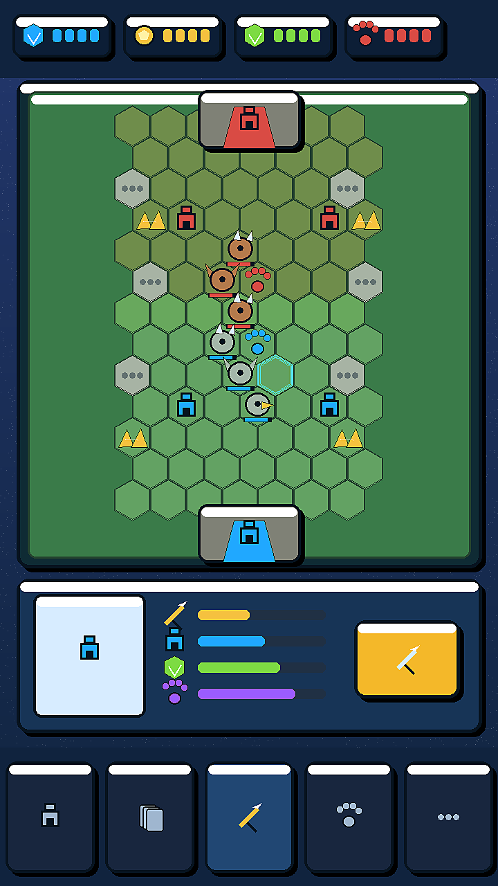
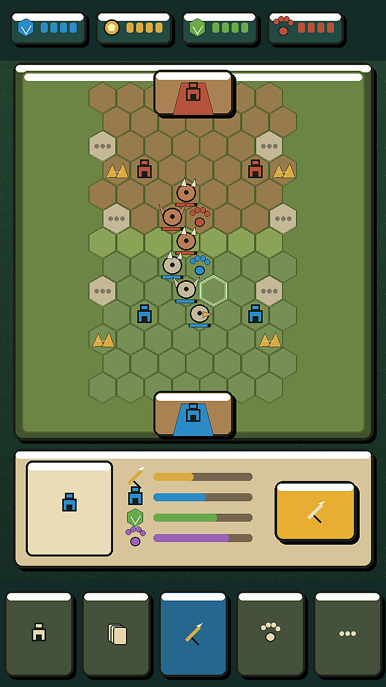
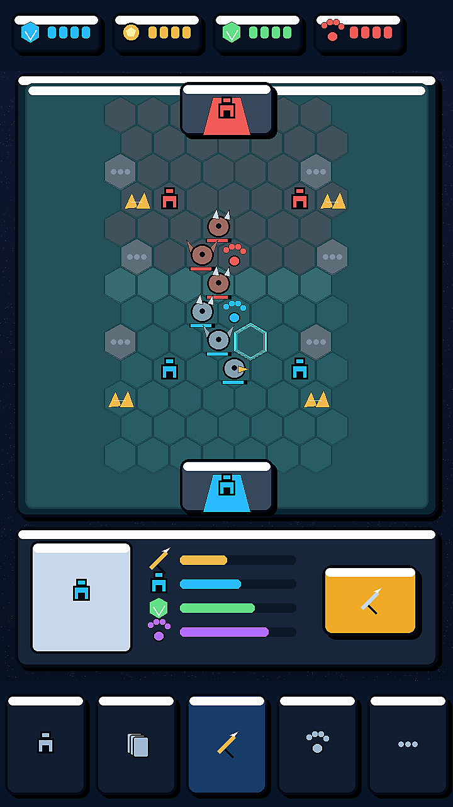
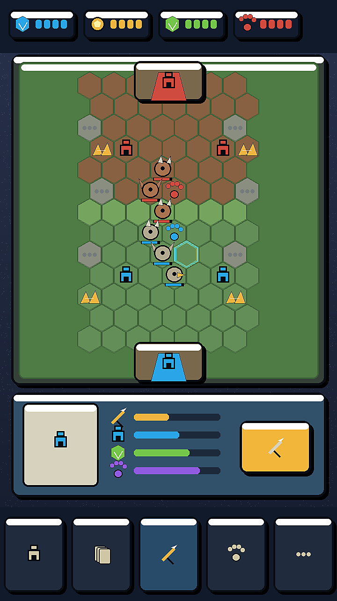

# 战城大师 2D UE 锁定页面美术升级方案

生成日期：2026-07-06  
用途：在不改变任何 UE 的前提下，为当前战斗页提供多版 2D 美术皮肤效果图供审核。

## 1. 本轮硬约束

本轮不是重新设计页面，也不是重新设计交互。页面信息和点击反馈必须完全不变。

锁定内容：

- 页面信息不变：资源、棋盘、地块状态、选中信息、按钮、底部导航仍使用当前结构。
- 页面布局不变：顶部 HUD、中央棋盘、底部信息面板、底部导航的位置和尺寸不变。
- 点击目标不变：所有按钮、地块、卡牌/信息区、底部导航的可点击范围不变。
- 状态含义不变：己方、敌方、未解锁、可选中、选中、建筑、单位、资源点的含义不变。
- 点击反馈不变：只保留现有选中高亮、面板高亮和按钮反馈节奏，不新增交互反馈。
- 维度不变：本项目按 2D-first 执行，不使用 3D、2.5D、等距场景或透视重构。

允许升级内容：

- 面板 2D 皮肤。
- 描边、硬阴影、按钮材质和卡槽质感。
- 地块、建筑、资源点、单位和图标的 2D 表现。
- 色彩体系、明度层级、品质感和移动端小尺寸可读性。

## 2. 固定线框

四个方案使用同一套固定坐标和信息区：

| 区域 | 锁定范围 | 说明 |
| --- | --- | --- |
| 顶部 HUD | 顶部横条，4 个资源/状态槽 | 只换资源槽皮肤，不增减信息 |
| 中央棋盘 | 7 列 x 13 行六边形地块 | 棋盘位置、地块数量、地块状态不变 |
| 战斗对象 | 上下基地、塔、金矿、营地、单位、锁定地块 | 只换 2D 图标和材质，不改玩法含义 |
| 底部信息面板 | 左侧图标、中部属性条、右侧 CTA | 控件位置不变，只换面板皮肤 |
| 底部导航 | 5 个等宽导航槽 | 数量、位置、当前选中态不变 |

## 3. 多方案总览

| 方案 | 文件 | 核心方向 | 取舍 |
| --- | --- | --- | --- |
| A 清爽街机蓝 | `output/visual_concepts/current_game_2d_ue_locked_option_a_clean_arcade.png` | 最接近当前街机 UI，清晰、安全 | 高辨识度来自蓝色 UI 和清楚地块，个性相对保守 |
| B 纸雕丛林 | `output/visual_concepts/current_game_2d_ue_locked_option_b_paper_jungle.png` | 更温和、更轻量，适合 2D 手绘方向 | 高级感靠材质和纸感，不适合过多粒子或强光效 |
| C 晶体夜色 | `output/visual_concepts/current_game_2d_ue_locked_option_c_crystal_night.png` | 品质感最强，适合高阶主题 | 深色 UI 要严格控制可读性和对比 |
| D 玩具棋盘 | `output/visual_concepts/current_game_2d_ue_locked_option_d_toy_board.png` | 稳定、亲和、有棋盘玩具感 | 需要后续加强图标家族，否则会偏朴素 |

## 4. 方案 A：清爽街机蓝

美术判断：

- 优点：最安全，和当前高饱和街机方向一致；资源、棋盘、按钮的层级清楚。
- 风险：如果只沿用蓝色面板，长期视觉身份可能不够独特。
- 适合：首版正式化、快速替换当前原型 UI、最小返工路线。

## 5. 方案 B：纸雕丛林

美术判断：

- 优点：2D 感最明确，简单、干净，和动物/丛林主题天然契合。
- 风险：战斗紧张感弱于 A/C/D，需要通过按钮状态和命中反馈补强。
- 适合：轻策略、休闲、低噪声 UI 和更温和的长期运营气质。

## 6. 方案 C：晶体夜色

美术判断：

- 优点：品质感、氛围感和稀有度表达最强；适合后续高级关卡、赛季主题或高品质版本。
- 风险：深色会压低小屏可读性，必须保持地块边线、选中态和 CTA 的亮度。
- 适合：确定要走更“精致、魔法、晶体资源”的项目身份时选择。

## 7. 方案 D：玩具棋盘

美术判断：

- 优点：棋盘感明确，材质亲和，和“卡牌 + 地块 + 自动推进”玩法匹配。
- 风险：如果不加强图标细节，可能显得过于朴素。
- 适合：想要更像实体桌游、玩具棋盘、轻竞技的方向。

## 8. 推荐选择

推荐优先级：

1. A 清爽街机蓝：最适合先落地，UE 迁移风险最低。
2. B 纸雕丛林：最符合 2D-first 和“简单但品质高”的方向。
3. D 玩具棋盘：适合强化棋盘玩具感。
4. C 晶体夜色：建议作为高级主题或第二套皮肤，不建议首个默认版本直接深色化。

我建议这轮优先在 A 和 B 之间选主方向：A 更像正式手游 UI，B 更像原创 2D 风格。

## 9. 审核后下一步

用户选定方向后再推进：

1. 把选定方案拆成 UI 组件状态表：普通、选中、禁用、可购买、不可购买、点击反馈。
2. 定 2D Technical Artist 交付规格：尺寸、九宫格切片、atlas、导入设置、锚点、层级。
3. 按现有 Godot UE 坐标替换视觉绘制，不改输入逻辑和页面流程。
4. 做小屏可读性 QA：资源条、地块边线、选中态、CTA、底部导航。

当前状态：等待用户选择或要求追加版本。
