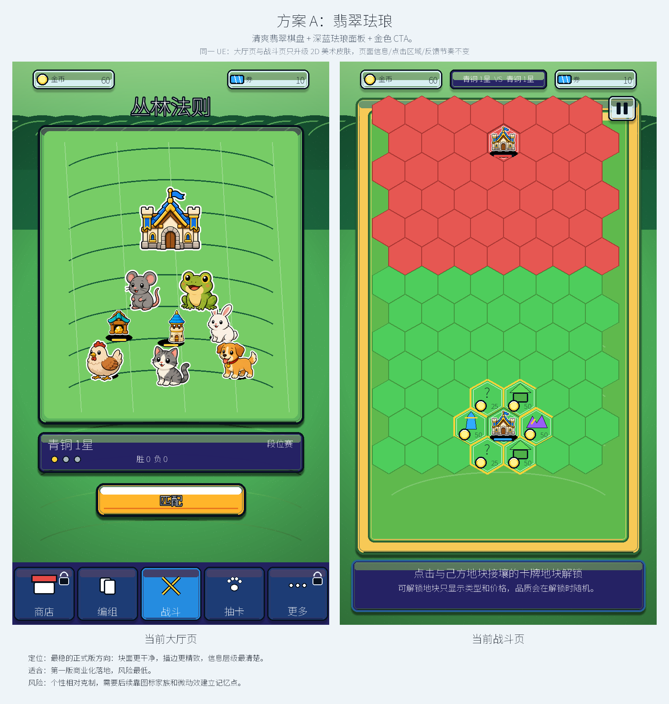
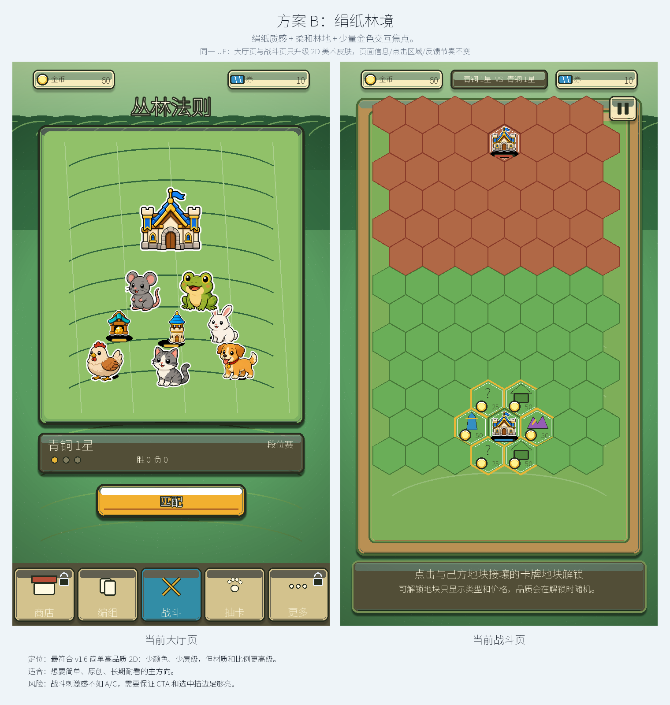
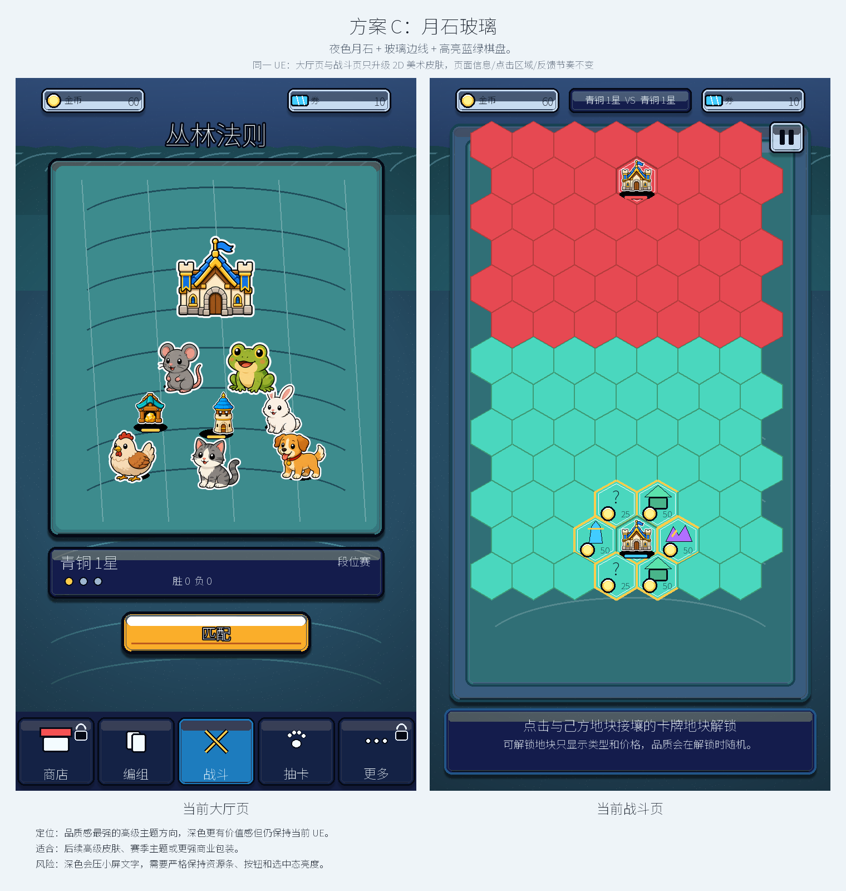
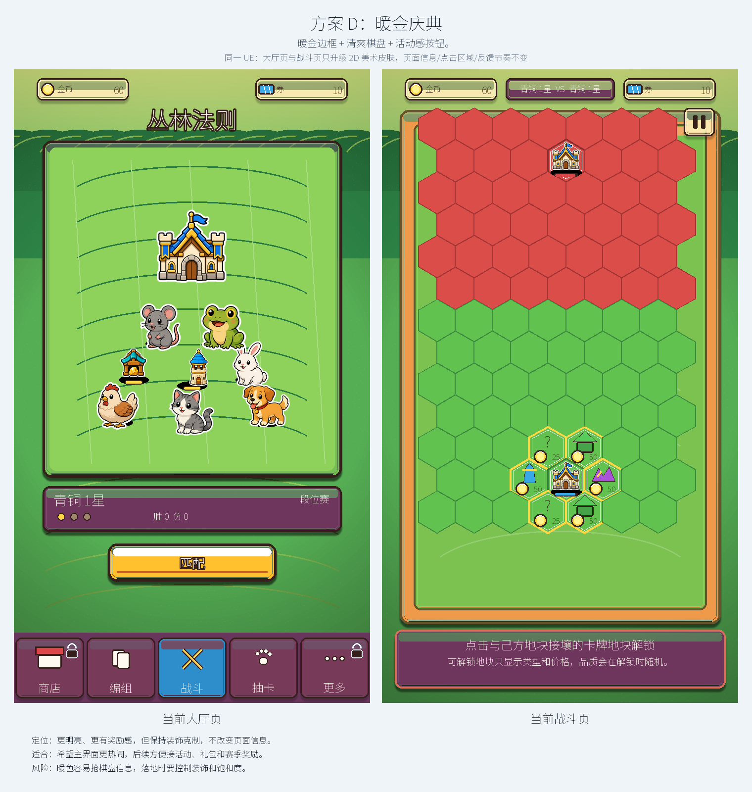

# 当前游戏 2D UE 锁定美术皮肤方案

生成日期：2026-07-06

本轮按公共流程 v1.6 的“简单高品质 2D”质量门禁再次迭代：少形状、少颜色、少层级，但提升比例、间距、对比、材质、组件复用和小屏可读性。

## 1. 硬性锁定

- 页面信息不变：大厅仍是金币、券、标题、场景、段位、匹配、底部五入口；战斗仍是金币、券、对战状态、棋盘、选中说明、暂停。
- 页面布局不变：所有矩形坐标来自 `scripts/app/main.gd` 的当前绘制结构。
- 点击目标不变：匹配按钮、底部导航、战斗地块、暂停按钮、选中信息区的范围不变。
- 点击反馈不变：不新增动效节奏，不改变当前按钮、选中、呼吸、弹出、toast 和地块 pulse 的语义。
- 维度不变：只做 2D，不使用 3D、2.5D、透视重构或等距重画。
- 资产不变：动物、建筑仍优先使用项目现有 PNG；本轮只比较面板、背景、描边、材质、色彩和图标质感。

## 2. v1.6 质量 Gate

- 每个页面只保留一个主要视觉焦点。
- 控制形状、颜色、层级和状态数量，不通过堆细节显得高级。
- 资源条、CTA、选中态、锁定态和战斗地块必须在 3 秒内读懂。
- UI 覆盖在玩法背景上仍需清晰可读。
- 所有方案都必须能拆成可复用组件：资源条、场景框、段位面板、CTA、底部导航、棋盘框、地块、暂停按钮、选中说明面板。

## 3. 当前 UE 基线

| 页面 | 锁定内容 | 本轮允许变化 |
| --- | --- | --- |
| 大厅页 | 顶部金币/券、标题、中央场景、段位面板、匹配按钮、底部五入口 | 背景质感、场景框、面板皮肤、按钮材质、描边、阴影、色彩脚本 |
| 战斗页 | 顶部金币/券、VS 状态、棋盘、可解锁地块提示、选中说明面板、暂停按钮 | 棋盘材质、地块皮肤、建筑/地块图标质感、面板和按钮皮肤 |

## 4. 方案总览

| 方案 | 名称 | 视觉句子 | 定位 | 适合 | 风险 | 评审图 |
| --- | --- | --- | --- | --- | --- | --- |
| A | 翡翠珐琅 | 清爽翡翠棋盘 + 深蓝珐琅面板 + 金色 CTA。 | 最稳的正式版方向：块面更干净，描边更精致，信息层级最清楚。 | 第一版商业化落地，风险最低。 | 个性相对克制，需要后续靠图标家族和微动效建立记忆点。 | `output/visual_concepts/current_game_ue_locked_v2_a_emerald_enamel_sheet.png` |
| B | 绢纸林境 | 绢纸质感 + 柔和林地 + 少量金色交互焦点。 | 最符合 v1.6 简单高品质 2D：少颜色、少层级，但材质和比例更高级。 | 想要简单、原创、长期耐看的主方向。 | 战斗刺激感不如 A/C，需要保证 CTA 和选中描边足够亮。 | `output/visual_concepts/current_game_ue_locked_v2_b_silk_grove_sheet.png` |
| C | 月石玻璃 | 夜色月石 + 玻璃边线 + 高亮蓝绿棋盘。 | 品质感最强的高级主题方向，深色更有价值感但仍保持当前 UE。 | 后续高级皮肤、赛季主题或更强商业包装。 | 深色会压小屏文字，需要严格保持资源条、按钮和选中态亮度。 | `output/visual_concepts/current_game_ue_locked_v2_c_moonstone_glass_sheet.png` |
| D | 暖金庆典 | 暖金边框 + 清爽棋盘 + 活动感按钮。 | 更明亮、更有奖励感，但保持装饰克制，不改变页面信息。 | 希望主界面更热闹，后续方便接活动、礼包和赛季奖励。 | 暖色容易抢棋盘信息，落地时要控制装饰和饱和度。 | `output/visual_concepts/current_game_ue_locked_v2_d_warm_festival_sheet.png` |

## 方案 A：翡翠珐琅

- 视觉句子：清爽翡翠棋盘 + 深蓝珐琅面板 + 金色 CTA。
- 定位：最稳的正式版方向：块面更干净，描边更精致，信息层级最清楚。
- 适合：第一版商业化落地，风险最低。
- 风险：个性相对克制，需要后续靠图标家族和微动效建立记忆点。
- 大厅页单图：`output/visual_concepts/current_game_ue_locked_v2_a_emerald_enamel_lobby.png`
- 战斗页单图：`output/visual_concepts/current_game_ue_locked_v2_a_emerald_enamel_battle.png`

## 方案 B：绢纸林境

- 视觉句子：绢纸质感 + 柔和林地 + 少量金色交互焦点。
- 定位：最符合 v1.6 简单高品质 2D：少颜色、少层级，但材质和比例更高级。
- 适合：想要简单、原创、长期耐看的主方向。
- 风险：战斗刺激感不如 A/C，需要保证 CTA 和选中描边足够亮。
- 大厅页单图：`output/visual_concepts/current_game_ue_locked_v2_b_silk_grove_lobby.png`
- 战斗页单图：`output/visual_concepts/current_game_ue_locked_v2_b_silk_grove_battle.png`

## 方案 C：月石玻璃

- 视觉句子：夜色月石 + 玻璃边线 + 高亮蓝绿棋盘。
- 定位：品质感最强的高级主题方向，深色更有价值感但仍保持当前 UE。
- 适合：后续高级皮肤、赛季主题或更强商业包装。
- 风险：深色会压小屏文字，需要严格保持资源条、按钮和选中态亮度。
- 大厅页单图：`output/visual_concepts/current_game_ue_locked_v2_c_moonstone_glass_lobby.png`
- 战斗页单图：`output/visual_concepts/current_game_ue_locked_v2_c_moonstone_glass_battle.png`

## 方案 D：暖金庆典

- 视觉句子：暖金边框 + 清爽棋盘 + 活动感按钮。
- 定位：更明亮、更有奖励感，但保持装饰克制，不改变页面信息。
- 适合：希望主界面更热闹，后续方便接活动、礼包和赛季奖励。
- 风险：暖色容易抢棋盘信息，落地时要控制装饰和饱和度。
- 大厅页单图：`output/visual_concepts/current_game_ue_locked_v2_d_warm_festival_lobby.png`
- 战斗页单图：`output/visual_concepts/current_game_ue_locked_v2_d_warm_festival_battle.png`

## 5. 推荐选择

优先推荐：

1. B 绢纸林境：最符合 v1.6 的“简单高品质 2D”，长期耐看，复杂度最低。
2. A 翡翠珐琅：最稳，最适合第一版商业化落地。
3. C 月石玻璃：品质感强，适合作为高级主题或后续皮肤。
4. D 暖金庆典：活动感强，适合后续运营包装。

我建议这轮优先在 B / A 之间选主方向：B 更高级克制，A 更稳妥商业化。

## 6. 审核后下一步

用户选定方向后再推进：

1. 拆出 UI 组件状态：普通、选中、禁用、可点击、不可点击、点击反馈。
2. 按当前 Godot 坐标替换绘制皮肤，不改输入逻辑和页面流程。
3. 做小屏可读性 QA：金币、券、选中说明、可解锁地块、暂停按钮、底部导航。
4. 再进入 2D Technical Artist handoff：九宫格、atlas、导入设置、锚点、层级。
