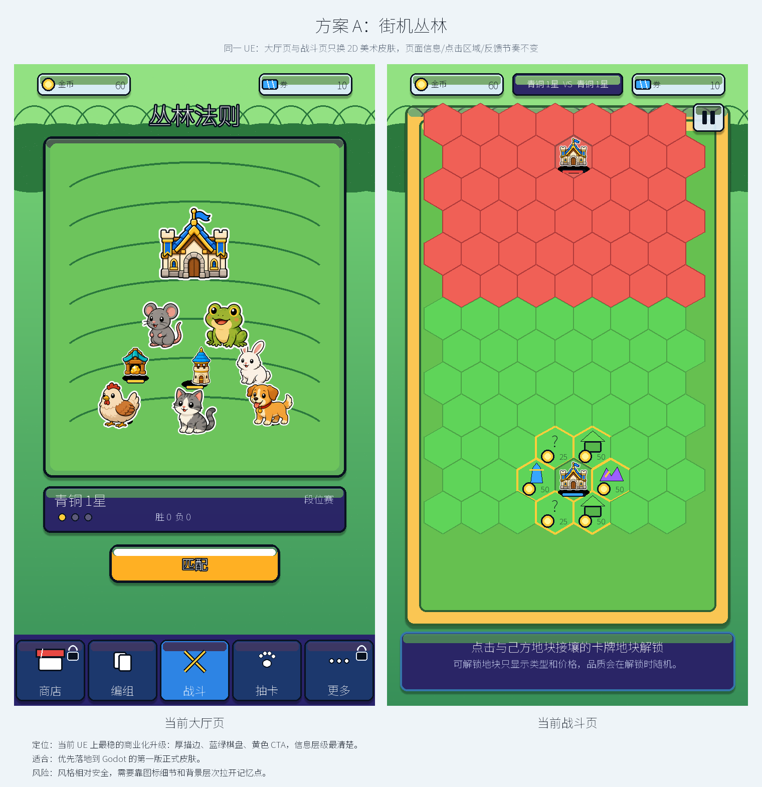
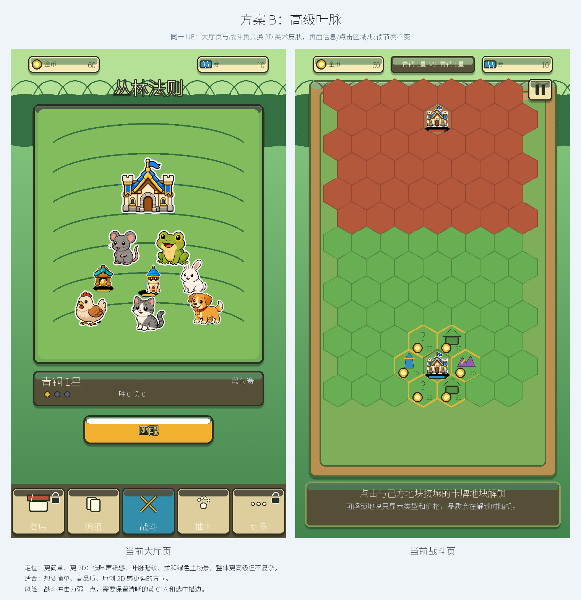
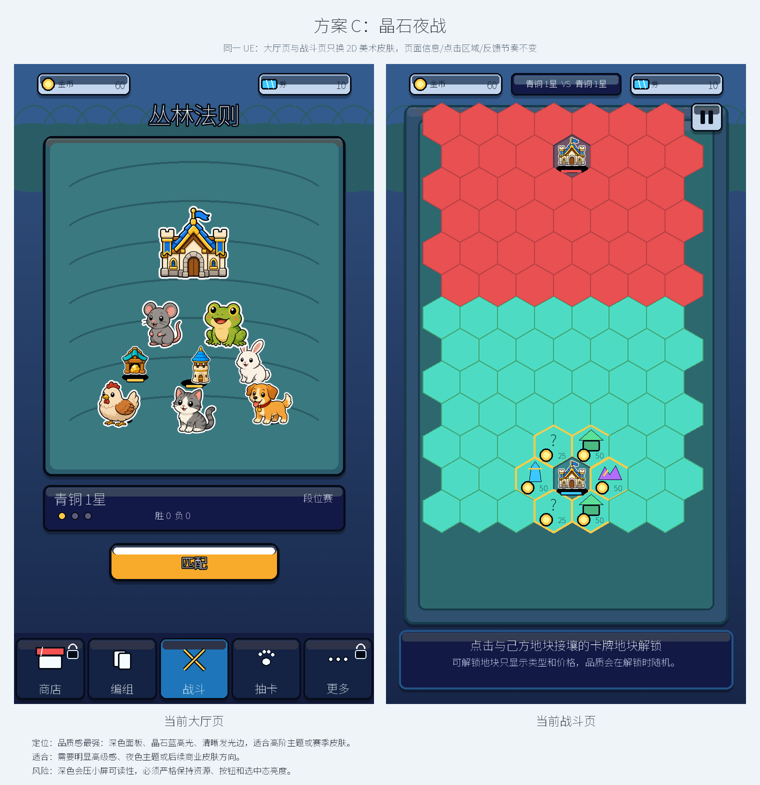
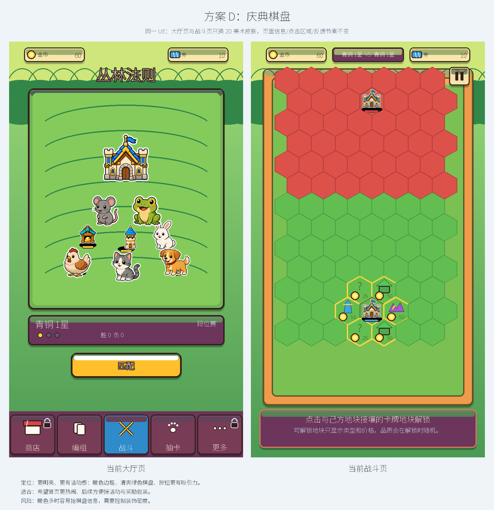

# 当前游戏 2D UE 锁定美术皮肤方案

生成日期：2026-07-06

本轮只做页面美术皮肤升级，不重新设计页面，不调整 UE。

## 1. 硬性锁定

- 页面信息不变：大厅仍是金币、券、标题、场景、段位、匹配、底部五入口；战斗仍是金币、券、对战状态、棋盘、选中说明、暂停。
- 页面布局不变：所有矩形坐标来自 `scripts/app/main.gd` 的当前绘制结构。
- 点击目标不变：匹配按钮、底部导航、战斗地块、暂停按钮、选中信息区的范围不变。
- 点击反馈不变：不新增动效节奏，不改变当前按钮、选中、呼吸、弹出、toast 和地块 pulse 的语义。
- 维度不变：只做 2D，不使用 3D、2.5D、透视重构或等距重画。
- 资产不变：动物、建筑仍优先使用项目现有 PNG；本轮只比较面板、背景、描边、材质、色彩和图标质感。

## 2. 当前 UE 基线

| 页面 | 锁定内容 | 这轮允许变化 |
| --- | --- | --- |
| 大厅页 | 顶部金币/券、标题、中央场景、段位面板、匹配按钮、底部五入口 | 背景质感、场景框、面板皮肤、按钮材质、描边和阴影 |
| 战斗页 | 顶部金币/券、VS 状态、棋盘、可解锁地块提示、选中说明面板、暂停按钮 | 棋盘材质、地块皮肤、建筑/地块图标质感、面板和按钮皮肤 |

## 3. 方案总览

| 方案 | 名称 | 定位 | 适合 | 风险 | 评审图 |
| --- | --- | --- | --- | --- | --- |
| A | 街机丛林 | 当前 UE 上最稳的商业化升级：厚描边、蓝绿棋盘、黄色 CTA，信息层级最清楚。 | 优先落地到 Godot 的第一版正式皮肤。 | 风格相对安全，需要靠图标细节和背景层次拉开记忆点。 | `output/visual_concepts/current_game_ue_locked_a_arcade_jungle_sheet.png` |
| B | 高级叶脉 | 更简单、更 2D：低噪声纸感、叶脉暗纹、柔和绿色主场景，整体更高级但不复杂。 | 想要简单、高品质、原创 2D 感更强的方向。 | 战斗冲击力弱一点，需要保留清晰的黄 CTA 和选中描边。 | `output/visual_concepts/current_game_ue_locked_b_premium_leaf_sheet.png` |
| C | 晶石夜战 | 品质感最强：深色面板、晶石蓝高光、清晰发光边，适合高阶主题或赛季皮肤。 | 需要明显高级感、夜色主题或后续商业皮肤方向。 | 深色会压小屏可读性，必须严格保持资源、按钮和选中态亮度。 | `output/visual_concepts/current_game_ue_locked_c_crystal_night_sheet.png` |
| D | 庆典棋盘 | 更明亮、更有活动感：暖色边框、清爽绿色棋盘、按钮更有吸引力。 | 希望首页更热闹、后续方便接活动与奖励包装。 | 暖色多时容易抢棋盘信息，需要控制装饰密度。 | `output/visual_concepts/current_game_ue_locked_d_festival_board_sheet.png` |

## 方案 A：街机丛林

- 定位：当前 UE 上最稳的商业化升级：厚描边、蓝绿棋盘、黄色 CTA，信息层级最清楚。
- 适合：优先落地到 Godot 的第一版正式皮肤。
- 风险：风格相对安全，需要靠图标细节和背景层次拉开记忆点。
- 大厅页单图：`output/visual_concepts/current_game_ue_locked_a_arcade_jungle_lobby.png`
- 战斗页单图：`output/visual_concepts/current_game_ue_locked_a_arcade_jungle_battle.png`

## 方案 B：高级叶脉

- 定位：更简单、更 2D：低噪声纸感、叶脉暗纹、柔和绿色主场景，整体更高级但不复杂。
- 适合：想要简单、高品质、原创 2D 感更强的方向。
- 风险：战斗冲击力弱一点，需要保留清晰的黄 CTA 和选中描边。
- 大厅页单图：`output/visual_concepts/current_game_ue_locked_b_premium_leaf_lobby.png`
- 战斗页单图：`output/visual_concepts/current_game_ue_locked_b_premium_leaf_battle.png`

## 方案 C：晶石夜战

- 定位：品质感最强：深色面板、晶石蓝高光、清晰发光边，适合高阶主题或赛季皮肤。
- 适合：需要明显高级感、夜色主题或后续商业皮肤方向。
- 风险：深色会压小屏可读性，必须严格保持资源、按钮和选中态亮度。
- 大厅页单图：`output/visual_concepts/current_game_ue_locked_c_crystal_night_lobby.png`
- 战斗页单图：`output/visual_concepts/current_game_ue_locked_c_crystal_night_battle.png`

## 方案 D：庆典棋盘

- 定位：更明亮、更有活动感：暖色边框、清爽绿色棋盘、按钮更有吸引力。
- 适合：希望首页更热闹、后续方便接活动与奖励包装。
- 风险：暖色多时容易抢棋盘信息，需要控制装饰密度。
- 大厅页单图：`output/visual_concepts/current_game_ue_locked_d_festival_board_lobby.png`
- 战斗页单图：`output/visual_concepts/current_game_ue_locked_d_festival_board_battle.png`

## 4. 推荐选择

优先推荐：

1. B 高级叶脉：最符合“足够简单，又能体现高品质高质量”。
2. A 街机丛林：最稳，最适合快速落地。
3. C 晶石夜战：品质感强，但更适合高级主题或后续皮肤。
4. D 庆典棋盘：活动感强，适合后续运营包装。

我建议这轮优先在 A / B 之间选主方向：A 偏稳妥商业化，B 偏原创高级 2D。

## 5. 审核后下一步

用户选定方向后再推进：

1. 拆出 UI 组件状态：普通、选中、禁用、可点击、不可点击、点击反馈。
2. 按当前 Godot 坐标替换绘制皮肤，不改输入逻辑和页面流程。
3. 做小屏可读性 QA：金币、券、选中说明、可解锁地块、暂停按钮、底部导航。
4. 再进入 2D Technical Artist handoff：九宫格、atlas、导入设置、锚点、层级。
