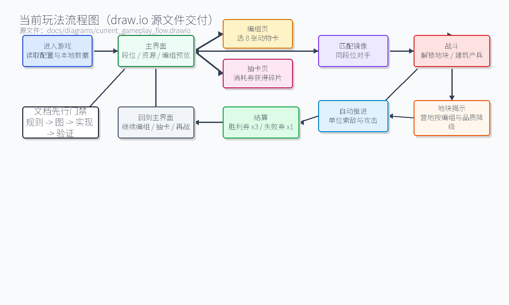
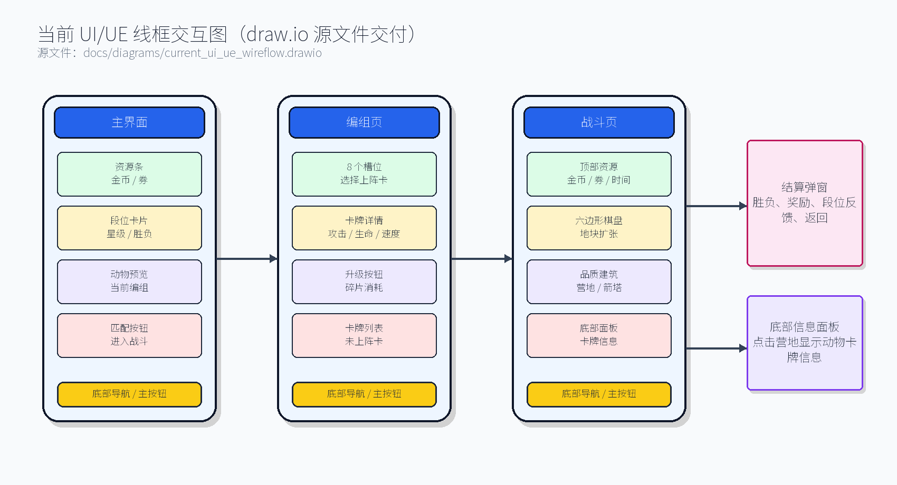

# 战城大师当前游戏设计文档

生成日期：2026-07-01

## 1. 文档用途

本文档整理当前 Godot 原型和配置表中已经存在的游戏设计，便于后续修改规则、数值、卡牌、地块、经济和界面流程。

当前工程同时存在两层设计：

- 当前实装原型：主要在 `scripts/app/main.gd` 中运行，包含大厅、编组页、战斗、地块购买、单位推进、胜负结算等。
- 配置表目标规则：主要在 `config/tables/` 和 `runtime/config/` 中，包含单位、技能、关卡、地块类型、价格池、翻开池、卡池、掉落和经济。

后续修改时建议先确定规则属于哪一层。如果希望规则长期可维护，应优先改配置表，并逐步把 `main.gd` 中的硬编码规则迁移到配置读取。

### 1.1 专业图件交付

当前设计文档必须和项目开发流程保持一致：正式评审版需要同时包含玩法流程图和 UI/UE 图，且保留可编辑的专业源文件。Mermaid 只能作为快速草图，不替代正式图件。

| 图件 | 专业源文件 | 预览图 |
| --- | --- | --- |
| 当前玩法流程图 | `docs/diagrams/current_gameplay_flow.drawio` | `output/diagrams/current_gameplay_flow.png` |
| 当前 UI/UE 线框交互图 | `docs/diagrams/current_ui_ue_wireflow.drawio` | `output/diagrams/current_ui_ue_wireflow.png` |





### 1.2 当前视觉效果图评审

当前游戏视觉方向按公共流程 v1.4 的专业美术生产线先进入多版效果图评审，不直接推进 Godot 实装或资产替换。

评审文档：`docs/CURRENT_GAME_VISUAL_CONCEPT_OPTIONS.md`

候选图输出：

- `output/visual_concepts/current_game_visual_option_a_jungle_frontier.png`
- `output/visual_concepts/current_game_visual_option_b_sunset_canyon.png`
- `output/visual_concepts/current_game_visual_option_c_moonlit_ruins.png`
- `output/visual_concepts/current_game_visual_option_d_floating_island_lobby.png`

用户确认方向后，再进入 art brief、production sheet、Sprite Forge/Godot handoff 和实现阶段。

## 2. 游戏定位

`战城大师` 当前是一个移动竖屏、轻策略、卡牌编组加地块争夺的 Godot 原型。

玩家在局外选择出战卡牌，进入局内后通过购买相邻地块、翻开建筑或资源、生成单位和防御建筑来推进领土。双方动物会自动寻找敌对动物或敌方建筑作为目标，不再把普通地块作为攻击目标；摧毁对方基地或在倒计时结束时靠真实解锁领土和建筑分数取胜。

设计关键词：

- 竖屏移动端
- 大厅加底部导航
- 卡牌编组
- 六边形地块争夺
- 自动单位推进
- 建筑生产和防御
- 价格池和卡池驱动的随机奖励
- 后续可扩展局外养成、抽卡、商店和关卡奖励

## 3. 当前用户流程

| 流程节点 | 当前状态 | 说明 |
| --- | --- | --- |
| 大厅 | 已实装 | 中央装饰场景，显示当前编组预览、段位和胜负，点击 `匹配` 进入同段位对战 |
| 底部导航 | 已实装 | 5 个按钮：商店、编组、战斗、抽卡、更多 |
| 编组页 | 已实装 | 5 套编组，每套 8 个出战位，当前版本默认全部卡牌开放 |
| 抽卡 | 未开放 | 点击提示暂未开放 |
| 商店 | 未开放 | 点击提示暂未开放 |
| 更多 | 未开放 | 点击提示暂未开放 |
| 战斗 | 已实装 | 7x13 六边形地图，点击可购买可连接地块 |
| 结算 | 已实装 | 基地被摧毁或倒计时结束后显示胜负，点击重新开始 |

## 4. 界面与输入规则

### 4.1 画面基准

| 项 | 当前值 | 位置 |
| --- | --- | --- |
| 设计分辨率 | 720x1280 | `scripts/app/main.gd` |
| Godot 窗口 | 1080x1920 | `project.godot` |
| 拉伸模式 | canvas_items / expand | `project.godot` |
| 主场景 | `scenes/main.tscn` | `project.godot` |
| 主节点 | `Node2D` | `scenes/main.tscn` |

### 4.2 底部导航

| 位置 | 按钮 | 当前功能 |
| --- | --- | --- |
| 左 1 | 商店 | 锁定，提示暂未开放 |
| 左 2 | 编组 | 进入编组页 |
| 中间 | 战斗 | 回到大厅战斗入口 |
| 右 2 | 抽卡 | 锁定，提示暂未开放 |
| 右 1 | 更多 | 锁定，提示暂未开放 |

### 4.3 编组页输入

- 点击页签 `1-5` 切换编组。
- 点击上方出战位或下方所有卡牌列表中的卡牌，都只切换中间详情预览，并播放一次详情区 UI pop 动效。
- 下方未上阵卡牌的详情区显示 `上阵` 按钮；点击后进入替换选择状态，上方所有已上阵卡牌播放 UI 呼吸动效。
- 替换选择状态下，玩家再点击上方某个已上阵卡牌，才会把待上阵卡牌放入该槽位；完成后停止呼吸动效。
- 已上阵卡牌只显示 `升级` 操作，不显示 `上阵` 操作。
- 鼠标滚轮或拖动可滚动所有卡牌列表。

## 5. 编组与卡牌规则

### 5.1 当前实装规则

| 项 | 当前值 |
| --- | --- |
| 编组数量 | 5 |
| 每套编组出战位 | 8 |
| 当前版本卡牌开放 | 初始拥有 8 张普通动物卡、紫色金矿卡、绿色防御塔卡；其他防御塔卡可通过抽卡获得 |
| 卡牌来源 | `config/tables/cards.csv`，包含动物卡、金矿卡和防御塔卡 |
| 卡牌名称来源 | `localization_zh` 文本表 |
| 默认初始化 | 优先放入金矿卡和绿色防御塔卡，再用已拥有动物卡补满编组 |
| 重复限制 | 同一编组内点击已有卡牌时执行交换，避免重复占位 |
| 必带规则 | 每套编组必须包含金矿卡，且至少包含 1 张防御塔卡 |

配置备注规范：`config/tables/cards.csv` 的 `design_notes` 必须贴近游戏内可见名称，统一使用 `卡牌名：定位/用途/注意事项` 格式，例如 `蜗牛：无技能纯肉盾，属性效率最高。`。

### 5.2 当前卡牌战力公式

当前编组页展示的战力来自原型脚本：

```text
card_power = max_hp + base_damage * 12 + shop_cost * 18 + rarity_rank * 80
deck_power = 所有出战卡牌 card_power 求和
```

品质等级：

| 品质 | rarity_rank | 显示等级 |
| --- | ---: | ---: |
| common | 0 | 1 |
| rare | 1 | 2 |
| epic | 2 | 3 |
| legendary | 3 | 4 |

### 5.3 当前卡牌美术占位

当前编组卡牌暂用三种已有单位图：

| 品质 | 使用图 |
| --- | --- |
| common | 兔兵图 |
| rare | 狼兵图 |
| epic / legendary | 熊兵图 |

后续需要为每个单位族群补独立头像、卡面或程序化变体。

## 6. 战斗核心规则

### 6.1 当前实装战斗参数

| 项 | 当前值 | 位置 |
| --- | ---: | --- |
| 战斗时长 | 180 秒 | `GAME_TIME` |
| 地图尺寸 | 7 列 x 13 行 | `GRID_COLS`, `GRID_ROWS` |
| 六边形半径 | 44 | `HEX_SIZE` |
| 玩家基地 | `(3, 11)` | `PLAYER_BASE` |
| 敌方基地 | `(3, 1)` | `ENEMY_BASE` |
| 玩家初始金币 | 60 | `gold` |
| 敌方初始金币 | 60 | `enemy_gold` |

### 6.2 当前开局地块布局

当前战斗原型由 `BoardRules.create_initial_tiles()` 生成 7x13 地块。玩家初始只有大本营 `(3, 11)` 是已解锁地块，AI 初始只有大本营 `(3, 1)` 是已解锁地块；其余地块开局会生成隐藏类型和价格，但必须由对应阵营消耗金币解锁后才计入真实拥有地块。

开局视觉上，棋盘下半区标记为玩家阵营预归属，上半区标记为敌方阵营预归属。预归属只用于战线识别，不等同于已解锁，不提供收入，也不会绕过金币解锁。

当前开局生成规则：

| 区域/内容 | 规则 |
| --- | --- |
| 玩家大本营 | 固定在 `(3, 11)`，开局已解锁 |
| 敌方大本营 | 固定在 `(3, 1)`，开局已解锁 |
| 预归属 | `y >= 6` 的地块标记为玩家预归属，`y < 6` 的地块标记为敌方预归属 |
| 真实解锁 | 除大本营外，所有地块都需要消耗金币解锁后才生成建筑/空地并计入拥有 |
| 地块站点 | 由坐标 hash 决定问号、动物营地/大厅、防御塔或金矿；未解锁前只显示中性色类型图标，不显示具体卡牌或品质色 |
| 地块价格 | 问号 25，金矿/防御塔 50，单位建筑按 50/100/250 价格池生成；大本营相邻随机单位建筑固定为 50 |
| 营地卡牌 | 双方解锁动物营地/大厅时，才随机目标品质并从各自出战编组中选择卡牌；若编组没有目标品质，则逐级降到更低品质；若没有任何更低可用卡牌，则该地块变为空地 |
| 防御/金矿卡牌 | 玩家解锁防御塔时从当前编组内按目标品质选择防御塔卡；金矿固定绑定紫色金矿卡 |

### 6.3 地块购买规则

玩家点击地块时按以下顺序处理：

1. 如果地块不可选中，则无操作。
2. 如果地块属于敌方，提示需要先占领地块。
3. 如果地块未连接己方已解锁地块，提示未连接。
4. 如果金币不足，提示金币不足。
5. 扣除金币。
6. 根据地块类型生成建筑、空地或奖励反馈。

当前可购买条件：

- 目标地块必须有 `site`。
- 目标地块不能已经有建筑。
- 目标地块不能属于敌方。
- 目标地块必须连接己方已解锁地块或己方建筑。
- 玩家金币必须大于等于地块价格。

动物营地显示和揭示规则：

- 解锁前只显示“动物营地”和价格，不提前显示具体是狼、袋鼠或其它动物营地，也不显示品质色。
- 解锁时才进行品质概率随机，再根据地块价格和本次随机结果在当前阵营编组内筛选同品质卡牌。
- 若没有同品质卡牌，则按 legendary -> epic -> rare -> common 的顺序向低品质降级；降到 common 仍没有可用卡牌时，解锁结果为空地。
- 解锁后的营地、防御塔和金矿会在地块上方短暂弹出对应卡牌；点击已解锁地块后，战斗区下方面板复用卡牌排版展示对应卡牌信息。
- 解锁后的营地可点击查看对应动物卡牌信息，防御塔显示塔卡攻击、生命、射程和冷却，金矿显示生命和金币收入；编组页详情使用简化属性图标展示关键属性。

### 6.4 地块占领规则

- 当前战斗规则不再允许动物把空地或普通地块作为攻击目标。
- 地块扩张主要通过玩家/AI 消耗金币解锁相邻站点完成。
- 动物完整离开一个敌方预归属、未真实解锁且没有敌方动物驻留的地块时，会把该地块的视觉归属染成己方颜色；这只改变 `territory_team` 的战线显示，不清除站点、不生成建筑、不计入真实拥有地块，也不能替代金币解锁。
- 摧毁非基地建筑后，该建筑所在地块会转为攻击方真实拥有的空地，并播放反馈。
- 摧毁基地仍直接触发胜负，不进入普通地块占领流程。

### 6.5 建筑规则

| 建筑 | HP | 功能 |
| --- | ---: | --- |
| base | 520 | 基地，提供金币和防御塔式攻击，被摧毁则直接失败/胜利，不产兵 |
| barracks | 绑定动物最大生命 x 3 | 周期生成单位 |
| hall | 绑定动物最大生命 x 3 | 周期生成强单位 |
| tower | 180 | 周期攻击范围内敌方单位 |
| mine | 125 | 提供金币收入 |
| empty | 0 | 空地 |

当前攻击与生产：

| 建筑 | 周期/冷却 | 范围 | 伤害 | 说明 |
| --- | ---: | ---: | ---: | --- |
| tower | 1.1 秒 | 210 | 44 | 自动攻击最近敌方单位 |
| base | 1.1 秒 | 210 | 44 | 使用防御塔式攻击，不生产单位 |
| barracks / hall | 读取绑定动物召唤间隔 | - | - | 玩家和敌方使用相同生产间隔 |

战斗建筑视觉规则：

- 动物营地不再按动物物种做单独外形，解锁后只保留 common / rare / epic / legendary 4 种品质外形；未解锁时统一使用黑灰剪影。
- 防御塔同样只保留 4 种品质外形；未解锁时统一使用黑灰剪影，塔的攻击数值仍沿用统一原型规则。
- 解锁后的建筑主色必须跟品质色一致：绿色、蓝色、紫色、金色。
- 未解锁的玩家预归属地块使用半透明绿色底色，敌方预归属地块使用半透明红色底色；可解锁状态在该底色上叠加强黄边。
- 营地、防御塔和金矿图标改为简化几何图标：动物营地是小房子，防御塔是细长塔，金矿是山形图标；未解锁时统一为中性色，不显示品质或具体卡牌颜色。
- 解锁后的动物营地和防御塔按对应卡牌品质上色；金矿按紫色金矿卡与金币强调色显示。
- 动物营地/大厅的召唤进度条使用更短、更细的小条，并放在六边形内部偏上位置；建筑生命条同样收窄，避免超出地块边缘。

### 6.6 当前金币收入

当前实装收入与配置表目标收入不同。

当前实装：

| 阵营 | 基地收入 | 金矿收入 | 结算周期 |
| --- | ---: | ---: | ---: |
| 玩家 | 每个基地 +12 | 每个金矿 +10 | 3 秒 |
| 敌方 | 每个基地 +12 | 每个金矿 +10 | 3 秒 |

配置表目标：

| 来源 | 金币 | 周期 |
| --- | ---: | ---: |
| 大本营 | 12 | 3 秒 |
| 金矿 | 10 | 3 秒 |

后续如果要统一规则，应把 `main.gd` 收入逻辑改为读取 `economy.csv` 或地块配置。

### 6.7 当前单位原型

战斗内当前只使用 3 种战场单位原型：

| 单位 | HP | 速度 | 攻击 | 射程 | 冷却 | 搜敌 |
| --- | ---: | ---: | ---: | ---: | ---: | --- |
| 战斗单位 | 读取卡牌生命 | 卡牌速度 x 50% | 读取卡牌攻击 | 读取卡牌射程 | 1.70 | 敌对动物和敌方建筑 |

注意：当前战斗单位读取卡牌数值，但为了放慢节奏，移动速度在战斗内统一乘以 0.5，攻击速度也降为原来的 50%。

### 6.8 单位 AI

单位每帧执行：

1. HP 小于等于 0 时移除并播放反馈。
2. 扫描敌对动物和敌方建筑作为候选目标，双方动物会互相攻击。
3. 按距离分数选择目标，敌对动物和敌方基地拥有更高目标权重。
4. 如果目标在攻击范围内，按冷却造成伤害。
5. 所有动物移动速度按卡牌速度的 50% 执行，攻击冷却固定 1.70 秒。
6. 如果目标不在攻击范围内，向目标位置移动。
7. 远程攻击和防御塔攻击会生成一条短时间高亮弹道，帮助玩家看清攻击来源和目标。
8. 如果没有敌对动物或敌方建筑，则原地等待，不攻击空地。

### 6.9 敌方 AI

敌方 AI 当前规则：

- 开局 `4.0` 秒后首次尝试行动，之后每 `2.2` 秒尝试行动一次。
- 从可连接、可购买地块中选择目标。
- AI 与玩家一样使用战斗金币；如果敌方金币不足，则暂不购买。
- 购买后按同样地块翻开规则生成建筑。
- 敌方大本营不再产兵；敌方默认阵容为 8 张 common 绿色动物卡牌，产兵建筑按绑定卡牌召唤间隔生产。

### 6.10 胜负规则

| 情况 | 结果 |
| --- | --- |
| 玩家摧毁敌方基地 | 玩家胜利 |
| 敌方摧毁玩家基地 | 玩家失败 |
| 倒计时结束 | 按分数判定 |

倒计时分数：

```text
score = 拥有地块数 * 2 + 拥有建筑数 * 5
```

玩家分数大于或等于敌方分数时，玩家胜利。

结算奖励：

| 结果 | 奖励 |
| --- | ---: |
| 胜利 | 抽卡券 x3 |
| 失败 | 抽卡券 x1 |

### 6.11 段位匹配与镜像数据库

当前原型新增 ELO 天梯系统。底层使用 ELO 计算隐藏匹配分，所有游戏页面都不直接显示原始 ELO 或 ELO 增减值，界面只显示段位和星数。

| 段位 | 隐藏分范围 | 星级 |
| --- | ---: | --- |
| 青铜 | 1000-1199 | 3 星 |
| 白银 | 1200-1399 | 3 星 |
| 黄金 | 1400-1599 | 4 星 |
| 钻石 | 1600-1799 | 5 星 |
| 王者 | 1800+ | 每 40 ELO 增加 1 星 |

匹配和数据规则：

- 玩家点击大厅“匹配”时，先读取当前隐藏 ELO 并换算当前段位。
- 系统优先从 `user://rank_mirror_db.json` 中选择同段位其他玩家镜像；只有本机记录时退回本机镜像，没有同段位记录时生成同段位默认镜像兜底。
- 镜像记录包含段位、隐藏 ELO、8 张出战卡、卡牌等级和记录时间。
- 战斗胜负结算时，玩家与镜像按隐藏 ELO 公式更新分数，当前 K 值为 32。
- 玩家在某段位胜利后，会把本局开战时的段位、隐藏 ELO、卡组和等级记录为该段位胜利镜像。
- 玩家失败只更新隐藏 ELO 和胜负统计，不写入胜利镜像。
- 每个段位本地最多保留 20 条镜像记录，超过后移除最旧记录。

显示规则：大厅只显示段位、星数和胜负，不显示镜像数量等服务器/匹配池信息；战斗顶部只显示双方段位星数；结算页只显示结算后的当前段位星数。

当前版本使用本地 JSON 作为原型数据库。后续接入服务器时，可以把相同结构迁移为共享镜像库，匹配时从同段位其他玩家的胜利镜像中抽取对手。

## 7. 配置表目标规则

### 7.1 地图生成目标

`config/tables/board_rules.csv` 定义当前目标地图规则：

| 规则 | 当前值 |
| --- | --- |
| map_key | map_default |
| 开局随机地块类型 | true |
| 开局随机价格 | true |
| 镜像轴 | horizontal |
| 镜像锚点 | map_center |
| 镜像来源 | upper_to_lower |
| 地块权重表 | board_cells |

设计意图：每局开始先在上半地图按地块权重随机类型和价格，再以地图中心水平轴镜像到下半地图，保证双方资源机会一致。

### 7.2 地块类型目标

| 地块 | 类型 | 价格模式 | 价格/价格池 | 收入 | 出现概率 | 说明 |
| --- | --- | --- | --- | --- | ---: | --- |
| cell_question | question | fixed | 25 | 无 | 50% | 购买后抽空、防御、单位或金币 |
| cell_unit | unit | random_pool | 50/100/250 | 无 | 20% | 价格越高，单位卡池品质越高 |
| cell_defense | defense | random_pool | 50/100/250 | 无 | 20% | 价格越高，防御卡池品质越高 |
| cell_gold_mine | gold_mine | fixed | 50 | 10 金币 / 3 秒 | 10% | 固定金矿 |
| cell_home_base | home_base | free | 0 | 12 金币 / 3 秒 | 0% | 固定基地，不参与随机 |

### 7.3 地块价格池

| 价格 | 权重 | 概率 | 品质档 |
| ---: | ---: | ---: | --- |
| 50 | 30 | 30% | low |
| 100 | 50 | 50% | mid |
| 250 | 20 | 20% | high |

### 7.4 问号翻开规则

| 结果 | 类型 | 概率 | 数量 |
| --- | --- | ---: | --- |
| empty | 空 | 70% | 0 |
| defense_cards_question | 防御池 | 10% | 1 |
| unit_cards_question | 单位池 | 10% | 1 |
| gold | 货币 | 10% | 25-40 |

### 7.5 单位/防御地块翻开规则

| 地块 | 结果 |
| --- | --- |
| unit | 根据开局价格选择对应单位卡池，抽 1 张单位卡 |
| defense | 根据开局价格选择对应防御卡池，抽 1 张防御卡 |
| gold_mine | 固定生成金矿 |
| home_base | 固定生成大本营 |

## 8. 单位、防御与卡池

### 8.1 单位配置状态

| 类别 | 数量 | 来源 |
| --- | ---: | --- |
| 英雄 | 2 | `units.csv` |
| 敌人 | 2 | `units.csv` |
| 召唤单位 | 30 | `units.csv` |
| 防御塔 | 4 | `defenses.csv` |

召唤单位覆盖族群：

- beast
- fiend
- dragonkin
- elemental
- clockwork
- marshkin
- serpentfolk
- pirate
- boarfolk
- undead

### 8.2 品质定位

| 品质 | 设计用途 |
| --- | --- |
| common | 铺场、低费、基础玩法识别 |
| rare | 提供明确战术主题，如远程、光环、护盾、回复 |
| epic | 阵容核心、控场、高血或强支援 |
| legendary | 高投资翻盘点和压场核心 |

### 8.3 价格池与卡池关系

| 价格 | 单位池 | 防御池 |
| ---: | --- | --- |
| 50 | unit_cards_price_50 | defense_cards_price_50 |
| 100 | unit_cards_price_100 | defense_cards_price_100 |
| 250 | unit_cards_price_250 | defense_cards_price_250 |

平衡意图：

- 50 金币池：普通为主，保留少量稀有和极低概率史诗。
- 100 金币池：中期主力池，稀有和史诗明显提高，传说低概率出现。
- 250 金币池：史诗和传说权重最高，是高投入高回报的赌点。

## 9. 关卡、奖励与经济

### 9.1 当前关卡配置

| 关卡 | 难度 | 时间 | 地图 | 敌人池 | 奖励池 | 推荐战力 |
| --- | --- | ---: | --- | --- | --- | ---: |
| stage_tutorial_01 | tutorial | 120 | map_gate_trial | enemy_pool_tutorial | reward_pool_tutorial | 0 |
| stage_field_01 | normal | 180 | map_wasteland_patrol | enemy_pool_field_01 | reward_pool_field_01 | 120 |

### 9.2 掉落池

| 池 | 内容 |
| --- | --- |
| enemy_pool_tutorial | enemy_grunt 3-5 |
| enemy_pool_field_01 | enemy_grunt 5-8，enemy_brute 1-2 |
| reward_pool_tutorial | gold 30-45，训练短刀 |
| reward_pool_field_01 | gold 45-70，守备护符 |

### 9.3 道具

| 道具 | 槽位 | 品质 | 价格 | 效果 |
| --- | --- | --- | ---: | --- |
| 训练短刀 | weapon | common | 80 | base_damage +6 |
| 守备护符 | trinket | rare | 160 | max_hp +35 |
| 行军口粮 | consumable | common | 40 | energy_restore +10 |

## 10. 修改入口清单

| 想修改的内容 | 优先修改位置 | 注意事项 |
| --- | --- | --- |
| 单位属性 | `config/tables/units.csv` | 改完运行校验和导出 |
| 单位技能描述/效果 | `config/tables/skills.csv` | 当前战斗原型尚未完整执行所有技能 |
| 防御塔属性 | `config/tables/defenses.csv` | 当前战斗原型塔逻辑仍较简化 |
| 卡池概率 | `config/tables/card_random_pools.csv` | 同一 pool 的概率建议合计 100 |
| 地块类型概率 | `config/tables/board_cell_types.csv` | 当前目标规则，战斗原型尚未完全接入 |
| 地块价格概率 | `config/tables/cell_price_pools.csv` | 影响单位/防御池品质档 |
| 问号翻开规则 | `config/tables/cell_reveal_rules.csv` | 70% 空、10% 防御、10% 单位、10% 金币为当前目标 |
| 关卡时间/推荐战力 | `config/tables/stages.csv` | 当前战斗原型使用 `GAME_TIME = 180` |
| 局内金币收入 | `config/tables/economy.csv` 和 `main.gd` | 当前实装与配置目标不一致 |
| 编组数量/出战位 | `scripts/app/main.gd` | 当前为 5 套、每套 8 位 |
| 底部导航开放状态 | `scripts/app/main.gd` | 当前商店、抽卡、更多锁定 |
| 战斗地块布局 | `scripts/app/main.gd` | 当前硬编码，建议迁移到 `board_cells.csv` |
| 战斗胜负公式 | `scripts/app/main.gd` | 当前为地块数*2 + 建筑数*5 |

## 11. 推荐修改顺序

如果你要系统性改规则，建议按以下顺序进行：

1. 先改体验目标：决定一局时长、地图大小、玩家每局主要决策数量。
2. 再改经济节奏：初始金币、基地收入、金矿收入、地块价格。
3. 再改地块结构：问号、单位、防御、金矿比例。
4. 再改卡池品质：50/100/250 三档分别控制普通、稀有、史诗、传说概率。
5. 再改单位和防御塔：先保证每档都有清晰定位，再调数值。
6. 最后改 UI 呈现：根据最终规则决定哪些信息必须在大厅、编组和战斗中显示。

## 12. 当前主要差异与待配置化事项

| 项 | 当前状态 | 建议 |
| --- | --- | --- |
| 地图生成 | `main.gd` 硬编码布局 | 迁移到 `board_rules` 和 `board_cells` |
| 战斗单位 | 只使用兔兵、狼兵、熊兵三套原型 | 让战斗读取 `units.csv` 的 30 个召唤单位 |
| 技能系统 | 配置表已存在，战斗执行简化 | 按 `skills.csv` 接入攻击、主动、被动和终极效果 |
| 经济节奏 | 实装每秒收入，配置目标每 3 秒收入 | 统一到配置表 |
| 编组影响战斗 | 编组页可换卡，但战斗暂未按编组生成单位 | 建立出战卡牌到局内建筑/召唤的映射 |
| 抽卡 | UI 锁定 | 后续接入卡池、货币和保底 |
| 商店 | UI 锁定 | 后续接入道具、资源和每日刷新 |
| 关卡 | 配置表已有 2 关 | 大厅需要接入关卡选择或当前模式卡 |

## 13. 每次修改后的验证

修改配置表后：

```powershell
python tools/validate_config.py
python tools/export_config.py
```

如果系统没有 `python` 命令，可以使用：

```powershell
py -3 tools/validate_config.py
py -3 tools/export_config.py
```

修改 Godot 脚本后：

- 打开 Godot 项目确认主场景可运行。
- 检查大厅、编组、战斗、结算流程。
- 至少测试一次胜利、一次失败、一次倒计时结算。
- 编组页测试卡牌替换、页签切换、滚动和锁定按钮提示。
