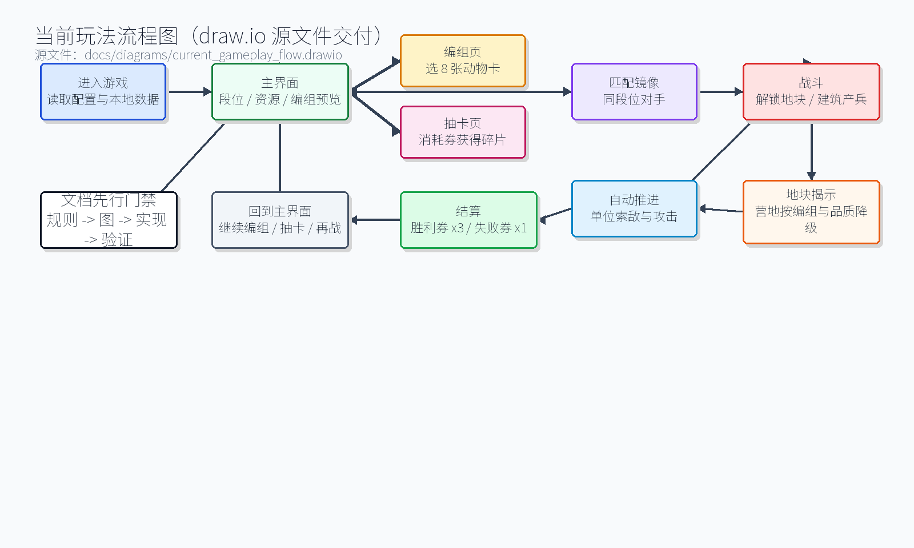
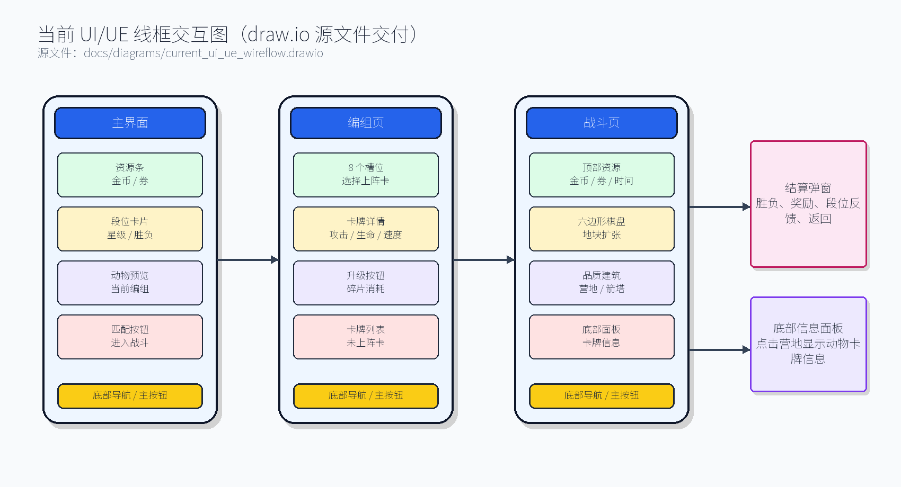

# 战城大师当前游戏设计文档

更新日期：2026-09-07

### 2026-09-07 制作人战斗反馈修订

- 结算奖励调整为下方独立固定区域，位于玩家列表下方、关闭按钮上方；继续显示图标与数量，不随玩家列表滚动，点击奖励区不退出结算。
- 鹦鹉改为远程，制作人确认攻击范围 1.5 格；额外攻击一个敌人的技能及其他属性不变。
- 战斗防御塔按品质缩放，绿色/蓝色/紫色/金色在镜头缩放前的逻辑包含框为 56/66/76/84 像素；脚底对齐，不改变碰撞、攻击范围、属性或卡牌详情大小。
- 狐狸光环覆盖所有活着的友方动物，包括后出生及自身技能禁用的受益者；同种光环不叠加，最后来源离场撤销光环属性，不撤销永久加成。
- 子弹在发射、飞行和终点均有视觉记录；命中同一模拟帧也必须可见，不改变伤害或飞行速度。高对比小弹头与短拖尾适配全部地块色。
- 结算停留到玩家明确点击关闭，0.35 秒防误触；迟到快照及离房/断线不能覆盖结算。紧凑资源与奖励使用统一金币、券、星形图标和数量，不重复资源名称；技能、错误、动作及结算结果保留必要文字。
- 剧情对话系统尚未实现；本轮仅核验并如实报告状态，不将需求记录当作运行时交付。

### 2026-09-06 动物验证与横向地块补充

- 狗仅在友军出生技能实际额外召唤一只动物时获得攻击 +1，普通召唤、被上限阻止的额外召唤不触发；制作人最终数值不变。
- 战斗结束 HUD 恢复显示账户金币，战斗内金币仍独立。抽卡详情默认隐藏，点击最近获得的卡牌查看，再次点击可收起。
- 地块统一横向平顶；画面坐标旋转 90 度，点击反算、镜头边界同步，动物、建筑和文字保持正立；世界坐标、寻路、范围和网络状态不旋转。裁切原纹理至规则六边形，视觉半径 96%，保持原透明度，六边等宽留缝。
- 60 种动物使用真实运行时固定种子对抗与混编验证；强弱异常仅报告，不自动调整配置。没有额外攻击目标时跳过无用的全敌人排序，保持规则与随机数顺序。
- 工程验收见 `docs/receipts/REQ-20260906-ALL-ANIMALS-AUDIT.md`；本轮追加 Android 测试包，不包含未获授权的云端账号接口部署。

### 2026-09-06 制作人动物表修订（当前规则，覆盖下文旧版同类条目）

本次权威来源为制作人更新的 `config/tables/cards.csv` 及确认答复，工程执行合同见 `docs/receipts/REQ-20260906-ANIMAL-TABLE-V3-READ-ONLY.md`。旧版段落与历史 Word 中的统一成长、移动减半、永久出生光环及旧动物技能不再作为当前实现依据。

- 71 张卡牌保留原表属性及描述；移动速度为格/秒，攻击范围为格，0 表示近战。相邻六边格中心距离为一格。表中已包含静态技能效果，不能重复乘速度、加攻击或加距离。
- `attack_lv`、`max_hp_lv` 为逐卡等级成长，所有卡牌（包括塔）按 `基础值+(等级-1)*成长值` 累加；保留累计小数，仅面板和战斗属性取整数部分。不再使用旧统一百分比或近战/远程固定生命成长。移速、射程、召唤间隔不随等级变化。
- 60 种动物以 `skill_text` 编译成明确机制；旧冲突字段已清空。未实现的新描述会在配置校验阶段报错，不能静默套用旧技能。塔的技能 ID 规范化并同步 `defenses.csv`。
- 跳跃跨一格到下一格中心，斑马多跨一格；落地才占领和触发落地效果。近战能够接敌相邻格，避免固定跨两格的动物因格坐标奇偶性无法交战。冲锋间隔 4 秒、蓄力 2 秒、快速前进 4 格，对路径触及的敌人各结算一次攻击力伤害，地图边缘停止。
- 普通攻击暴击 2 倍，猴子光环下 3 倍，红色放大伤害文字；攻击闪避显示 miss 并闪身。技能伤害不会额外暴击或闪避。弹射从命中点搜索 3 格内未命中的敌人/建筑；穿透保持原方向至原射程；溅射范围 1 格，仅伤敌方动物。
- 狐狸、猴子、鹿光环全体盟友在场生效，同种不叠加，最后来源离场移除，来源脚底显示光环。鹿只对每只动物首次跳跃提供加成，不赋予普通动物跳跃移动。
- 松鼠存活 8 秒结算一次；骆驼、长颈鹿、蓝鲸每 8 秒结算。生命增益同时提升最大和当前生命；守护范围 1 格；掠夺从敌方实际余额转移，不凭空增加。
- 不修改账号、在线权威/转火规则、已批准 B 风格布局或服务部署；本次不含 APK 出包和真机性能承诺。

## 1. 文档用途

本文档整理当前 Godot 原型和配置表中已经存在的游戏设计，便于后续修改规则、数值、卡牌、地块、经济和界面流程。

当前工程同时存在两层设计：

- 当前实装原型：主要在 `scripts/app/main.gd` 中运行，包含大厅、编组页、战斗、地块购买、单位推进、胜负结算等。
- 配置表目标规则：主要在 `config/tables/` 和 `runtime/config/` 中，包含单位、技能、关卡、地块类型、价格池、翻开池、卡池、掉落和经济。

后续修改时建议先确定规则属于哪一层。如果希望规则长期可维护，应优先改配置表，并逐步把 `main.gd` 中的硬编码规则迁移到配置读取。

### 1.1 专业图件交付

当前设计文档必须和项目开发流程保持一致：正式评审版需要同时包含玩法流程图和 UI/UE 图，且保留可编辑的专业源文件。Mermaid 只能作为快速草图，不替代正式图件。

| 图件 | 专业源文件 | 预览图 |
| --- | --- | --- |
| 当前玩法流程图 | `docs/diagrams/current_gameplay_flow.drawio` | `output/diagrams/current_gameplay_flow.png` |
| 当前 UI/UE 线框交互图 | `docs/diagrams/current_ui_ue_wireflow.drawio` | `output/diagrams/current_ui_ue_wireflow.png` |





### 1.2 当前视觉效果图评审

当前游戏视觉方向按公共流程 v1.5 的 2D-first 专业美术生产线先进入多版效果图评审，不直接推进 Godot 实装或资产替换。

整体氛围评审文档：`docs/CURRENT_GAME_VISUAL_CONCEPT_OPTIONS.md`

2D UE 锁定页面美术评审文档：`docs/CURRENT_GAME_2D_UE_LOCKED_ART_OPTIONS.md`

候选图输出：

- `output/visual_concepts/current_game_visual_option_a_jungle_frontier.png`
- `output/visual_concepts/current_game_visual_option_b_sunset_canyon.png`
- `output/visual_concepts/current_game_visual_option_c_moonlit_ruins.png`
- `output/visual_concepts/current_game_visual_option_d_floating_island_lobby.png`
- `output/visual_concepts/current_game_ue_locked_a_arcade_jungle_sheet.png`
- `output/visual_concepts/current_game_ue_locked_a_arcade_jungle_lobby.png`
- `output/visual_concepts/current_game_ue_locked_a_arcade_jungle_battle.png`
- `output/visual_concepts/current_game_ue_locked_b_premium_leaf_sheet.png`
- `output/visual_concepts/current_game_ue_locked_b_premium_leaf_lobby.png`
- `output/visual_concepts/current_game_ue_locked_b_premium_leaf_battle.png`
- `output/visual_concepts/current_game_ue_locked_c_crystal_night_sheet.png`
- `output/visual_concepts/current_game_ue_locked_c_crystal_night_lobby.png`
- `output/visual_concepts/current_game_ue_locked_c_crystal_night_battle.png`
- `output/visual_concepts/current_game_ue_locked_d_festival_board_sheet.png`
- `output/visual_concepts/current_game_ue_locked_d_festival_board_lobby.png`
- `output/visual_concepts/current_game_ue_locked_d_festival_board_battle.png`

用户确认方向后，再进入 art brief、production sheet、2D Technical Artist handoff、Sprite Forge/Godot handoff 和实现阶段。页面美术升级必须锁定 UE：页面信息、布局、点击目标和反馈节奏不变，只换 2D 美术皮肤。

## 2. 游戏定位

`战城大师` 当前是一个移动竖屏、轻策略、卡牌编组加地块争夺的 Godot 原型。

玩家在局外选择出战卡牌，进入局内后通过购买相邻地块、翻开建筑或资源、生成单位和防御建筑来推进领土。动物出生或当前推进目标失效时，锁定最近的敌方建筑作为寻路目标；推进途中只攻击自身攻击范围内的敌对动物或建筑，不为路过目标改道，也不持续重算寻路。锁定建筑死亡或消失后才重新选择最近敌方建筑。普通地块不作为攻击目标；摧毁对方基地或在倒计时结束时靠真实解锁领土和建筑分数取胜。

设计关键词：

- 竖屏移动端
- 大厅加底部导航
- 卡牌编组
- 六边形地块争夺
- 自动单位推进
- 建筑生产和防御
- 价格池和卡池驱动的随机奖励
- 后续可扩展局外养成、抽卡、商店和关卡奖励

## 3. 当前用户流程

| 流程节点 | 当前状态 | 说明 |
| --- | --- | --- |
| 大厅 | 已实装 | 中央装饰场景，显示当前编组预览、段位和胜负；`单人对战` 开始经典 1V1，`多人对战` 直接开始 6 人各自为战的自由混战 |
| 底部导航 | 已实装 | 5 个按钮：商店、编组、战斗、抽卡、房间 |
| 编组页 | 已实装 | 5 套编组，每套 8 个出战位，当前版本默认全部卡牌开放 |
| 抽卡 | 未开放 | 点击提示暂未开放 |
| 商店 | 未开放 | 点击提示暂未开放 |
| 房间 | 已实装 | 选择 `1V1 / 2V2 / 3V3`，邀请玩家或由随机玩家补位后开始双边对战 |
| 单人战斗 | 已实装 | 每局从 5 张对称 `1V1` 地图中随机 1 张，点击可购买可连接地块，地图超出视窗时可拖动查看 |
| 多人自由混战 | 已实装 | 大厅多人按钮直接开始 6 人局，本地玩家随机进入 6 个三角扇区之一，其余 5 个槽位由电脑控制；使用标准正六边形地图，六方互相敌对 |
| 房间战斗 | 已实装 | 按房间人数从对应 5 张对称地图中随机；双方最多各 3 人，地图超出视窗时拖动查看 |
| 结算 | 已实装 | 所有模式逐条显示本场全部玩家的名次、结算前后段位星级与星级变化；自己固定在首屏特殊高亮，其他玩家可纵向滑动查看；6 人自由混战按最终名次结算，房间按阵营胜负结算 |

## 4. 界面与输入规则

### 4.1 画面基准

| 项 | 当前值 | 位置 |
| --- | --- | --- |
| 竖屏设计分辨率 | 720x1280 | `scripts/app/main.gd` |
| 当前 Godot 窗口 | 720x1280 | `project.godot` |
| 横屏默认分辨率 | 1280x720 | 跨项目默认；当前项目固定竖屏，不启用横屏 |
| 分辨率权威 | 2026-08-25 制作人决策 | 取代旧 `1080x1920` 视口与 `540x960` 桌面预览规则；旧回执仅作历史证据 |
| 拉伸模式 | canvas_items / expand | `project.godot` |
| 主场景 | `scenes/main.tscn` | `project.godot` |
| 主节点 | `Node2D` | `scenes/main.tscn` |

### 4.2 底部导航

| 位置 | 按钮 | 当前功能 |
| --- | --- | --- |
| 左 1 | 商店 | 锁定，提示暂未开放 |
| 左 2 | 编组 | 进入编组页 |
| 中间 | 战斗 | 回到大厅战斗入口 |
| 右 2 | 抽卡 | 锁定，提示暂未开放 |
| 右 1 | 房间 | 进入双边房间页 |

大厅主操作区同时保留 `单人对战` 和 `多人对战`：点击多人按钮立即开始一局 6 人自由混战，不跳转房间页；按钮右上角固定显示小型高对比度 `HOT!` 角标。`多人对战` 主文案必须以整个按钮的几何中心为准进行水平和垂直居中，不能继续为已移除的第二行说明预留偏移；`HOT!` 角标不参与主文案的居中计算。大厅不直接展示玩法规则或奖励说明，详细规则由对应说明页承载。角标属于多人按钮的视觉层和点击范围，不能遮挡按钮主文案。需要组队或自定义人数时，玩家仍从底栏 `房间` 进入双边房间页。

点击大厅基地打开 `设置与账号` 弹窗。弹窗采用独立标题栏、账号身份区、凭据区和通用设置区的纵向结构：关闭按钮固定在标题栏右侧；未登录时只要求账号 ID 与密码即可直接登录或注册；自动设备账号创建成功后，玩家只需确认用户名和头像即可完成首次身份设置。已登录时显示头像、用户名、账号 ID、UserID、服务器同步状态和身份编辑区，并保留“切换账号”；档案列表优先显示头像与用户名，账号 ID 作为次级识别信息，列表底部保留黄色“新建账号”按钮。新建账号立即进入服务器提供的新手进度；音乐与音效位于单独的声音设置区。任何标题、按钮、输入框和状态文字的矩形都不得重叠，玩家协议页复用同一标题栏并保留独立返回按钮。

账号自动登录不依赖点击大厅基地：本机已有有效安装 ID 与长期令牌时，进入大厅后自动连接服务器并恢复同一账号；账号密码仅用于当次手动登录，成功后由服务器校验当前长期令牌并把该账号加入本机档案集合，本机不得保存密码明文。`user_id` 是不可修改的服务器内部主键，`account` 是唯一稳定的登录账号 ID，`username` 是允许重名且可修改的玩家展示名；用户名不能登录，也不能覆盖账号 ID。房间、账号中心和档案列表统一优先显示服务器权威用户名，不再使用“玩家X”作为正常占位名。凭据区分别提供“复制账号”“复制密码”“复制全部”；明文密码只允许存在于本次创建或本次玩家输入后的前台会话，服务器和磁盘不得恢复历史明文密码。首版运行时开放猫、狗、狐狸、兔子、老虎、狮子、大象、企鹅、水獭、松鼠、仓鼠、猴子 12 个既有动物头像；4 个原创通用人物头像只保留整套评审板，制作人书面批准前固定为 `NOT_RUNTIME`。中央基地继续作为账号中心入口，同时按玩家当前段位切换造型和同源包装色：青铜木石堡、白银石堡、黄金王庭、铂金尖塔、钻石晶堡、星耀星宫、王者皇冠城。段位越高，塔楼数量、建筑高度、材质稀有度和徽记等级越高；城堡绘制区域、点击区域和动物预览位置保持稳定。

### 4.3 编组页输入

- 点击页签 `1-5` 切换编组。
- 点击上方出战位或下方所有卡牌列表中的卡牌，都只切换中间详情预览，并播放一次详情区 UI pop 动效。
- 下方未上阵卡牌的详情区显示 `上阵` 按钮；点击后进入替换选择状态，上方所有已上阵卡牌播放 UI 呼吸动效。
- 替换选择状态下，玩家再点击上方某个已上阵卡牌，才会把待上阵卡牌放入该槽位；完成后停止呼吸动效。
- 已上阵卡牌只显示 `升级` 操作，不显示 `上阵` 操作。
- 鼠标滚轮或拖动可滚动所有卡牌列表。

### 4.4 多人战斗输入与房间页

- 底栏最后一个页签进入房间页；房主选择 `1V1 / 2V2 / 3V3`，本地玩家固定在我方 1 号槽位，其余有效槽位可等待邀请玩家或由随机玩家补位。
- 房间码支持复制，并提供真实玩家接入槽位的接口；在好友、账号和公网房间服务接入前，复制成功不表示远端玩家已经连接。
- 关闭随机玩家补位时，仍有空槽位则禁止开始；开启后，每个未连接槽位分配一个随机玩家名并由自动逻辑控制。
- 以下地图拖动、点击查看和自动寻敌规则同时适用于大厅 6 人自由混战与双边房间战斗；同边盟友规则只适用于房间模式。
- 所有轴向六边形战斗棋盘的默认视觉镜头倍率固定为 `1.30`，即相对原始 `1.00` 拉近 30%；地块、动物和建筑按同一镜头投影放大，HUD 与底部信息区保持原尺寸。镜头倍率只影响世界坐标到屏幕坐标的绘制、命中反算和可视范围，不改变动物移动速度、攻击距离、碰撞、寻路、地块邻接或服务器战斗状态；鼠标左键拖动或单指拖动继续平移地图。
- 拖动只修改摄像机的视图偏移；单位、建筑、弹道、攻击目标和占领判定始终保留独立的世界坐标，不能因拖动而改变实际位置或战斗距离。
- 按下后移动超过 `12` 设计像素才进入拖动，未超过阈值的按下/抬起按一次点击处理，避免拖动地图时误触地块查看或购买。
- 点击己方可购买地块仍执行购买；点击其他地块或建筑只切换信息查看，不再下达手动攻击指令。
- 动物出生或当前推进建筑死亡、消失、转为盟友时，选择最近的敌方建筑并锁定为推进目标；寻路过程中不因出现新的动物或更近建筑而改道。重选后从动物当前世界位置直接朝新路径的下一节点推进，不得先退回当前六边格中心或任一旧路径格。动物只攻击自身攻击范围内的敌对动物或建筑，玩家拖动地图和查看地块不能改变其推进目标。
- 受击转火（2026-09-06 修订）：动物当前未在攻击状态，且当前索敌目标比实际攻击者远超过 1 格时，才锁定攻击者并追击至第一次反击。距离按受击瞬间的世界直线距离计算，1 格为相邻六边格中心距（`sqrt(3) * HEX_SIZE`，当前约 74.478）；差值恰好 1 格或不足 1 格不转火。范围内已有有效攻击目标时属于攻击状态，包含冷却等待，不被新攻击者抢走。当前索敌目标优先取有效的反击追击目标，否则取推进建筑；无有效目标时保留直接反击兜底。来源须为存活敌方动物、基地或防御塔并造成实际生命伤害。第一次反击后恢复普通射程锁定，目标死亡、关系失效或离开射程时才释放。
- 带有 `flying` 标签的动物可直线飞越地图空白区域；其余地面动物只能沿实际存在且相邻的六边格移动，并使用简单六边格寻路绕过缺失地块。
- 阵营不能只靠颜色识别：单位和建筑生命条使用阵营色，同时显示 `1-6` 槽位编号；本地玩家固定为 1 号，同边槽位互为盟友。

### 4.5 战斗单位信息查看

- 战斗中点击任意存活动物时，动物命中优先于其脚下的地块：本次点击只选中动物，不购买地块、不触发地块脉冲，也不切换到地块详情。
- 底部既有信息区在动物被选中时显示该动物的卡图、品质、名称、等级、所属阵营/槽位与玩家名、当前攻击、当前生命/最大生命，以及当前生效的护盾、眩晕、减速、中毒、加速状态。攻击与生命只使用攻击图标、心形图标和数值，不显示“攻/攻击/血/生命”属性标签。
- 动物选择使用稳定的 `unit.id`，不能缓存单位字典；在线快照重排、单位死亡、单位被移除或切换对局后必须自动失效，绝不显示旧单位信息。
- 动物卡牌不显示独立的“近战/远程/超远程”属性槽。近战不增加范围文案；远程或超远程在技能信息最前显示“远程”或“超远程”，后接原始 `skill_text`。远程但空描述时只显示范围标签；近战且空描述时不显示技能行，也不得从结构化字段生成说明。
- 被选中的动物以轻量阵营色外圈标记，标记仅跟随镜头显示，不改变碰撞、寻路、攻击目标、部署或服务器战斗状态。
- 点击动物营地 `barracks/hall` 或已建成防御塔时，底部显示该建筑 `site_card` 绑定的卡牌，严格显示 `3.0s` 后自动消失；再次点击会重新计时。营地显示动物卡，防御塔显示塔卡最终属性与完整技能描述。基地和金矿不伪造动物映射。
- 营地卡牌出现时，只有原始 `skill_text` 非空且语音资源状态已获准运行时才播放对应技能语音；空描述、待审核或缺失资源安全静默，但仍正常显示卡牌。画面计时与语音播放独立：卡牌到 `3.0s` 消失，已开始的语音允许自然播完；新点击会中断旧语音，离开战斗、重新开始或关闭音效会立即停止语音。
- 点击有效地块或战斗空白区域时清除动物选择和临时营地卡牌；暂停、结算、顶部按钮和战斗视窗外点击继续遵守原有输入优先级。多人模式拖动超过 `12` 设计像素时仍只拖动地图，不选中动物。

## 5. 编组与卡牌规则

### 5.1 当前实装规则

| 项 | 当前值 |
| --- | --- |
| 编组数量 | 5 |
| 每套编组出战位 | 8 |
| 当前版本卡牌开放 | 初始拥有 8 张普通动物卡、紫色金矿卡、绿色防御塔卡；其他防御塔卡可通过抽卡获得 |
| 卡牌来源 | `config/tables/cards.csv`，包含动物卡、金矿卡和防御塔卡 |
| 卡牌名称来源 | `localization_zh` 文本表 |
| 默认初始化 | 优先放入金矿卡和绿色防御塔卡，再用已拥有动物卡补满编组 |
| 重复限制 | 同一编组内点击已有卡牌时执行交换，避免重复占位 |
| 必带规则 | 每套编组必须包含金矿卡和至少 1 张绿色（common）防御塔卡；尝试替换掉最后一张绿色防御塔时阻止替换，并提示“绿色防御塔必须在卡组中，否则会变成空地” |

配置备注规范：`config/tables/cards.csv` 的 `design_notes` 必须贴近游戏内可见名称，统一使用 `卡牌名：定位/用途/注意事项` 格式，例如 `蜗牛：无技能纯肉盾，属性效率最高。`。

### 5.1.1 对手显示名与金色建筑限次

- 自动补位和段位镜像对手从随机玩家名库中取名；同一房间内优先保证名称不重复，界面只显示玩家式昵称，不显示“AI”或“电脑”作为名称。
- 掉线托管沿用原玩家昵称，避免在战斗、房间和结算页把该槽位重新命名为 AI。
- 金色建筑指 `cards.csv` 中 `rarity = legendary` 且类别为 `mine` 或 `defense` 的建筑卡。每支队伍的每一种金色建筑卡在一局战斗中最多成功生成一次；已经生成过的同名金色建筑会从后续建筑抽取候选中排除，并按原有品质向下回退规则选择本编组内的较低品质建筑。若没有可回退建筑，该地块翻为空地。

### 5.2 当前卡牌战力公式

当前编组页展示的战力来自原型脚本：

```text
card_power = max_hp + base_damage * 12 + shop_cost * 18 + rarity_rank * 80
deck_power = 所有出战卡牌 card_power 求和
```

品质等级：

| 品质 | rarity_rank | 显示等级 |
| --- | ---: | ---: |
| common | 0 | 1 |
| rare | 1 | 2 |
| epic | 2 | 3 |
| legendary | 3 | 4 |

### 5.3 当前卡牌显示规则

- 动物卡牌的品质、攻击、生命、速度、射程、召唤间隔和技能说明均以 `config/tables/cards.csv` 为权威来源。
- 所有卡牌和战斗信息区的攻击、生命属性都使用统一攻击图标、心形图标和数值，不再显示“攻击力/攻击/攻”“生命值/生命/血”等属性标签；技能描述中的自然语言不受此规则影响。
- `skill_text` 是玩家可见的技能设计说明和技能语音文字真源，不能因 `skill_id` 为空而忽略，也不能由结构化字段杜撰替代文案。
- 动物卡牌不显示独立射程属性槽。基于卡牌基础射程分类：近战不附加标签，远程在技能区前置“远程”，超远程前置“超远程”；分类不会因卡牌升级后的数值放大而变化。
- `skill_text` 为空时，近战动物不显示“技能”“无技能”、结构化兜底文案或自动速度标签；远程/超远程动物只显示范围标签。结构化字段可以继续驱动已实现的战斗效果，但不能自行生成玩家可见技能说明或语音。
- 动物卡牌不再把移动速度作为独立属性显示，速度只在战斗计算中继续读取 `move_speed`。
- 动物需要一次召唤多个时，优先在 `skill_text` 中写 `数量+1` 或 `额外召唤一个...`，战斗生产会按该文本额外生成单位。
- 战斗底部的“选中动物”和“营地动物预览”只在右侧摘要标题显示一次动物名；左侧缩略卡只显示动物图，不再重复写名字。摘要标题保留阵营关系、动物名和等级，不额外显示“绿色/蓝色/紫色/金色”等品质文字；卡牌本身原有品质配色不受此条影响。

### 5.4 当前卡牌美术占位

当前编组卡牌暂用三种已有单位图：

| 品质 | 使用图 |
| --- | --- |
| common | 兔兵图 |
| rare | 狼兵图 |
| epic / legendary | 熊兵图 |

后续需要为每个单位族群补独立头像、卡面或程序化变体。

## 6. 战斗核心规则

### 6.1 当前实装战斗参数

| 项 | 当前值 | 位置 |
| --- | ---: | --- |
| 战斗时长 | 180 秒 | `GAME_TIME` |
| 地图池 | 5 张对称 1V1 地图 | `MultiplayerRules.map_ids_for_size(1)` |
| 六边形半径 | 44 | `HEX_SIZE` |
| 每方初始预归属格 | 36 | `MultiplayerRules.CELLS_PER_PLAYER` |
| 基地位置 | 每局从 3 套对称出生模板中随机，并严格镜像/旋转 | `classic_base_keys` |

#### 运营统计采集（v1.2）

- 每场具有完整终局、在线认证会话且能够送达阿里云统计端的战斗必须恰好记录一次，并使用受控 `battle_type`：`classic_ranked_ai`、`multiplayer_1v1`、`multiplayer_2v2`、`multiplayer_3v3`、`free_for_all_6`；旧记录缺少可靠类型时只能标 `legacy_unknown`。
- 在线房间（含 AI 补位）由专用服记录，`analytics_authority=server_authoritative`；不再要求房间必须由满额真人组成，动物样本只使用服务器冻结的已认证真人阵容。
- 经典段位 AI 与本地六人乱斗在结算时通过当前登录会话提交一次性 report ID；服务器从账号权威档案冻结 user_id、段位和保存阵容，并标 `analytics_authority=authenticated_client_reported`。客户端回报不得冒充服务器权威样本。
- 总览可合计全部类型，但动物平衡必须能够按单一 `battle_type` 查看样本、平均名次、置信区间与建议；跨模式合计仅供覆盖观察，不直接触发自动改数。
- 未完成、主动退出、无有效终局、重复 report ID 或离线且从未送达服务器的战斗不得伪造成云端完成事实。

### 多人出生位置与动物数值反馈

- 多人房间进入战斗前由服务器对全部启用槽位执行一次洗牌；真人与 AI 都参与，房主身份和战斗权威不随出生位置改变。每个客户端从服务器下发的 `local_team_id` 获取本局位置，不能在客户端自行随机。
- 金币与属性反馈绑定动物 `unit_id`，绘制时实时读取动物当前位置，不保存为脱离动物的固定屏幕坐标；动物死亡或已移除时才使用触发瞬间坐标兜底。
- 攻击、生命上限、治疗、护盾、减速和眩晕使用“对应图标 + 有符号数值/时长”的短时上飘反馈；同一动物短时间内的同类反馈合并，避免遮挡战斗。
- 移动速度、速度光环与临时加速继续参与战斗计算，但不生成任何头顶速度图标或数值飘字，避免逐帧刷新被误读为属性持续增长。
- 所有反馈只作用于实际受到效果的动物；群体技能为每个受影响动物分别生成反馈，不能显示在施法者或地块中心。
| 玩家初始金币 | 60 | `gold` |
| 敌方初始金币 | 60 | `enemy_gold` |

### 6.2 当前开局地块布局

经典单人战斗复用房间地图系统的 5 张 `1V1` 对称地图：高原、菱形、沙漏、十字、波纹。每次点击单人对战时在这 5 张地图中等概率随机 1 张；测试和回放可以显式传入 `map_id` 与对局种子。多人生成器先为玩家与 AI 各生成 36 个初始预归属格，经典战线优化再从中线各配给 1 格，因此经典局最终双方各 37 格；每局先从 3 套合法出生模板中随机 1 套，再把同一模板严格镜像给对手。基地、起始金矿和起始营地始终使用同一套对称变换，不能为单个玩家独立抽取而破坏公平。

预归属只用于战线识别，不等同于已解锁，不提供收入，也不会绕过金币解锁。经典地图使用 `1.30` 默认镜头倍率；超出战斗视窗的部分使用鼠标拖动、单指拖动或滚轮查看。

经典单人和段位 AI 使用的全部 5 张 `1V1` 地图必须在多人地图生成完成后执行独立的经典战线优化：双方初始预归属格数相等、各自保持连通，双方直接相邻的六边格公共边不少于 `9` 条，并至少保留 `1` 格中立争夺格。双方新增战线格必须复制同一份站点与价格模板，到各自基地的六边格距离差不得超过 `2`；阵营分配按对局种子交替，避免长期固定偏向。该优化不得修改 `MultiplayerRules.create_match()` 的多人地图输出、房间地图或六人自由混战地图。

当前开局生成规则：

| 区域/内容 | 规则 |
| --- | --- |
| 玩家大本营 | 位于本局随机出生模板对应的玩家侧出生点，开局已解锁 |
| 敌方大本营 | 使用同一出生模板的严格镜像点，开局已解锁 |
| 预归属 | 玩家与 AI 各 36 格，中线保留少量中立争夺格 |
| 真实解锁 | 除大本营外，所有地块都需要消耗金币解锁后才生成建筑/空地并计入拥有 |
| 地块站点 | 选择地图开局时按配置权重和本局种子重新生成问号、动物营地/大厅或防御塔；普通地块不再独立随机为金矿。同一地图连续两局大部分普通地块应不同，对称地块的类型和价格必须一致 |
| 金矿定额 | 每个势力的大本营相邻可解锁地块中有且仅有 1 块初始金矿；除此之外，该势力领地内严格再生成 1 块不与基地相邻的额外金矿。额外金矿优先使用全部合法候选中六边格中心距离最小的圈，同圈再由布局种子稳定打散，并按地图镜像/旋转成组放置。因此每个势力整张地图总计固定 2 块金矿，不能随机出现第 3 块、缺少额外金矿或在开局相邻圈直接解锁两矿 |
| 地块价格 | 问号 25，金矿 50，营地按 50/100/250 价格池随机生成；防御塔按对应玩家本局购买次数使用 50、100、150……递增价；双方基地相邻各至少有 1 块 50 价格营地 |
| 营地卡牌 | 玩家和电脑解锁动物营地/大厅时，只能从各自当前出战编组中的动物卡选择；先匹配随机目标品质，没有时逐级向更低品质查找，绝不跨编组或向高品质补位 |
| 防御/金矿卡牌 | 解锁防御塔时只能从该玩家当前出战编组中的防御塔卡选择；先匹配随机目标品质，没有时逐级向更低品质查找，绝不跨编组或向高品质补位。目标品质及全部更低品质都没有时，该地块变为空地。金矿固定绑定紫色金矿卡 |

### 6.3 地块购买规则

玩家点击地块时按以下顺序处理：

1. 如果地块不可选中，则无操作。
2. 如果地块不属于己方视觉归属，不能购买，也不显示价格和隐藏建筑信息。

防御塔递增价格：

- 每个玩家或电脑独立记录本局主动购买的防御塔数量，开局计数为 0。
- 当前价格为 `50 + 已购买数量 * 50`，即第 1、2、3、4 座依次为 `50、100、150、200`。
- 只有购买明确标记为防御塔的地块并成功生成防御塔后才增加计数；问号地块随机翻出防御塔不增加计数。
- 战斗界面显示价、金币不足提示、玩家扣费和 AI 购买判断必须读取同一个动态价格，不能继续使用地图种子中的静态价格。
3. 如果地块未连接己方已解锁地块，提示未连接。
4. 如果金币不足，提示金币不足。
5. 扣除金币。
6. 根据地块类型生成建筑、空地或奖励反馈。

当前可购买条件：

- 目标地块必须有 `site`。
- 目标地块必须仍未真实解锁，不能已经属于任一阵营的真实拥有地块。
- 目标地块必须属于当前阵营的视觉归属；不可解锁地块不显示价格、站点图标或隐藏建筑信息。
- 目标地块不能已经有建筑。
- 目标地块必须连接己方已解锁地块或己方建筑。
- 玩家金币必须大于等于地块价格。

营地/防御塔显示和揭示规则：

- 解锁前只显示“动物营地”和价格，不提前显示具体是狼、袋鼠或其它动物营地，也不显示品质色。
- 解锁时先读取 `config/tables/cell_reveal_rules.csv` 中对应 reveal pool 的权重，决定本次结果类型；若结果为单位池或防御池，再读取 `config/tables/card_random_pools.csv` 中对应 card pool 的权重决定目标卡牌/品质。
- 营地地块按自身价格从 `config/tables/cell_price_pools.csv` 映射到 `unit_cards_price_50`、`unit_cards_price_100` 或 `unit_cards_price_250`，再按对应池子的概率抽取。
- 动物营地仅使用当前阵营出战编组内的动物卡：配置卡池只负责随机目标品质；目标品质有多张时按地块随机种子选择，没有同品质时按 `legendary -> epic -> rare -> common` 的方向逐级向下查找。不得跨编组、跨阵营或向更高品质补位；目标品质及全部更低品质都没有时，解锁结果为空地。
- 防御塔仅使用当前阵营出战编组内的塔卡，品质回退规则与动物完全一致：本品质优先，只向下取可用的最高品质，不得向上或跨编组；全部候选为空时生成空地。
- 解锁后的营地、防御塔和金矿会在地块上方短暂弹出对应卡牌；点击已解锁地块后，战斗区下方面板复用卡牌排版展示对应卡牌信息。
- 解锁后的营地可点击查看对应动物卡牌信息，防御塔页面只显示塔卡攻击、生命及制作人原表技能描述，不显示射程或攻击间隔；金矿显示生命和金币收入。编组页防御塔详情遵循同一规则。

### 6.4 地块占领规则

- 当前战斗规则不再允许动物把空地或普通地块作为攻击目标。
- 地块扩张主要通过玩家/AI 消耗金币解锁相邻站点完成。
- 动物完整离开一个敌方视觉归属地块时，如果该地块没有敌方动物且没有任何建筑，会把该地块软占领成经过方颜色；这只改变 `occupier`/`territory_team` 的战线显示，不清除站点、不生成建筑、不计入真实拥有地块，也不能替代金币解锁。
- 摧毁非基地建筑后，该建筑所在地块会转为攻击方真实拥有的空地，并播放反馈。
- 摧毁基地仍直接触发胜负，不进入普通地块占领流程。

### 6.5 建筑规则

| 建筑 | HP | 功能 |
| --- | ---: | --- |
| base | 50 | 基地，提供金币和固定低伤攻击，被摧毁则直接失败/胜利，不产兵 |
| barracks | 绑定动物最大生命 x 3 | 周期生成单位 |
| hall | 绑定动物最大生命 x 3 | 周期生成强单位 |
| tower | 读取绑定防御塔卡 | 按绑定塔卡攻击间隔与稳定技能 ID 结算攻击 |
| mine | 125 | 提供金币收入 |
| empty | 0 | 空地 |

当前攻击与生产：

| 建筑 | 周期/冷却 | 范围 | 伤害 | 说明 |
| --- | ---: | ---: | ---: | --- |
| tower | 读取绑定塔卡最终间隔 | 读取绑定塔卡距离（格）并乘 `HEX_SIZE` | 读取绑定卡牌 | 攻击、生命、距离、间隔均为制作人效果后最终值；所有塔卡等级保持不变，禁止等级倍率或包装文案二次叠加 |
| base | 1.1 秒 | 210 | 2 | 双方基地统一攻击，不生产单位 |
| barracks / hall | 读取绑定动物召唤间隔 | - | - | 玩家和敌方使用相同生产间隔 |

防御塔首次攻击时按距离与塔技能目标策略选择目标，并用稳定单位 ID 或建筑地块坐标保存锁定。只要该目标仍存活、仍为敌对且仍符合当前塔的合法目标范围，后续攻击继续命中同一目标，不因另一个目标变近或优先级更高而切换；目标死亡、建筑摧毁、关系失效或离开合法区域后才清除锁定并重新选择。远程优先只作用于新目标获取。

最新防御塔表（`F-ZC-DEFENSE-TOWER-005`）：

| 品质 | 稳定 ID | 包装名 | 攻击 | 生命 | 距离（格） | 攻击间隔 | 玩家技能描述 |
| ---: | --- | --- | ---: | ---: | ---: | ---: | --- |
| 2 | `defense_watch_tower` | 兔子哨塔 | 1 | 5 | 2 | 1.5s |  |
| 3 | `defense_longshot_tower` | 猎鹰瞭望塔 | 1 | 5 | 3.5 | 1.5s | 攻击距离+1.5，优先攻击远程 |
| 3 | `defense_cannon_tower` | 野猪重弩塔 | 2 | 6 | 2 | 1.5s | 攻击+1 |
| 3 | `defense_plunder_tower` | 松鼠掠金塔 | 1 | 7 | 2 | 1.5s | 攻击时，掠夺1金币 |
| 4 | `defense_rapid_tower` | 麻雀速弩塔 | 1 | 6 | 2 | 0.5s | 攻击速度+200% |
| 4 | `defense_repair_beacon` | 龟甲壁垒塔 | 1 | 21 | 2 | 1.5s | 生命值+200% |
| 4 | `defense_twinshot_tower` | 鹦鹉双弩塔 | 1 | 10 | 3 | 1.5s | 攻击目标+1，攻击距离+1 |
| 5 | `defense_bounty_tower` | 老虎赏金塔 | 3 | 12 | 2 | 1.5s | 攻击+2，击杀时，获得10金币 |
| 5 | `defense_territory_tower` | 金雕领空塔 | 1 | 12 | 2 | 1.5s | 无视攻击距离，只要敌人处于我方领地上即可攻击 |
| 5 | `defense_storm_obelisk` | 猛犸震地塔 | 1 | 12 | 2 | 5s | 每5秒对所有动物造成1点伤害 |

V1.3 最终属性与页面显示规则：

- 上表四项数值均为已经考虑效果后的最终属性；`Lv.1` 至最高等级的防御塔攻击、生命、距离与攻击间隔必须逐项保持上表值。
- 防御塔升级等级仍可记录，但不得再改变上述四项战斗属性；动物、金矿及其他非防御塔卡继续各自既有成长规则。
- 卡牌详情与战斗塔详情仅显示攻击、生命和 `cards.skill_text` 原文。距离与攻击间隔只用于内部战斗，不在页面显示。
- 兔子哨塔的技能描述按制作人空白原表处理：不显示技能行，不自行补写“基础防御塔”“无特殊效果”或其他说明；其余九塔逐字显示上表文案。

特殊塔精确定义：掠金塔在成功直接攻击后，从主目标阵营向塔阵营转移最多 1 金币，目标没有金币时不产币；双弩塔额外攻击一个不同的范围内敌方动物，使用完整面板攻击；赏金塔只在实际击杀动物时获得 10 金币，摧毁建筑不触发；领空塔只把当前位置处于塔方或盟友领地的敌方动物视为合法目标，不攻击建筑；震地塔每 5 秒以全体脉冲替代普通单体攻击，对触发开始时所有存活动物（含己方、友方、敌方）各造成 1 点伤害，不伤建筑。

战斗建筑视觉规则：

- 动物营地不再按动物物种做单独外形，解锁后只保留 common / rare / epic / legendary 4 种品质外形；未解锁时统一使用黑灰剪影。
- 制作人于 2026-08-27 最终批准方案 A，并取代此前尚未进入运行时绑定的方案 B：十座塔必须与已有动物 PNG 保持同一套紧凑 Q 版平涂风格，以粗深色轮廓、大色块和极少细节为核心；每塔只保留 3～5 个主形状、4～6 个稳定色彩角色和 2～4 块大墙体分区，禁止逐块砖缝、微小铆钉、密集羽毛线、金币纹理和碎装饰。未解锁的防御塔地块继续使用统一黑灰剪影，不提前暴露随机结果；已建成防御塔读取 `site_card -> art_path` 显示唯一建筑化动物主题塔图。塔体必须占主体轮廓至少 85%，第一眼仍是可工作的建筑；动物元素只能建筑化为屋脊、檐口、扶壁、甲片、纹样、机括或导管，禁止完整动物站、坐、骑乘、驾驶、停驻或用独立巨大动物头替代塔体。`defense_towers_v2` 方向板保持 `NOT_RUNTIME`，正式资源必须重新生成十张 `480×480 RGBA` 透明图，先通过鹦鹉双弩塔 `720×1280` 代表运行切片，再进行十塔全量绑定；缺图或旧存档安全回退通用塔图标。
- 解锁后的建筑主色必须跟品质色一致：绿色、蓝色、紫色、金色。
- 每局按对局种子为玩家随机分配阵营色；颜色整体使用较低饱和度，避免大面积高饱和色造成视觉噪音。双边房间仍保持 `1-3` 为暖色组、`4-6` 为冷色组，自由混战使用六个等距色相。
- 同一玩家的预归属、软占领和真实金币解锁地块统一使用同一种低饱和阵营色，不再通过底色区分占领与解锁状态；当前可购买状态继续使用黄色描边表达。
- 六边形战斗地块整体按中间战斗框的中心自动定位，避免上方越界或下方空白过多。
- 营地、防御塔和金矿图标改为简化几何图标：动物营地是小房子，防御塔是细长塔，金矿是山形图标；未解锁时统一为中性色，不显示品质或具体卡牌颜色。
- 解锁后的动物营地和防御塔按对应卡牌品质上色；金矿按紫色金矿卡与金币强调色显示。
- 动物营地/大厅的召唤进度条使用更短、更细的小条，并放在六边形内部偏上位置；建筑生命条同样收窄。建筑生命值等于最大生命值时不显示生命条，首次受伤后才显示；多人槽位编号不受此规则影响并继续显示。战斗中的单位血条、建筑生命条和召唤进度条只保留一条底槽加填充，不额外绘制下方黑色阴影条。

### 6.6 当前金币收入

当前实装收入与配置表目标收入不同。

当前实装：

| 阵营 | 基地收入 | 金矿收入 | 结算周期 |
| --- | ---: | ---: | ---: |
| 玩家 | 每个基地 +12 | 每个金矿 +10 | 3 秒 |
| 敌方 | 每个基地 +12 | 每个金矿 +10 | 3 秒 |

配置表目标：

| 来源 | 金币 | 周期 |
| --- | ---: | ---: |
| 大本营 | 12 | 3 秒 |
| 金矿 | 10 | 3 秒 |

基地与金矿共用当前 3 秒收入计时。每座有效基地和金矿都在建筑下方显示由空到满的紧凑生产进度条；周期完成时按建筑逐座结算，在对应建筑上方播放金币图标与 `+12` 或 `+10` 上浮淡出动效。该显示只拆分反馈来源，不改变每个阵营的总收入、计时周期或淘汰队伍不再结算的规则。

后续如果要统一规则，应把 `main.gd` 收入逻辑改为读取 `economy.csv` 或地块配置。

### 6.7 当前单位原型

战斗内单位已经改为读取 `config/tables/cards.csv` 的动物卡配置：

| 单位 | HP | 速度 | 攻击 | 射程 | 冷却 | 搜敌 |
| --- | ---: | ---: | ---: | ---: | ---: | --- |
| 战斗单位 | 读取 `max_hp` | `move_speed x 50%` | 读取 `attack`，允许为 0 | 读取 `attack_range` | 1.70 | 敌对动物和敌方建筑 |

战斗动物按卡牌 `rarity` 叠加基础视觉倍率：

| 品质 | 品质色 | 动物视觉倍率 |
| --- | --- | ---: |
| common | 绿 | 100% |
| rare | 蓝 | 120% |
| epic | 紫 | 150% |
| legendary | 金 | 180% |

品质倍率只放大战斗中的动物本体和随身阴影，并以脚底为固定锚点；它会与攻击、受击、登场等程序化动作的瞬时缩放相乘。该倍率不改变单位世界坐标、生命、攻击、速度、射程、碰撞、寻路或寻敌，单位血条和多人队伍编号也保持固定界面尺寸。

注意：当前战斗单位为了放慢节奏，移动速度在战斗内统一乘以 0.5，攻击速度也降为原来的 50%。动物及非防御塔卡继续使用各自既有升级规则；防御塔四项属性按 V1.3 制作人最终表锁定，不应用等级系数。

### 6.8 单位技能落地

当前动物技能以 `config/tables/cards.csv` 为准：

- `skill_text` 有内容时，以该文本描述作为玩家可见设计和行为验收基准；旧结构化字段不能覆盖或改写它。
- `skill_text` 为空时，可继续使用 `skill_trigger / skill_effect / skill_power / skill_cooldown_sec` 驱动已有战斗效果，但界面不显示技能行。
- 刺猬的 `skill_text` 与 `skill_power` 共同定义为：受到近战的实际伤害且仍存活时，对伤害来源造成 3 点反伤；反伤使用非递归伤害路径，不会触发第二层反伤。护盾完全吸收或刺猬已死亡时，沿用当前“未受到实际伤害/不能行动”的触发边界。
- 已接入触发：登场、攻击、受伤、阵亡、击杀、周期、参与占领、持续光环和目标偏好。
- 已接入效果：额外召唤、金币、攻击/生命成长、护盾、治疗/修复、减速、眩晕、反伤、斩杀、额外目标、范围伤害、速度光环、先手攻击、攻击/受击自损、附近友军承伤和建筑/后排/远程/前排优先攻击。
- 动物触发金币效果时，在该动物头顶显示金币图标与 `+数量`，短暂上浮并淡出；同一动物在极短时间内连续触发时合并数字，避免大量单位同时产金造成信息噪音。基地与金矿周期完成时也在各自建筑上方显示同类动效，但按单座建筑分别显示对应基础收入。
- 金币动物的 `skill_power` 即单次实际金币数，不按触发频率追加倍率；当前未放大收益为：鸡 +1、鸽子 +3、仓鼠每 8 秒 +2、狗 35% 概率 +1、松鼠/牛参与占领 +1、水獭每个友军阵亡 +2。猪阵亡时由击杀方/敌方获得 +5，而非己方获得金币。
- 技能数值是当前自动战斗原型的轻量化版本，例如 `skill_power` 会换算成小额护盾、治疗或额外伤害，避免旧大数值直接压垮当前低生命战斗节奏。
- 更复杂或带概率的 `skill_text` 会先按当前可识别关键词执行；后续如果要做到完全精确，应把这些文本技能拆成新的结构化字段。

### 6.9 单位 AI

单位每帧执行：

1. HP 小于等于 0 时移除并播放反馈。
2. 出生时选择最近的敌方建筑作为推进目标并缓存；只有该建筑死亡、消失或不再敌对时才重新选择。重选时保留单位当前世界坐标，路径从下一节点继续，不能为对齐格中心而回撤。
3. 没有有效攻击锁定时，才扫描攻击范围内的敌对动物和建筑，并按原有距离与技能目标偏好选择一次；选中后以稳定单位 ID 或建筑地块坐标保存锁定。
4. 当前攻击目标仍存活、仍为敌对且仍在动物当前射程内时，持续攻击同一目标；另一个目标变近或优先级提高都不能抢走锁定。目标死亡、建筑摧毁、关系失效或离开射程时才清除锁定，并在本次更新重新选择范围内目标。
5. 如果范围内存在有效攻击目标，按冷却造成伤害；否则继续沿缓存路径向锁定建筑推进。范围外动物通常不作为追逐目标，也不改变推进路径。
6. 受击例外：只有未在射程内交战、且当前索敌目标比实际伤害来源远超过 1 格时，才转火并追击来源至第一次反击；距离定义、无目标兜底和来源校验见上文“受击转火”。范围内交战及冷却等待均保持原目标。第一次反击后取消追击例外，后续执行普通锁定规则。
7. 所有动物移动速度按卡牌速度的 50% 执行，攻击冷却固定 1.70 秒。
8. 不因途中出现更近建筑而重新寻路。
9. 远程攻击和防御塔攻击会生成一条短时间高亮弹道，帮助玩家看清攻击来源和目标。
10. 如果没有敌对动物或敌方建筑，则原地等待，不攻击空地。

### 6.10 敌方 AI

敌方 AI 当前规则：

- 开局 `4.0` 秒后首次尝试行动，之后每 `2.2` 秒尝试行动一次。
- 从可连接、可购买地块中选择目标。
- AI 与玩家一样使用战斗金币；如果敌方金币不足，则暂不购买。
- 购买后按同样地块翻开规则生成建筑。
- 敌方大本营不再产兵；敌方默认阵容为 8 张 common 绿色动物卡牌，产兵建筑按绑定卡牌召唤间隔生产。

### 6.11 胜负规则

| 情况 | 结果 |
| --- | --- |
| 玩家摧毁敌方基地 | 玩家胜利 |
| 敌方摧毁玩家基地 | 玩家失败 |
| 倒计时结束 | 按分数判定 |

倒计时分数：

```text
score = 拥有地块数 * 2 + 拥有建筑数 * 5
```

玩家分数大于或等于敌方分数时，玩家胜利。

结算奖励：

| 结果 | 奖励 |
| --- | ---: |
| 胜利 | 抽卡券 x3 |
| 失败 | 抽卡券 x1 |

### 6.12 段位匹配与镜像数据库

当前原型使用星数制段位。玩家资料保存当前段位 `rank_key` 和星数 `stars`，所有游戏页面只显示段位和星数，不显示原始隐藏分或数值变化。

经典单人 1V1 胜利固定提升 1 星，失败固定降低 1 星；多人自由混战和房间模式使用各自结算表中的星数变化。超过当前段位星数上限时晋级到下一段 1 星，低于 1 星时降到上一段满星。青铜 1 星失败不再降低；王者星数无上限，王者 1 星失败降到钻石 5 星。

| 段位 | 星级上限 | 晋级/降级规则 |
| --- | ---: | --- |
| 青铜 | 9 星 | 满星再胜进白银 1 星，1 星失败不再降低 |
| 白银 | 9 星 | 满星再胜进黄金 1 星，1 星失败降青铜 9 星 |
| 黄金 | 16 星 | 满星再胜进铂金 1 星，1 星失败降白银 9 星 |
| 铂金 | 16 星 | 满星再胜进钻石 1 星，1 星失败降黄金 16 星 |
| 钻石 | 25 星 | 满星再胜进星耀 1 星，1 星失败降铂金 16 星 |
| 星耀 | 25 星 | 满星再胜进王者 1 星，1 星失败降钻石 25 星 |
| 王者 | 无上限 | 胜利继续加星，1 星失败降星耀 25 星 |

匹配和数据规则：

- 玩家点击大厅“匹配”时，直接读取当前段位和星数，并优先匹配同段位镜像。
- 系统优先从 `user://rank_mirror_db.json` 中选择同段位其他玩家镜像；只有本机记录时退回本机镜像，没有同段位记录时生成同段位默认镜像兜底。
- 镜像记录包含段位、星数、8 张出战卡、卡牌等级和记录时间；旧 `elo` 字段只作为历史兼容元数据保留，不再驱动结算和界面显示。
- 经典单人 1V1 结算固定为胜利 +1 星、失败 -1 星；多人模式按名次或房间胜负使用独立星数奖励。
- 玩家在某段位胜利后，会把本局开战时的段位、星数、卡组和等级记录为该段位胜利镜像。
- 胜者镜像按整套 8 张卡校验，不再只统计动物。它必须保持 1 张紫色金矿、1 张防御塔和 6 张动物的结构，并精确符合对应段位的整套品质分布；规则不能删除、替换或屏蔽玩家编组中的绿色动物，也不能影响战斗中的解锁、出兵或品质向下取整。
- 镜像策略 v3 升级时一次性清空 v2 及更早的动物单独计数镜像。之后本地和服务器每次读取镜像时都会再次验证完整 8 卡结构和品质分布，只保留平衡候选。
- 玩家失败只更新星数和胜负统计，不写入胜利镜像。
- 每个段位本地最多保留 20 条镜像记录，超过后移除最旧记录。

新系统段位镜像每套固定为 6 张动物、1 张紫色金矿和 1 张防御塔；完整 8 卡品质按段位平滑增长：

| 段位 | 绿 | 蓝 | 紫 | 橙 | 6 张动物构成 |
| --- | ---: | ---: | ---: | ---: | --- |
| 青铜 | 7 | 0 | 1 | 0 | 6 绿 |
| 白银 | 6 | 1 | 1 | 0 | 5 绿、1 蓝 |
| 黄金 | 5 | 1 | 2 | 0 | 4 绿、1 蓝、1 紫 |
| 铂金 | 3 | 3 | 2 | 0 | 3 绿、2 蓝、1 紫 |
| 钻石 | 2 | 3 | 2 | 1 | 2 绿、2 蓝、1 紫、1 橙 |
| 星耀 | 2 | 2 | 3 | 1 | 2 绿、2 蓝、1 紫、1 橙 |
| 王者 | 2 | 2 | 3 | 1 | 2 绿、2 蓝、2 紫 |

王者的第 3 张紫色来自固定金矿，唯一橙色来自传说防御塔；完整规则以 `docs/RANK_AI_DECK_QUALITY_COVERAGE_2026-07-19.md` 为准。

显示规则：大厅只显示段位、星数和胜负，不显示镜像数量等服务器/匹配池信息；中央城堡和段位面板使用同一段位视觉配置，七个段位分别使用不同城堡造型、主色和强调色。经典单人战斗顶部显示双方段位星数，多人自由混战显示 3 分钟倒计时、玩家实时名次和六方地块榜，房间显示双方存活槽位数；结算页显示结算后的当前段位星数。

结算页玩家列表规则：结算时冻结本场全部参战玩家的最终顺序，每行显示名次、玩家名、结算前段位星级、星级增减和结算后段位星级。自己的结果卡固定在列表上方，以金色描边和“自己”标识特殊显示，进入结算页无需滚动即可看见；其余玩家放入独立纵向滚动区域，支持鼠标滚轮、鼠标拖动和触摸滑动。滚动区域不能带动战斗地图，也不能因拖动误触返回。

互联网房间由服务器在房间槽位快照中同步玩家进入房间时的 `rank_key` 与 `rank_stars`，各客户端根据最终名次或阵营结果计算并展示该玩家本场星级变化；AI 槽位使用系统初始段位。客户端不能用本机玩家段位冒充其他真人玩家的结算前段位。

当前版本使用本地 JSON 作为原型数据库。后续接入服务器时，可以把相同结构迁移为共享镜像库，匹配时从同段位其他玩家的胜利镜像中抽取对手。

### 6.13 大厅六人自由混战

- 点击大厅 `多人对战` 后直接创建 6 个独立阵营并进入战斗，不经过房间页；本地玩家按本局对局种子随机分配到 1-6 号中的一个三角形扇区，其余 5 个槽位由电脑控制。同一对局种子必须复现同一玩家扇区，重新开局则重新随机。
- 大厅 `多人对战` 与底栏 `房间` 是两个独立入口：前者只进入本地 6 人自由混战，后者才进入互联网双边房间，不得互相跳转替代。
- `多人对战` 按钮不直接展示 `6人乱斗 · 名次奖励` 等规则说明，仅在右上角显示小型 `HOT!` 角标，并与整个按钮共享同一点击区域。
- 自由混战使用专用 `ffa_regular_hex` 地图：地图是半径 10 格的标准等边正六边形，共 331 格；中心 1 格中立，其余 330 格按 60 度旋转对称分成 6 份，每名玩家预归属 55 格。该地图不进入 `3V3` 双边房间地图池。
- 每局从 3 套六重旋转对称的出生模板中随机 1 套，六个基地、起始金矿和起始营地由同一母版每 60 度旋转得到；所有玩家到中心和关键战线的相对距离一致。
- 地块类型和基础价格在选择该地图开局时按本局种子重新生成，再把母版结果六重旋转复制；因此同一张正六边形地图连续两局的大部分普通地块不同，但六方资源机会完全一致。
- 六个阵营各自为战，除同一阵营自身外不存在盟友；单位、基地和防御塔可以把任意其他存活阵营作为敌人。
- 自由混战独立使用 180 秒倒计时。战斗中按地块当前可见归属实时计分和排序，单位夺色会立即改变双方分数；同分时按槽位号从小到大排序，保证榜单稳定。
- 单个玩家的原始大本营被摧毁后，该玩家立即淘汰：该玩家单位清除，大本营修复为最后一击方拥有的大本营；除被攻破的大本营外的全部原领地改为最后一击方的“已拥有、未解锁”地块。既有建筑全部清除，格子保留或按原地图种子重建其站点与价格，攻击方必须从已接管的大本营向外消耗金币逐格解锁。淘汰方地块积分归零，最后一击方立即获得这些领地的归属积分。淘汰玩家不能继续购买地块，但本地玩家可留在战场观察实时排名。
- 倒计时结束时只按当前地块积分确定最终名次；同分时按槽位号从小到大排序。若倒计时前仅剩 1 名存活玩家，则提前按同一规则结算。
- 带有 `flying` 标签的可飞行动物可跨越地图空白区域；其他动物使用基于实际六边格邻接关系的简单寻路，移动路径中的每一步都必须落在地图已有地块上。
- 结算沿用 6 人名次奖励：第 1 名 `+3` 星与 5 张抽卡券并计 1 场胜利，第 2-3 名 `+2` 星与 2 张抽卡券，第 4-6 名 `-1` 星与 1 张抽卡券；第 2-6 名计入败场，结算后点击返回大厅。

### 6.14 双边房间模式

房间与地图规则：

- `1V1 / 2V2 / 3V3` 各有 5 张轮廓、通路和中央战线明显不同的地图，共 15 张；开局只在当前人数对应的 5 张地图中等概率随机。
- 房间地图与大厅六人自由混战地图不执行经典单人战线优化；多人生成结果、各槽位预归属格数和对称规则保持不变。
- 所有地图按当前总人数严格等分，同局每一名玩家的领地形状、格数、基地相对位置、起始金矿和起始营地都能通过该地图的对称变换完全重合。`1V1` 为二等分镜像，`2V2` 为四等分对称，`3V3` 为六角形六等分并以 60 度旋转对应六个槽位。
- `1V1 / 2V2 / 3V3` 房间中的每名真人必须使用自己账号当前保存的 8 张出战卡组和对应卡牌等级。服务器在进入房间时从已认证账号资料读取 `deck` 与 `card_levels`，随槽位快照同步并在开战时冻结为该槽位的战斗卡组；房主客户端不能用房主卡组或统一敌方卡组覆盖其他真人。只有 AI 补位槽使用系统 AI 卡组。
- 每张地图提供 3 套合法出生模板；每局只随机 1 个模板编号，再对所有玩家做镜像、平移或旋转映射。不得为各玩家独立抽取不同模板。
- 选定地图后，按配置表规则和本局种子重新生成普通地块类型与基础价格；先生成一份母版，再对称复制到其他玩家区域。同地图连续开局应有过半普通地块的“类型+价格”组合发生变化。
- 每名玩家或电脑拥有 `30-100` 个初始预归属格，同图所有槽位数量一致；5 张同规模地图仍须有明显不同的外轮廓、通路或边界节奏。
- 每个基地保底且仅有 1 个相邻初始金矿和 1 个 50 金币营地；每个势力领地内再严格放置 1 个不与基地相邻的额外金矿，总计固定 2 个金矿。额外金矿必须落在本方全部合法候选中最靠近地图中心的六边格距离圈，同圈由布局种子稳定打散，并沿 1V1/2V2 镜像或 3V3/自由战六重旋转成组生成，不参与普通地块概率池。每名玩家的初始领地连通，整张地图也必须连通。
- 房间战斗和经典单人 1V1 共用轴向六边形世界坐标、邻接、命中检测和实际地图边界；屏幕点击先反算为世界坐标，绘制时再叠加摄像机偏移。

阵营与战斗规则：

- 我方使用槽位 `1, 2, 3`，对方使用槽位 `4, 5, 6`；按房间规模每边只启用前 N 个槽位。本地玩家固定为 1 号，未由真人接管的有效槽位由电脑控制。
- 槽位 `1-3` 使用每局随机的低饱和暖色组，槽位 `4-6` 使用每局随机的低饱和冷色组；同边颜色保持同一色温，通过色相与槽位编号区分具体玩家，不能把暖色和冷色混在同一边。每个槽位只生成一种阵营色，并统一用于预归属、软占领和真实解锁地块。
- 同一边互为盟友：单位、基地和防御塔不会攻击盟友，不会占领盟友地块，也不会把盟友基地作为推进目标。
- 每个槽位拥有独立金币、基地、单位、建筑、AI 计时器和存活状态；每个槽位最多同时保留 12 个战斗单位。
- 联网战斗已开始后，任一非最后在线的真人玩家退出或断线时，服务器将该槽位原位转为 AI 接管。AI 继承原玩家的卡组、卡牌等级、金币、领地、建筑、场上单位和存活状态，不重新出生、不重置战斗。若退出者是当前同步权威，权威先迁移给剩余真人，再由新权威驱动接管 AI；最后一名真人也离开时房间结束。
- 多人开局时为每个有效槽位建立独立的 8 张出战编组快照；默认电脑快照内容可以相同，但数组彼此独立。战斗中的动物与防御塔随机只能读取所属槽位快照，任何一个槽位的编组变化都不能污染其他槽位。
- 单个玩家的原始大本营被摧毁只淘汰对应槽位；最后一击方接管该大本营，并获得该槽位全部领地的归属与积分，但除该大本营外的地块均保持未解锁，必须从接管基地向外消耗金币逐格解锁。败方既有建筑全部清除，避免攻击方获得编组外动物或防御塔；重新锁定的格子保留或按原地图种子重建其站点与价格。摧毁已经易主的副基地只让该基地再次易主，不淘汰当前拥有者，也不转移当前拥有者的其他领地。一边全部原始大本营被摧毁时战斗结束，另一边获胜。
- 房间局倒计时为 `300` 秒；超时后按双方存活基地数、基地总生命、拥有地块数、建筑数依次比较，完全相同则平局。

房间结算：

| 结果 | 星数变化 | 抽卡券 | 胜负统计 |
| --- | ---: | ---: | --- |
| 胜利 | +3 | 5 | 胜场 +1 |
| 平局 | 0 | 2 | 只增加场次 |
| 失败 | -1 | 1 | 败场 +1 |

星数变化允许跨段位连续结算；房间本地电脑局和后续真人房间都不写入单人 1v1 胜利镜像数据库。完整规则及验收口径见 `docs/ROOM_MODE_DESIGN.md`。

## 7. 配置表目标规则

### 7.1 地图生成目标

`config/tables/board_rules.csv` 定义当前目标地图规则：

| 规则 | 当前值 |
| --- | --- |
| map_key | map_default |
| 开局随机地块类型 | true |
| 开局随机价格 | true |
| 镜像轴 | horizontal |
| 镜像锚点 | map_center |
| 镜像来源 | upper_to_lower |
| 地块权重表 | board_cells |

设计意图：每局开始由统一对局种子驱动地图选择、出生模板、阵营色、地块类型和基础价格。系统先在单个母版区域按地块权重随机类型和价格，再按当前地图的镜像、平移或 60 度旋转规则复制到其他玩家区域，保证资源机会一致；同一显式种子必须可复现完整开局。

### 7.2 地块类型目标

| 地块 | 类型 | 价格模式 | 价格/价格池 | 收入 | 出现概率 | 说明 |
| --- | --- | --- | --- | --- | ---: | --- |
| cell_question | question | fixed | 25 | 无 | 52.6% | 购买后抽空、防御、单位或金币 |
| cell_unit | unit | random_pool | 50/100/250 | 无 | 31.6% | 价格越高，单位卡池品质越高 |
| cell_defense | defense | random_pool | 50/100/250 | 无 | 15.8% | 价格越高，防御卡池品质越高 |
| cell_gold_mine | gold_mine | fixed | 50 | 10 金币 / 3 秒 | 0% | 不参与普通地块随机池；每个势力固定生成 1 块基地相邻初始金矿和 1 块最靠近地图中心合法圈的非相邻额外金矿；建筑显示生产进度和结算动效 |
| cell_home_base | home_base | free | 0 | 12 金币 / 3 秒 | 0% | 固定基地，不参与随机；建筑显示生产进度和结算动效 |

### 7.3 地块价格池

| 价格 | 权重 | 概率 | 品质档 |
| ---: | ---: | ---: | --- |
| 50 | 30 | 30% | low |
| 100 | 50 | 50% | mid |
| 250 | 20 | 20% | high |

### 7.4 问号翻开规则

| 结果 | 类型 | 概率 | 数量 |
| --- | --- | ---: | --- |
| empty | 空 | 70% | 0 |
| defense_cards_question | 防御池 | 10% | 1 |
| unit_cards_question | 单位池 | 10% | 1 |
| gold | 货币 | 10% | 25-40 |

### 7.5 单位/防御地块翻开规则

| 地块 | 结果 |
| --- | --- |
| unit | 根据开局价格选择对应单位卡池，抽 1 张单位卡 |
| defense | 根据价格池抽取目标品质，再仅从当前玩家编组内选择同品质防御塔；同品质没有则逐级降到更低品质，仍没有则生成空地 |
| gold_mine | 固定生成金矿 |
| home_base | 固定生成大本营 |

## 8. 单位、防御与卡池

### 8.1 单位配置状态

| 类别 | 数量 | 来源 |
| --- | ---: | --- |
| 英雄 | 2 | `units.csv` |
| 敌人 | 2 | `units.csv` |
| 召唤单位 | 30 | `units.csv` |
| 防御塔 | 4 | `defenses.csv` |

召唤单位覆盖族群：

- beast
- fiend
- dragonkin
- elemental
- clockwork
- marshkin
- serpentfolk
- pirate
- boarfolk
- undead

### 8.2 品质定位

当前动物品质定位反向来自 `config/tables/cards.csv`，不再用旧流派案强行约束表格。动物卡共 60 张，分布为 common 10 / rare 9 / epic 21 / legendary 20；其中 51 张已配置 `skill_text`，9 张为空。技能显示和朗读都必须尊重表中当前设计，不得由结构化字段补写描述。

| 品质 | 当前数量 | 设计定位 |
| --- | ---: | --- |
| common | 10 | 入门识别层，提供低数值、低召唤间隔和最直观的规则，如拆建筑、额外召唤、死亡金币、高速、慢速与随机友军增攻。 |
| rare | 9 | 第一层战术分化，开始出现击杀成长、攻击产金、占领收益、反伤、减伤、登场增益、全体生命和额外目标。 |
| epic | 21 | 中期主体池，覆盖拆建、经济、远程/后排目标、数量、死亡成长、全局攻击/速度光环和高血前排，是大多数阵容拼图的来源。 |
| legendary | 20 | 终局核心与强反制池，数值跨度更大，包含 AOE、生命比较增伤/翻倍、承伤、高生命成长、毒减速、超远程多目标和高血压线单位。 |

### 8.3 价格池与卡池关系

| 价格 | 单位池 | 防御池 |
| ---: | --- | --- |
| 50 | unit_cards_price_50 | defense_cards_price_50 |
| 100 | unit_cards_price_100 | defense_cards_price_100 |
| 250 | unit_cards_price_250 | defense_cards_price_250 |

动物营地实际品质概率：

| 价格 | 普通（绿） | 稀有（蓝） | 史诗（紫） | 传说（金） | 主品质 |
| ---: | ---: | ---: | ---: | ---: | --- |
| 50 | 70% | 25% | 5% | 0% | 普通（绿） |
| 100 | 15% | 70% | 12% | 3% | 稀有（蓝） |
| 250 | 0% | 10% | 70% | 20% | 史诗（紫） |

- 动物池与防御池只决定目标品质；实际动物卡和塔卡都只能从该阵营当前出战编组中选择。因此上表表示目标品质概率，最终品质可能因编组缺少该品质而向下降级。
- 同品质内按地块随机种子选择；没有同品质则逐级向低品质回退，取编组内不高于目标品质的最高品质，绝不使用更高品质或编组外卡牌；没有候选时生成空地。

## 9. 关卡、奖励与经济

### 9.1 当前关卡配置

| 关卡 | 难度 | 时间 | 地图 | 敌人池 | 奖励池 | 推荐战力 |
| --- | --- | ---: | --- | --- | --- | ---: |
| stage_tutorial_01 | tutorial | 120 | map_gate_trial | enemy_pool_tutorial | reward_pool_tutorial | 0 |
| stage_field_01 | normal | 180 | map_wasteland_patrol | enemy_pool_field_01 | reward_pool_field_01 | 120 |

### 9.2 掉落池

| 池 | 内容 |
| --- | --- |
| enemy_pool_tutorial | enemy_grunt 3-5 |
| enemy_pool_field_01 | enemy_grunt 5-8，enemy_brute 1-2 |
| reward_pool_tutorial | gold 30-45，训练短刀 |
| reward_pool_field_01 | gold 45-70，守备护符 |

### 9.3 道具

| 道具 | 槽位 | 品质 | 价格 | 效果 |
| --- | --- | --- | ---: | --- |
| 训练短刀 | weapon | common | 80 | base_damage +6 |
| 守备护符 | trinket | rare | 160 | max_hp +35 |
| 行军口粮 | consumable | common | 40 | energy_restore +10 |

## 10. 修改入口清单

| 想修改的内容 | 优先修改位置 | 注意事项 |
| --- | --- | --- |
| 动物卡牌属性 | `config/tables/cards.csv` | 动物品质、攻击、生命、速度、射程、召唤间隔以此表为准；改完运行校验和导出 |
| 动物技能描述/效果 | `config/tables/cards.csv` | `skill_text` 优先，结构化技能字段作为兜底；改完运行校验和导出 |
| 防御塔属性 | `config/tables/defenses.csv` | 当前战斗原型塔逻辑仍较简化 |
| 卡池概率 | `config/tables/card_random_pools.csv` | 同一 pool 的概率建议合计 100 |
| 地块类型概率 | `config/tables/board_cell_types.csv` | 改 `appearance_weight`，导出后普通地块会按该权重生成；当前有效池为问号50、营地30、防御15、金矿0，归一化概率约为52.6%/31.6%/15.8%/0%。金矿数量由地图定额规则控制，不再由权重控制 |
| 地块价格概率 | `config/tables/cell_price_pools.csv` | 影响单位/防御池品质档 |
| 问号翻开规则 | `config/tables/cell_reveal_rules.csv` | 70% 空、10% 防御、10% 单位、10% 金币为当前目标 |
| 关卡时间/推荐战力 | `config/tables/stages.csv` | 当前战斗原型使用 `GAME_TIME = 180` |
| 局内金币收入 | `config/tables/economy.csv` 和 `main.gd` | 当前实装与配置目标不一致 |
| 随机地块解锁结果 | `config/tables/cell_reveal_rules.csv` | `reveal_pool_question` 控制问号地块解锁为空、金币、单位池或防御池的概率 |
| 营地/防御地块卡池结果 | `config/tables/cell_price_pools.csv` 和 `config/tables/card_random_pools.csv` | 价格行决定使用哪个卡池；卡池行的 `weight/probability_pct` 控制抽到目标卡牌/品质的概率 |
| 编组数量/出战位 | `scripts/app/main.gd` | 当前为 5 套、每套 8 位 |
| 底部导航开放状态 | `scripts/app/main.gd` | 当前商店、抽卡、更多锁定 |
| 战斗地块布局 | `scripts/app/main.gd` | 当前硬编码，建议迁移到 `board_cells.csv` |
| 战斗胜负公式 | `scripts/app/main.gd` | 当前为地块数*2 + 建筑数*5 |

### 10.1 概率配置入口

| 调整目标 | 源表 | 直接修改字段 | 运行时导出 |
| --- | --- | --- | --- |
| 开局地块类型出现概率 | `config/tables/board_cell_types.csv` | `appearance_weight`、`appearance_probability_pct` | `runtime/config/board_cells.json` |
| 地块翻开后的结果概率 | `config/tables/cell_reveal_rules.csv` | `weight`、`probability_pct`、`min_count`、`max_count` | `runtime/config/cell_reveal_pools.json` |
| 单位/防御地块价格档概率 | `config/tables/cell_price_pools.csv` | `weight`、`probability_pct` | `runtime/config/cell_price_pools.json` |
| 各价格档的单位/防御品质与卡池概率 | `config/tables/card_random_pools.csv` | `weight`、`probability_pct`、`rarity` | `runtime/config/card_random_pools.json` |

概率一律以 `weight` 作为运行时抽取权重；`probability_pct` 用于配置可读性与校验，修改 CSV 后必须执行 `tools/validate_config.py` 和 `tools/export_config.py`。

## 11. 推荐修改顺序

如果你要系统性改规则，建议按以下顺序进行：

1. 先改体验目标：决定一局时长、地图大小、玩家每局主要决策数量。
2. 再改经济节奏：初始金币、基地收入、金矿收入、地块价格。
3. 再改地块结构：问号、单位、防御、金矿比例。
4. 再改卡池品质：50/100/250 三档分别控制普通、稀有、史诗、传说概率。
5. 再改单位和防御塔：先保证每档都有清晰定位，再调数值。
6. 最后改 UI 呈现：根据最终规则决定哪些信息必须在大厅、编组和战斗中显示。

## 12. 当前主要差异与待配置化事项

| 项 | 当前状态 | 建议 |
| --- | --- | --- |
| 地图生成 | `main.gd` 硬编码布局 | 迁移到 `board_rules` 和 `board_cells` |
| 战斗单位 | 已读取 `cards.csv` 动物卡属性 | 后续如要接入 `units.csv`，需明确卡牌和召唤单位的映射关系 |
| 技能系统 | 已按 `cards.csv` 文本和结构化字段接入原型效果 | 后续把复杂文本技能拆成更精确的结构化字段 |
| 经济节奏 | 实装每秒收入，配置目标每 3 秒收入 | 统一到配置表 |
| 编组影响战斗 | 编组页可换卡，但战斗暂未按编组生成单位 | 建立出战卡牌到局内建筑/召唤的映射 |
| 抽卡 | UI 锁定 | 后续接入卡池、货币和保底 |
| 商店 | UI 锁定 | 后续接入道具、资源和每日刷新 |
| 关卡 | 配置表已有 2 关 | 大厅需要接入关卡选择或当前模式卡 |

## 13. 每次修改后的验证

修改配置表后：

```powershell
python tools/validate_config.py
python tools/export_config.py
```

`config/tables/*.csv` 是设计源表，Godot 实际运行读取 `runtime/config/*.json`。因此任意 CSV，尤其是 `config/tables/cards.csv`，修改后必须立刻校验并导出 runtime JSON，否则游戏内仍会显示上一版导出的数值。

如果系统没有 `python` 命令，可以使用：

```powershell
py -3 tools/validate_config.py
py -3 tools/export_config.py
```

修改 Godot 脚本后：

- 打开 Godot 项目确认主场景可运行。
- 检查大厅、编组、战斗、结算流程。
- 至少测试一次胜利、一次失败、一次倒计时结算。
- 编组页测试卡牌替换、页签切换、滚动和锁定按钮提示。

## 14. 2026-07-19 段位 AI 与橙色动物营地修订

### 14.1 段位 AI 和胜者镜像

- 所有补位 AI 都读取本局冻结段位：经典 1v1、3v3 房间和 6 人混战均不可使用全绿色的 `enemy_deck` 兜底卡组。
- AI 品质按整套 8 张卡统计。固定金矿是紫色经济建筑；它不代表低段位动物提前开放紫色。所有高段位均须保留已开放的低品质动物。
- 王者补位 AI 使用 1 张紫色金矿、1 座橙色传说防御塔和 6 张动物；动物品质固定为 `普通 2 / 稀有 2 / 史诗 2 / 传说 0`，整套严格为 `绿 2 / 蓝 2 / 紫 3 / 橙 1`，卡牌等级为 Lv.6。
- 玩家在任意排位模式胜利后，只有同时满足 8 卡结构（1 金矿、1 防御、6 动物）与本局开始段位完整品质分布的卡组才会进入该段位 `rank_mirrors` 池。相同无序卡组签名只保留一个候选，重复胜利刷新该候选；旧的动物单独计数池在规则升级时清理，读取时也会再次校验。
- 各段位的完整品质分布见 `docs/RANK_AI_DECK_QUALITY_COVERAGE_2026-07-19.md`。

### 14.2 橙色（传说）动物营地

- 本文中的“橙色动物营地”对应 `legendary` 动物营地。250 金币动物池的目标品质调整为：稀有 10%、史诗 55%、传说 35%；50 和 100 金币池保持不变。
- 同一阵营在同一时间最多拥有一座绑定同一张传说动物卡的营地。若目标传说动物已经有营地，优先改选该阵营卡组中的另一张未占用传说动物；所有传说动物都被占用时，按品质向下回退为可正常生产的动物营地，不创建第二座同卡橙色营地。
- 营地的显示品质必须使用最终绑定动物的实际品质，不能把回退后的动物显示为橙色营地。
- 战斗中的每个存活势力都使用动态动物上限：`floor(72 / 当前存活势力数)`。因此 6/5/4/3/2/1 个存活势力时，单势力上限依次为 12/14/18/24/36/72；势力淘汰后，剩余势力在下一次产兵判定立即采用提高后的上限，且全场存活动物总量始终不超过 72。
- 动物达到当前动态上限时，已就绪的营地不得消耗完整生产冷却；名额释放或势力淘汰提高上限后，下一次更新立即生产其绑定动物。多个就绪营地竞争新增名额时，优先召唤绑定动物当前实际攻击力最高者；同攻击再按等待时长和地块坐标稳定排序。营地不能因动物上限而变为空地或丢失绑定卡。
- 战斗棋盘上，金币足够的可解锁地块金色边框必须在所有普通/黑色地块边框之后统一绘制，因此始终显示在黑色边框之上。

## 15. 2026-08-13 群体增益与升级生命修订

### 15.1 召唤快照型己方群体属性增益

- 所有会对己方全体动物增加攻击、最大生命或移动速度的技能统一改为召唤快照：每次召唤该技能动物时，读取触发瞬间仍在场且存活的己方所有动物，并对该名单各结算一次对应属性增益。
- 触发名单包含刚召唤的技能动物自身；结算完成后不再按帧、按秒、按技能冷却或因名单变化重复触发。
- 该次结算之后才召唤的己方动物不补发旧增益。之后再次召唤同类技能动物时，以新的在场名单再结算一次；多个技能动物按不同召唤次数叠加。
- 当前同类技能全量范围为羊、狐狸、天鹅、马、斑马、长颈鹿。随机目标、阵亡触发、局部范围、护盾或临时状态技能不得误改。

### 15.2 动物升级最大生命固定成长

- 动物仅按基础攻击范围分类：不大于 40 为近战，大于 40 为远程；召唤技能不改变分类。
- 动物最大生命不再乘以统一升级百分比。近战累计升级生命为 `等级 - 1`；远程累计升级生命为 `floor(等级 / 2)`。
- 金矿及其他非动物、非防御塔卡不使用动物固定生命成长，继续沿用现有等级系数；防御塔是明确例外，其攻击、生命、距离和攻击间隔在所有等级固定为制作人最终表。
- 卡牌详情、战斗召唤、单人 AI、多人玩家卡组与 AI 镜像统一使用 `CardRules.card_stats`。
