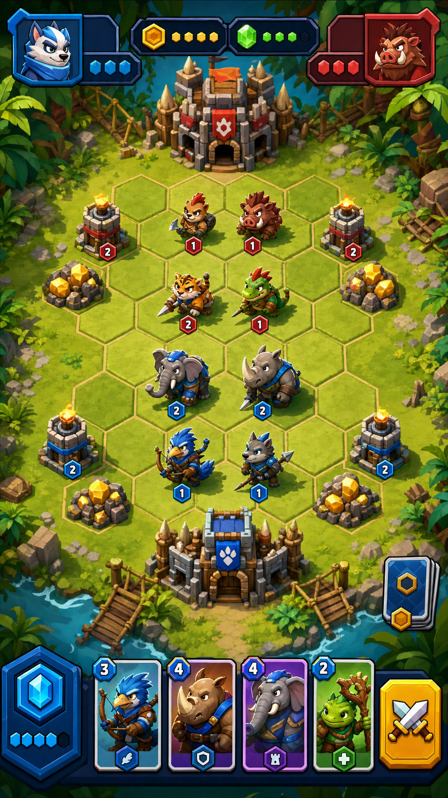
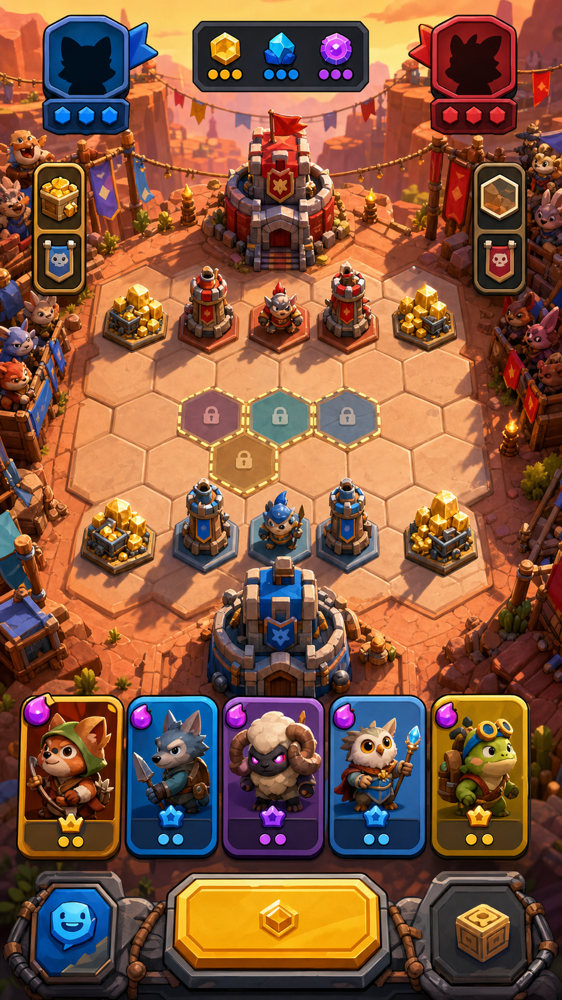
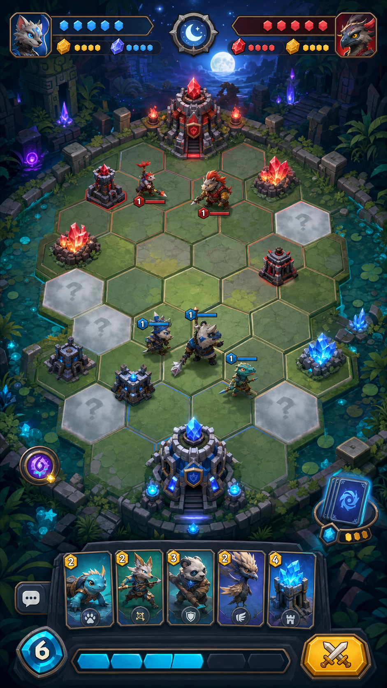
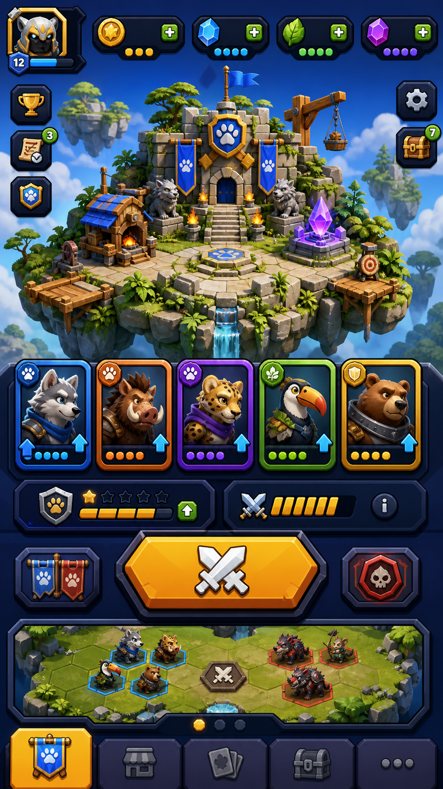
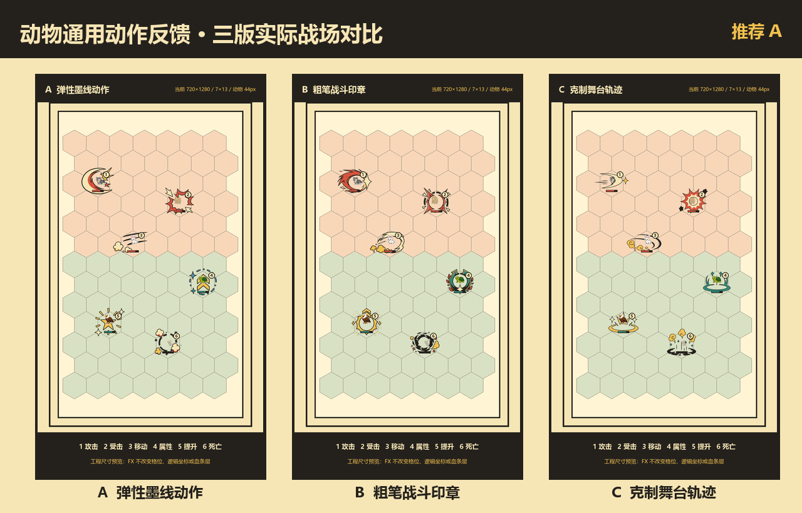

# 战城大师当前视觉效果图多方案评审

生成日期：2026-07-06  
用途：根据当前玩法设计，先提供多版视觉效果图供用户审核；审核通过前不推进 Godot 实装、UI 重绘或正式资产替换。

## 1. 评审边界

本轮只评审游戏视觉方向，不改玩法、不改数值、不改 Godot 运行逻辑。

当前玩法核心需要在画面中被保留：

- 竖屏移动端体验。
- 卡牌编组与底部卡牌操作区。
- 六边形地块争夺。
- 双方基地、金矿、防御塔、营地/建筑。
- 自动单位推进和阵营对抗。
- 粗描边、硬阴影、高饱和街机 UI。

本轮效果图是方向稿，不是最终 runtime 资产。后续若选定方向，需要再做 production sheet、UI 状态表、资产尺寸、切图规则、pivot/anchor、Godot handoff 和 QA。

## 2. 美术生产路由

本轮按公共流程 v1.4 的专业美术生产线执行：

```text
Producer -> Creative Director -> Art Director -> Visual Development Artist -> Concept Artist / Environment Artist / UI Artist -> Sprite Forge Specialist -> Godot Specialist -> QA Lead
```

当前停在“多版效果图评审”节点。用户确认前，不进入 Sprite Forge 正式资产生成或 Godot 实装。

## 3. 多方案总览

| 方案 | 文件 | 核心方向 | 建议用途 |
| --- | --- | --- | --- |
| A 丛林前线战场 | `output/visual_concepts/current_game_visual_option_a_jungle_frontier.png` | 明亮、清晰、最贴近当前六边形战斗原型 | 可作为战斗主视觉基线 |
| B 日暮峡谷竞技场 | `output/visual_concepts/current_game_visual_option_b_sunset_canyon.png` | 暖色、竞技感强、地块和阵营边界很清楚 | 可作为主战场或活动地图方向 |
| C 月夜晶体遗迹 | `output/visual_concepts/current_game_visual_option_c_moonlit_ruins.png` | 魔法、品质感强、氛围突出 | 可作为高阶地图或第二主题 |
| D 浮岛大厅入口 | `output/visual_concepts/current_game_visual_option_d_floating_island_lobby.png` | 大厅、编组、资源、匹配入口更完整 | 可作为主界面和大厅方向参考 |

## 4. 方案 A：丛林前线战场



美术判断：

- 优点：与当前“动物卡牌 + 六边形占地 + 建筑产兵”的玩法贴合度最高；战场、基地、防御塔、金矿、卡牌操作区都很直观。
- 风险：整体较常规，需要后续用独特建筑语言、族群设定和 UI 图标体系拉开原创识别度。
- 可保留：明亮丛林、上下基地对峙、清楚的六边形棋盘、底部卡牌栏、资源/阵营色。
- 需要避免：直接复用图中具体动物形象和图标；后续要重新设计原创单位族群。

适合拍板的问题：

- 当前游戏是否优先做“明亮丛林战棋”作为主基调？
- 战斗视角是否维持这种清晰俯视 2.5D？

## 5. 方案 B：日暮峡谷竞技场



美术判断：

- 优点：暖色记忆点强，阵营对抗、锁定地块、资源点和底部卡牌都醒目；整体更有竞技场和活动感。
- 风险：暖色环境容易让金币、黄边和 CTA 互相抢注意力，需要后续控制黄色使用范围。
- 可保留：峡谷地貌、观众席氛围、锁定地块表达、蓝红阵营对位、强烈主按钮。
- 需要避免：不要让画面变成单一橙色主题；UI 需要加入蓝、绿、紫等辅助色维持层级。

适合拍板的问题：

- 是否希望主战场更像“竞技场”，而不是自然丛林？
- 暖色场景是否符合当前游戏长期视觉身份？

## 6. 方案 C：月夜晶体遗迹



美术判断：

- 优点：氛围和品质感最好，晶体金矿、遗迹基地、夜色边界能形成更强主题；适合后续做稀有地图和高级关卡。
- 风险：深色环境对移动端小屏可读性要求更高，底部卡牌和战场主体要避免被夜色吞掉。
- 可保留：晶体资源、遗迹基地、月光氛围、蓝红双方资源条、卡牌栏品质感。
- 需要避免：低亮度背景过多；战斗单位轮廓、血条和可购买地块必须额外提亮。

适合拍板的问题：

- 是否把“魔法遗迹/晶体资源”作为世界观核心？
- 夜色地图是否只作为后续主题，而不是首个主战场？

## 7. 方案 D：浮岛大厅入口



美术判断：

- 优点：大厅结构、资源条、编组卡牌、匹配入口、底部导航和战斗预览关系更完整；适合指导主界面重做。
- 风险：战斗棋盘只是预览，不能直接作为战斗页最终参考；大厅信息密度需要和当前 Godot 绘制能力分阶段落地。
- 可保留：浮岛基地、资源 pills、卡牌编组预览、底部导航、明显的匹配 CTA、战斗小预览。
- 需要避免：照搬具体卡面、图标和排版；后续要按本项目 UI kit 重新拆组件。

适合拍板的问题：

- 是否采用“浮岛基地大厅”作为主界面身份？
- 大厅是否需要同时露出当前编组和战斗入口预览？

## 8. 推荐决策方式

建议不要只选一张图，而是按用途组合：

- 主战斗基线：优先从 A 或 B 中选择。
- 高阶/主题地图：C 可作为第二地图方向。
- 大厅和主界面：D 可作为 UI 和主页方向。

推荐组合：

1. A + D：最稳，战斗清晰，大厅有目标。
2. B + D：更有竞技场记忆点，适合强调对战。
3. A + C + D：首版明亮，后续用夜色晶体做高级主题。

## 9. 审核后下一步

用户确认方向后再推进：

1. 更新 art brief 和 visual direction。
2. 为选定方向拆分 UI 组件、战斗建筑、地块、单位族群、资源点和特效清单。
3. 产出 production sheet 与 Godot handoff 规格。
4. 再进入 Sprite Forge 或确定性资源制作。
5. 最后才改 Godot UI/场景/资产引用。

本轮当前状态：等待用户审核。

## 10. 独立功能评审：动物通用动作反馈（2026-07-12）

本节只登记动物通用动作反馈提案，不重新启用本文件前述旧页面方向，也不代表当前页面视觉已经定稿。动物 PNG、战斗 `7 x 13` 几何、逻辑位置和点击区保持不变；本轮只比较程序化姿态与通用图片 FX 的动作语言。



| 方案 | 定位 | 评审图 |
| --- | --- | --- |
| A 弹性墨线动作 | 动作/遮挡平衡最好，当前推荐 | `output/visual_concepts/animal_universal_motion_option_a_review_board.png` |
| B 粗笔战斗印章 | 小屏最醒目，但同屏遮挡风险最高 | `output/visual_concepts/animal_universal_motion_option_b_review_board.png` |
| C 克制舞台轨迹 | 干扰最低，可作为减弱动效基线 | `output/visual_concepts/animal_universal_motion_option_c_review_board.png` |

覆盖状态：攻击、受击、移动、获得属性、获得提升、死亡；建议获批后顺带补齐出生反馈。完整触发、时序、锚点、打断、性能、减弱动效和 Godot 落地规格见 `docs/ANIMAL_UNIVERSAL_MOTION_FEEDBACK_DESIGN.md`。

当前结论：建议选择 A。用户明确确认方案并说“实装”前，不修改运行时脚本、场景、资源绑定、输入或点击区域。
